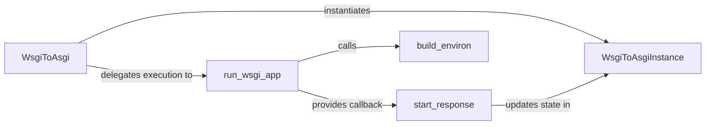

## Details

The WSGI Compatibility Adapter subsystem is primarily encapsulated within the asgiref/wsgi.py module. This module contains the core logic for adapting traditional WSGI applications to be served by an ASGI server, acting as a bridge between the two specifications.

### WsgiToAsgi
This is the primary adapter class, serving as the entry point for ASGI servers. It translates incoming ASGI `scope`, `receive`, and `send` calls into a format consumable by the WSGI application, effectively bridging the ASGI server interface with a traditional WSGI application.

**Related Classes/Methods**:

- <a href="https://github.com/django/asgiref/blob/main/asgiref/wsgi.py#L7-L21" target="_blank" rel="noopener noreferrer">`WsgiToAsgi`:7-21</a>

### run_wsgi_app
This function is responsible for the actual execution of the wrapped WSGI application within a dedicated thread. It sets up the WSGI environment, invokes the WSGI application, and manages the flow of data (request body, response headers, and body) between the ASGI and WSGI contexts.

**Related Classes/Methods**:

- <a href="https://github.com/django/asgiref/blob/main/asgiref/wsgi.py#L134-L166" target="_blank" rel="noopener noreferrer">`run_wsgi_app`:134-166</a>

### WsgiToAsgiInstance
This class manages the state specific to a single ASGI request's interaction with the WSGI application. It holds references to the `start_response` callable and buffers the response data generated by the WSGI application before it's sent back via the ASGI `send` channel.

**Related Classes/Methods**:

- <a href="https://github.com/django/asgiref/blob/main/asgiref/wsgi.py#L24-L166" target="_blank" rel="noopener noreferrer">`WsgiToAsgiInstance`:24-166</a>

### start_response
This function implements the WSGI `start_response` callable, which is passed to the WSGI application. It captures the HTTP status and headers provided by the WSGI application, making them available for the ASGI `send` channel.

**Related Classes/Methods**:

- <a href="https://github.com/django/asgiref/blob/main/asgiref/wsgi.py#L102-L132" target="_blank" rel="noopener noreferrer">`start_response`:102-132</a>

### build_environ
This function is responsible for translating the ASGI `scope` dictionary into the standard WSGI environment dictionary (`environ`). It maps ASGI-specific keys (e.g., `http_version`, `path`, `headers`) to their WSGI equivalents, ensuring the WSGI application receives a compatible environment.

**Related Classes/Methods**:

- <a href="https://github.com/django/asgiref/blob/main/asgiref/wsgi.py#L53-L100" target="_blank" rel="noopener noreferrer">`build_environ`:53-100</a>

### [FAQ](https://github.com/CodeBoarding/GeneratedOnBoardings/tree/main?tab=readme-ov-file#faq)