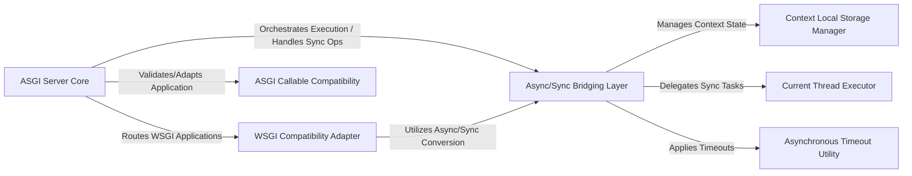

## Details

The `asgiref` library provides essential components for building and running asynchronous web applications, acting as a critical interoperability layer between synchronous and asynchronous Python code. Its architecture centers around the `ASGI Server Core`, which manages the lifecycle and execution of ASGI applications. This core component leverages the `ASGI Callable Compatibility` to ensure application adherence to the ASGI standard and interacts extensively with the `Async/Sync Bridging Layer` to handle transitions between async and sync code. The `WSGI Compatibility Adapter` extends this interoperability to traditional WSGI applications, allowing them to run within an ASGI environment. Supporting these core functions, the `Context Local Storage Manager` ensures proper state isolation during context switches, while the `Current Thread Executor` and `Asynchronous Timeout Utility` provide robust mechanisms for managing synchronous task execution and enforcing operational time limits within the asynchronous ecosystem. This design facilitates a flexible and resilient asynchronous web development experience.

### ASGI Server Core [[Expand]](./ASGI_Server_Core.md)
The primary component for running ASGI applications, managing their lifecycle, and orchestrating execution flow.

**Related Classes/Methods**:

- <a href="https://github.com/django/asgiref/blob/main/asgiref/server.py" target="_blank" rel="noopener noreferrer">`asgiref/server.py`</a>

### Async/Sync Bridging Layer [[Expand]](./Async_Sync_Bridging_Layer.md)
Provides core mechanisms (`async_to_sync`, `sync_to_async`) for converting calls between asynchronous and synchronous contexts.

**Related Classes/Methods**:

- <a href="https://github.com/django/asgiref/blob/main/asgiref/sync.py" target="_blank" rel="noopener noreferrer">`asgiref/sync.py`</a>

### WSGI Compatibility Adapter [[Expand]](./WSGI_Compatibility_Adapter.md)
Adapts traditional WSGI applications to conform to the ASGI specification, allowing them to be served by an ASGI server.

**Related Classes/Methods**:

- <a href="https://github.com/django/asgiref/blob/main/asgiref/wsgi.py" target="_blank" rel="noopener noreferrer">`asgiref/wsgi.py`</a>

### ASGI Callable Compatibility
Ensures ASGI applications adhere to the expected callable signature, adapting older or non-standard callables.

**Related Classes/Methods**:

- <a href="https://github.com/django/asgiref/blob/main/asgiref/compatibility.py" target="_blank" rel="noopener noreferrer">`asgiref/compatibility.py`</a>

### Context Local Storage Manager [[Expand]](./Context_Local_Storage_Manager.md)
Manages context-specific data, ensuring state is correctly isolated and accessible across different asynchronous tasks or threads.

**Related Classes/Methods**:

- <a href="https://github.com/django/asgiref/blob/main/asgiref/local.py" target="_blank" rel="noopener noreferrer">`asgiref/local.py`</a>

### Current Thread Executor
A specialized executor for running tasks on the current thread, used by the Bridging Layer for synchronous execution needs.

**Related Classes/Methods**:

- <a href="https://github.com/django/asgiref/blob/main/asgiref/current_thread_executor.py" target="_blank" rel="noopener noreferrer">`asgiref/current_thread_executor.py`</a>

### Asynchronous Timeout Utility
Provides a mechanism to enforce time limits on asynchronous operations, preventing indefinite waits.

**Related Classes/Methods**:

- <a href="https://github.com/django/asgiref/blob/main/asgiref/timeout.py" target="_blank" rel="noopener noreferrer">`asgiref/timeout.py`</a>

### [FAQ](https://github.com/CodeBoarding/GeneratedOnBoardings/tree/main?tab=readme-ov-file#faq)