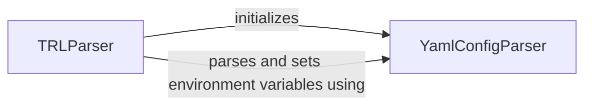

## Component Details

The configuration management subsystem is responsible for loading, parsing, and managing configuration settings from YAML files and command-line arguments. It sets environment variables and provides configuration objects to other components, ensuring that all training parameters are properly loaded and accessible throughout the training process. The TRLParser orchestrates the configuration loading process, utilizing YamlConfigParser to parse YAML files and set environment variables. The resulting configuration is then used to set defaults and configure the training process.

### TRLParser
The TRLParser class is responsible for parsing command-line arguments and configurations, setting default values based on a configuration file, and managing the overall configuration of the training process. It interacts with YamlConfigParser to load and parse YAML configuration files.

**Related Classes/Methods**:

- <a href="https://github.com/mnoukhov/async_rlhf/blob/master/src/utils.py#L54-L131" target="_blank" rel="noopener noreferrer">`src.utils.TRLParser` (54:131)</a>
- <a href="https://github.com/mnoukhov/async_rlhf/blob/master/src/utils.py#L55-L66" target="_blank" rel="noopener noreferrer">`src.utils.TRLParser.__init__` (55:66)</a>
- <a href="https://github.com/mnoukhov/async_rlhf/blob/master/src/utils.py#L91-L120" target="_blank" rel="noopener noreferrer">`src.utils.TRLParser.parse_args_and_config` (91:120)</a>
- <a href="https://github.com/mnoukhov/async_rlhf/blob/master/src/utils.py#L122-L131" target="_blank" rel="noopener noreferrer">`src.utils.TRLParser.set_defaults_with_config` (122:131)</a>

### YamlConfigParser
The YamlConfigParser class is responsible for parsing YAML configuration files and setting environment variables based on the configuration. It provides methods to load, parse, and apply configurations from YAML files, making it a central component for managing configuration settings.

**Related Classes/Methods**:

- <a href="https://github.com/mnoukhov/async_rlhf/blob/master/src/utils.py#L24-L51" target="_blank" rel="noopener noreferrer">`src.utils.YamlConfigParser` (24:51)</a>
- <a href="https://github.com/mnoukhov/async_rlhf/blob/master/src/utils.py#L25-L37" target="_blank" rel="noopener noreferrer">`src.utils.YamlConfigParser.parse_and_set_env` (25:37)</a>