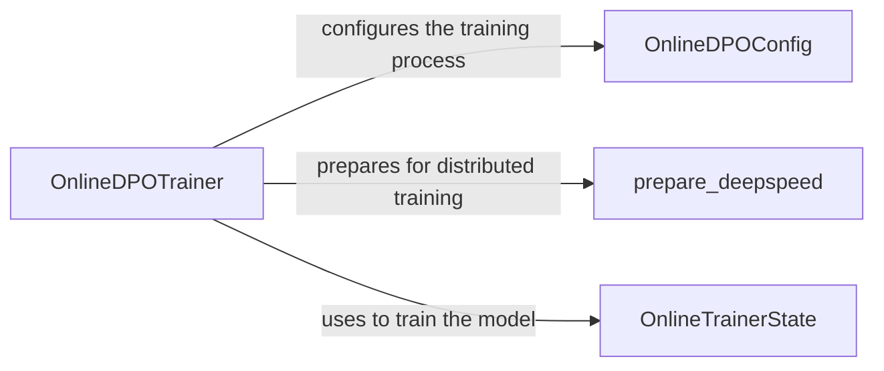

## Component Details

The DPO Trainer component orchestrates the Direct Preference Optimization training loop. It configures the training process, prepares the model and data for distributed training using DeepSpeed, generates completions, calculates rewards based on preferences, and updates the model using the DPO loss function. This component provides the core logic for training models based on preference data, enabling the model to align with human preferences.

### OnlineDPOTrainer
The OnlineDPOTrainer class is the central component responsible for training a model using the online DPO algorithm. It initializes the training process with configurations, manages the training loop, generates completions from the model, and updates the model's parameters based on preference data. It interacts with OnlineDPOConfig for configuration, OnlineTrainerState for managing the training state, and prepare_deepspeed for distributed training setup.

**Related Classes/Methods**:

- <a href="https://github.com/mnoukhov/async_rlhf/blob/master/src/online_dpo_trainer.py#L85-L691" target="_blank" rel="noopener noreferrer">`src.online_dpo_trainer.OnlineDPOTrainer` (85:691)</a>
- <a href="https://github.com/mnoukhov/async_rlhf/blob/master/src/online_dpo_trainer.py#L86-L261" target="_blank" rel="noopener noreferrer">`src.online_dpo_trainer.OnlineDPOTrainer.__init__` (86:261)</a>
- <a href="https://github.com/mnoukhov/async_rlhf/blob/master/src/online_dpo_trainer.py#L263-L644" target="_blank" rel="noopener noreferrer">`src.online_dpo_trainer.OnlineDPOTrainer.train` (263:644)</a>
- <a href="https://github.com/mnoukhov/async_rlhf/blob/master/src/online_dpo_trainer.py#L646-L691" target="_blank" rel="noopener noreferrer">`src.online_dpo_trainer.OnlineDPOTrainer.generate_completions` (646:691)</a>
- `src.online_dpo_trainer.OnlineDPOTrainer.train.repeat_generator` (308:311)

### OnlineTrainerState
OnlineTrainerState is a data class that holds the state of the online training process. This includes the current training step, model parameters, and optimizer state. It is used by OnlineDPOTrainer to keep track of the training progress and facilitate saving and loading checkpoints.

**Related Classes/Methods**:

- <a href="https://github.com/mnoukhov/async_rlhf/blob/master/src/online_dpo_trainer.py#L48-L49" target="_blank" rel="noopener noreferrer">`src.online_dpo_trainer.OnlineTrainerState` (48:49)</a>

### prepare_deepspeed
The prepare_deepspeed function configures the DeepSpeed environment for distributed training. It takes the model, optimizer, and data loader as input and sets them up for efficient training across multiple GPUs or machines. It returns the DeepSpeed-wrapped model, optimizer, and data loader.

**Related Classes/Methods**:

- <a href="https://github.com/mnoukhov/async_rlhf/blob/master/src/utils.py#L134-L169" target="_blank" rel="noopener noreferrer">`src.utils.prepare_deepspeed` (134:169)</a>

### OnlineDPOConfig
The OnlineDPOConfig class is a dataclass that holds the configuration parameters for the Online DPO training process. It defines settings such as learning rate, batch size, and other hyperparameters that control the training behavior. It is used by OnlineDPOTrainer to configure the training process.

**Related Classes/Methods**:

- <a href="https://github.com/mnoukhov/async_rlhf/blob/master/src/online_dpo_trainer.py#L53-L82" target="_blank" rel="noopener noreferrer">`src.online_dpo_trainer.OnlineDPOConfig` (53:82)</a>