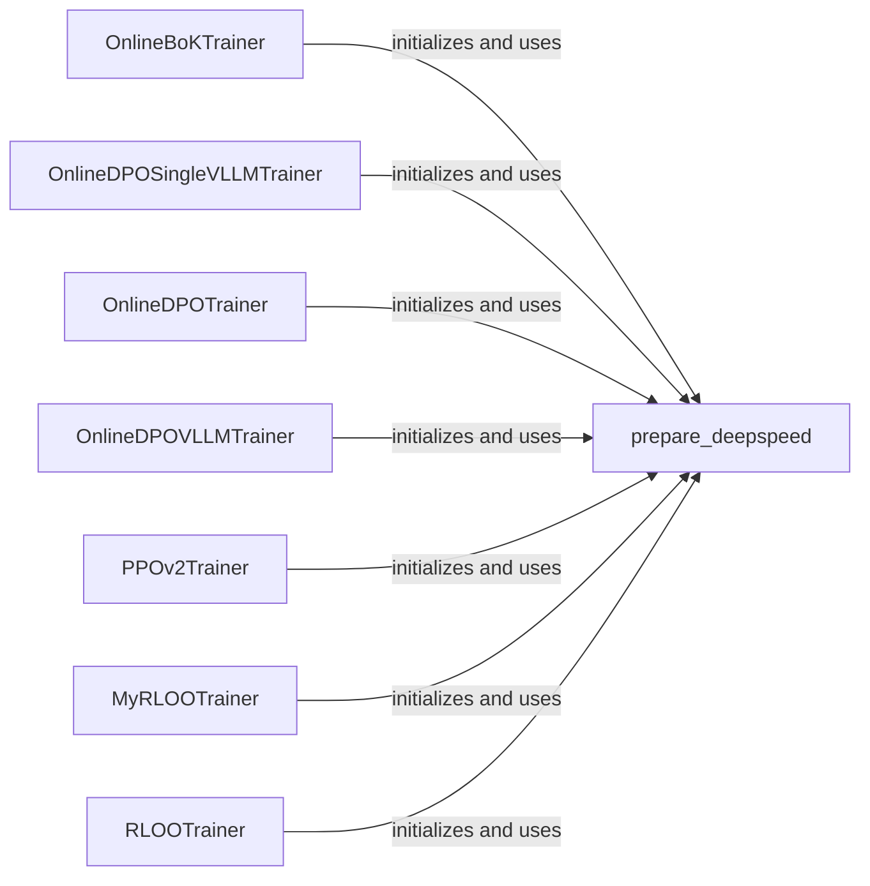

## Component Details

The DeepSpeed Integration component streamlines distributed training and optimization by leveraging the DeepSpeed library. It abstracts the complexities of parallel execution across multiple GPUs or nodes, enabling other components, particularly trainer classes, to concentrate on core training logic and achieve scalability. The central function, `prepare_deepspeed`, configures the DeepSpeed environment based on provided model, optimizer, and configuration parameters. Trainer classes then utilize this configured environment to perform distributed training.

### prepare_deepspeed
The `prepare_deepspeed` function initializes and configures the DeepSpeed environment for distributed training. It takes the model, optimizer, criterion, and DeepSpeed configuration as input, and returns the DeepSpeed-wrapped model, optimizer, and potentially a data loader. This setup enables efficient distributed training across multiple GPUs or nodes.

**Related Classes/Methods**:

- <a href="https://github.com/mnoukhov/async_rlhf/blob/master/src/utils.py#L134-L169" target="_blank" rel="noopener noreferrer">`src.utils.prepare_deepspeed` (134:169)</a>

### OnlineBoKTrainer
The `OnlineBoKTrainer` class is a trainer for Book of Knowledge models. It initializes the DeepSpeed environment using `prepare_deepspeed` during its initialization to enable distributed training of BoK models.

**Related Classes/Methods**:

- <a href="https://github.com/mnoukhov/async_rlhf/blob/master/src/online_bok_trainer.py#L45-L216" target="_blank" rel="noopener noreferrer">`src.online_bok_trainer.OnlineBoKTrainer.__init__` (45:216)</a>

### OnlineDPOSingleVLLMTrainer
The `OnlineDPOSingleVLLMTrainer` class is a trainer for DPO models using a single VLLM instance. It utilizes `prepare_deepspeed` in its `__init__` method to set up the distributed training environment for DPO models with VLLM.

**Related Classes/Methods**:

- <a href="https://github.com/mnoukhov/async_rlhf/blob/master/src/online_dpo_single_vllm_trainer.py#L63-L238" target="_blank" rel="noopener noreferrer">`src.online_dpo_single_vllm_trainer.OnlineDPOSingleVLLMTrainer.__init__` (63:238)</a>

### OnlineDPOTrainer
The `OnlineDPOTrainer` class is a trainer for DPO models. It calls `prepare_deepspeed` within its `__init__` method to configure DeepSpeed for distributed training of DPO models.

**Related Classes/Methods**:

- <a href="https://github.com/mnoukhov/async_rlhf/blob/master/src/online_dpo_trainer.py#L86-L261" target="_blank" rel="noopener noreferrer">`src.online_dpo_trainer.OnlineDPOTrainer.__init__` (86:261)</a>

### OnlineDPOVLLMTrainer
The `OnlineDPOVLLMTrainer` class is a trainer for DPO models using VLLM. It leverages `prepare_deepspeed` during initialization to set up the DeepSpeed environment for distributed training of DPO models with VLLM.

**Related Classes/Methods**:

- <a href="https://github.com/mnoukhov/async_rlhf/blob/master/src/online_dpo_vllm_trainer.py#L66-L242" target="_blank" rel="noopener noreferrer">`src.online_dpo_vllm_trainer.OnlineDPOVLLMTrainer.__init__` (66:242)</a>

### PPOv2Trainer
The `PPOv2Trainer` class is a trainer for PPO models. It uses `prepare_deepspeed` in its constructor to initialize the DeepSpeed environment for distributed training of PPO models.

**Related Classes/Methods**:

- <a href="https://github.com/mnoukhov/async_rlhf/blob/master/src/ppov2_trainer.py#L63-L205" target="_blank" rel="noopener noreferrer">`src.ppov2_trainer.PPOv2Trainer.__init__` (63:205)</a>

### MyRLOOTrainer
The `MyRLOOTrainer` class is a trainer for RLOO models. It calls `prepare_deepspeed` in its `__init__` method to set up the DeepSpeed environment for distributed training of RLOO models.

**Related Classes/Methods**:

- <a href="https://github.com/mnoukhov/async_rlhf/blob/master/src/rloo_trainer.py#L53-L210" target="_blank" rel="noopener noreferrer">`src.rloo_trainer.MyRLOOTrainer.__init__` (53:210)</a>

### RLOOTrainer
The `RLOOTrainer` class is a trainer for RLOO models using VLLM. It utilizes `prepare_deepspeed` during its initialization to configure the DeepSpeed environment for distributed training of RLOO models with VLLM.

**Related Classes/Methods**:

- <a href="https://github.com/mnoukhov/async_rlhf/blob/master/src/rloo_trainer_vllm.py#L47-L202" target="_blank" rel="noopener noreferrer">`src.rloo_trainer_vllm.RLOOTrainer.__init__` (47:202)</a>