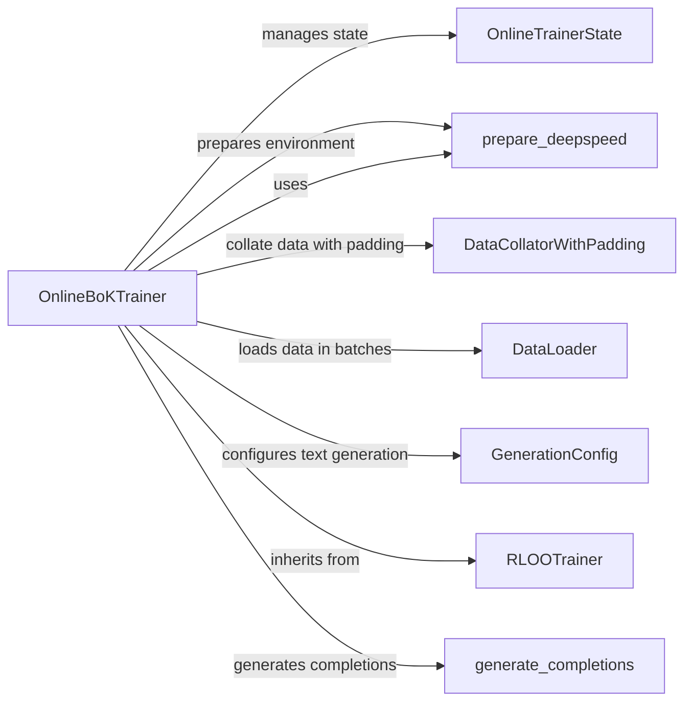

## Component Details

The Online BoK Trainer component facilitates the continuous training and adaptation of a Bag of Knowledge (BoK) model. It leverages DeepSpeed for distributed training, generates text completions, and uses the RLOO algorithm to refine the model's knowledge based on new data and feedback. The trainer manages its state to allow for resuming training and monitors performance during the process.

### OnlineBoKTrainer
The OnlineBoKTrainer class is the central component responsible for orchestrating the online training process of a Book of Knowledge (BoK) model. It initializes the training environment, manages the model and optimizer, generates text completions for evaluation, and performs training steps using the RLOO algorithm. It interacts with the OnlineTrainerState to persist and resume training, and utilizes prepare_deepspeed for distributed training.

**Related Classes/Methods**:

- <a href="https://github.com/mnoukhov/async_rlhf/blob/master/src/online_bok_trainer.py#L44-L646" target="_blank" rel="noopener noreferrer">`src.online_bok_trainer.OnlineBoKTrainer` (44:646)</a>
- <a href="https://github.com/mnoukhov/async_rlhf/blob/master/src/online_bok_trainer.py#L45-L216" target="_blank" rel="noopener noreferrer">`src.online_bok_trainer.OnlineBoKTrainer.__init__` (45:216)</a>
- <a href="https://github.com/mnoukhov/async_rlhf/blob/master/src/online_bok_trainer.py#L218-L596" target="_blank" rel="noopener noreferrer">`src.online_bok_trainer.OnlineBoKTrainer.train` (218:596)</a>
- <a href="https://github.com/mnoukhov/async_rlhf/blob/master/src/online_bok_trainer.py#L598-L646" target="_blank" rel="noopener noreferrer">`src.online_bok_trainer.OnlineBoKTrainer.generate_completions` (598:646)</a>

### OnlineTrainerState
The OnlineTrainerState class is responsible for managing and persisting the state of the online training process. This includes the current training step, optimizer state, and any other relevant information needed to resume training from a specific point. It allows the OnlineBoKTrainer to save and load the training progress, ensuring that training can be interrupted and resumed without losing progress.

**Related Classes/Methods**:

- <a href="https://github.com/mnoukhov/async_rlhf/blob/master/src/utils.py#L20-L21" target="_blank" rel="noopener noreferrer">`src.utils.OnlineTrainerState` (20:21)</a>

### prepare_deepspeed
The prepare_deepspeed function configures the DeepSpeed environment for distributed training. It initializes DeepSpeed, configures the model and optimizer for distributed training, and handles communication between processes. This function enables the OnlineBoKTrainer to leverage multiple GPUs or machines for faster and more efficient training.

**Related Classes/Methods**:

- <a href="https://github.com/mnoukhov/async_rlhf/blob/master/src/utils.py#L134-L169" target="_blank" rel="noopener noreferrer">`src.utils.prepare_deepspeed` (134:169)</a>

### DataCollatorWithPadding
The DataCollatorWithPadding class is used to collate batches of training data, padding them to the maximum length within each batch. This ensures that all sequences in a batch have the same length, which is required for efficient processing by the model. It is used by the DataLoader to prepare the data for training.

**Related Classes/Methods**:

- `transformers.DataCollatorWithPadding` (full file reference)

### DataLoader
The DataLoader class is responsible for loading and batching the training data. It iterates over the dataset, creating batches of data that are then fed to the model during training. It works in conjunction with the DataCollatorWithPadding to ensure that the data is properly formatted for training.

**Related Classes/Methods**:

- `torch.utils.data.DataLoader` (full file reference)

### GenerationConfig
The GenerationConfig class configures the text generation process, specifying parameters such as the maximum length, temperature, and sampling strategy. It is used by the generate_completions method to control how text is generated by the model.

**Related Classes/Methods**:

- `transformers.GenerationConfig` (full file reference)

### RLOOTrainer
The RLOOTrainer class serves as the base class for trainers that utilize the RLOO (Ranked List Output Optimization) algorithm. The OnlineBoKTrainer inherits from this class, leveraging its functionalities for optimizing the model based on ranked lists of outputs. It provides the core logic for RLOO-based training.

**Related Classes/Methods**:

- `trl.trainer.rloo_trainer.RLOOTrainer` (full file reference)

### generate_completions
The generate_completions method is responsible for generating text completions using the current model. This is used to evaluate the model's performance during training or to collect data for training. It uses the GenerationConfig to configure the generation process and interacts with the model to produce the completions.

**Related Classes/Methods**:

- <a href="https://github.com/mnoukhov/async_rlhf/blob/master/src/online_bok_trainer.py#L598-L646" target="_blank" rel="noopener noreferrer">`src.online_bok_trainer.OnlineBoKTrainer.generate_completions` (598:646)</a>