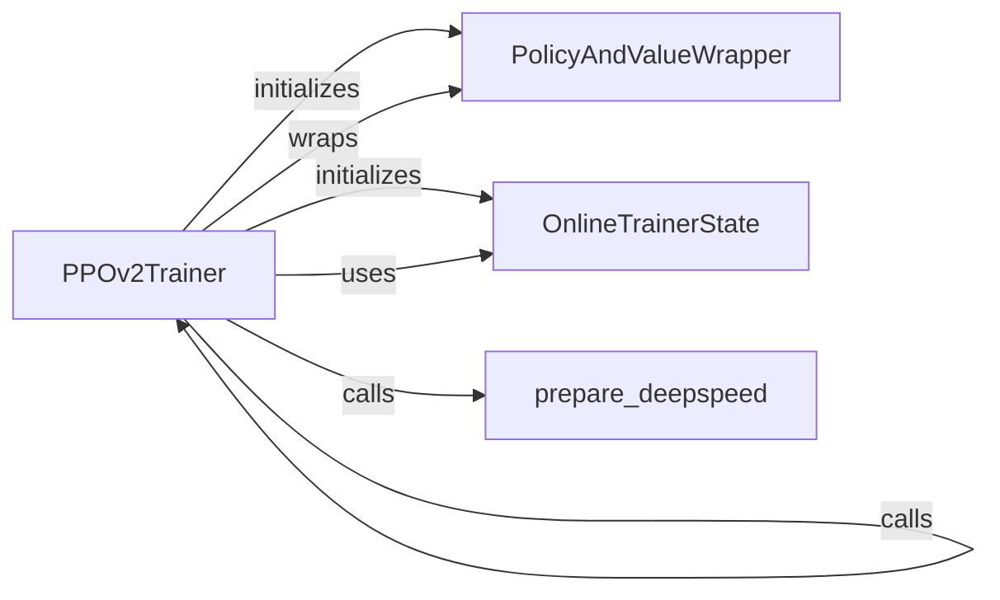

## Component Details

The PPO Trainer component implements the Proximal Policy Optimization (PPO) algorithm for reinforcement learning. It manages the training of policy and value function models using DeepSpeed for distributed training. The trainer interacts with a policy and value wrapper, tracks training state, and leverages DeepSpeed for efficient training across multiple GPUs.

### PPOv2Trainer
The PPOv2Trainer class orchestrates the training process using the PPO algorithm. It initializes the policy and value networks, sets up the DeepSpeed environment, and executes the training loop. It interacts with PolicyAndValueWrapper to manage the policy and value models, OnlineTrainerState to track training progress, and DeepSpeed for distributed training.

**Related Classes/Methods**:

- <a href="https://github.com/mnoukhov/async_rlhf/blob/master/src/ppov2_trainer.py#L62-L603" target="_blank" rel="noopener noreferrer">`src.ppov2_trainer.PPOv2Trainer` (62:603)</a>
- <a href="https://github.com/mnoukhov/async_rlhf/blob/master/src/ppov2_trainer.py#L63-L205" target="_blank" rel="noopener noreferrer">`src.ppov2_trainer.PPOv2Trainer.__init__` (63:205)</a>
- <a href="https://github.com/mnoukhov/async_rlhf/blob/master/src/ppov2_trainer.py#L224-L556" target="_blank" rel="noopener noreferrer">`src.ppov2_trainer.PPOv2Trainer.train` (224:556)</a>
- <a href="https://github.com/mnoukhov/async_rlhf/blob/master/src/ppov2_trainer.py#L558-L603" target="_blank" rel="noopener noreferrer">`src.ppov2_trainer.PPOv2Trainer.generate_completions` (558:603)</a>
- `src.ppov2_trainer.PPOv2Trainer.train.repeat_generator` (319:322)

### PolicyAndValueWrapper
The PolicyAndValueWrapper class encapsulates the policy and value models, providing a unified interface for accessing and updating them. It is used by the PPOv2Trainer to manage these models during training, offering methods for updating the models and sampling actions.

**Related Classes/Methods**:

- <a href="https://github.com/mnoukhov/async_rlhf/blob/master/src/ppov2_trainer.py#L47-L59" target="_blank" rel="noopener noreferrer">`src.ppov2_trainer.PolicyAndValueWrapper` (47:59)</a>

### OnlineTrainerState
The OnlineTrainerState class maintains the state of the online training process, tracking metrics such as the current training iteration, loss, and other relevant information. It is used by the PPOv2Trainer to monitor and log the training progress, as well as for checkpointing.

**Related Classes/Methods**:

- <a href="https://github.com/mnoukhov/async_rlhf/blob/master/src/utils.py#L20-L21" target="_blank" rel="noopener noreferrer">`src.utils.OnlineTrainerState` (20:21)</a>

### prepare_deepspeed
The prepare_deepspeed function initializes the DeepSpeed environment for distributed training. It is called by the PPOv2Trainer to configure and set up the resources needed for training on multiple GPUs or machines, leveraging the DeepSpeed library.

**Related Classes/Methods**:

- <a href="https://github.com/mnoukhov/async_rlhf/blob/master/src/utils.py#L134-L169" target="_blank" rel="noopener noreferrer">`src.utils.prepare_deepspeed` (134:169)</a>