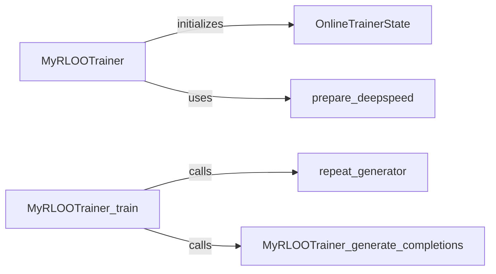

## Component Details

The RLOO Trainer component implements the Ranked List Optimization Objective (RLOO) training. It optimizes the model to generate ranked lists that align with preferences. The main flow involves initializing the trainer with a policy model, reference model, reward model, and data. The training loop generates completions, calculates rewards, and updates the policy model based on the RLOO algorithm. This process is repeated for multiple episodes, with the trainer state being updated to track progress. DeepSpeed is used to accelerate the training process.

### MyRLOOTrainer
This class is a subclass of the `Trainer` class from the `transformers` library and implements the RLOO (Ranked List Output Optimization) training procedure. It initializes the policy, reference policy, reward model, tokenizer, optimizer, and data loaders. It also handles the training loop, including generating responses, calculating rewards, and updating the policy based on the RLOO algorithm.

**Related Classes/Methods**:

- <a href="https://github.com/mnoukhov/async_rlhf/blob/master/src/rloo_trainer.py#L52-L527" target="_blank" rel="noopener noreferrer">`src.rloo_trainer.MyRLOOTrainer` (52:527)</a>
- <a href="https://github.com/mnoukhov/async_rlhf/blob/master/src/rloo_trainer.py#L53-L210" target="_blank" rel="noopener noreferrer">`src.rloo_trainer.MyRLOOTrainer.__init__` (53:210)</a>
- <a href="https://github.com/mnoukhov/async_rlhf/blob/master/src/rloo_trainer.py#L218-L480" target="_blank" rel="noopener noreferrer">`src.rloo_trainer.MyRLOOTrainer.train` (218:480)</a>
- <a href="https://github.com/mnoukhov/async_rlhf/blob/master/src/rloo_trainer.py#L482-L527" target="_blank" rel="noopener noreferrer">`src.rloo_trainer.MyRLOOTrainer.generate_completions` (482:527)</a>

### OnlineTrainerState
This dataclass extends the `TrainerState` class and adds an `episode` attribute to keep track of the current training episode. It's used to maintain the state of the training process.

**Related Classes/Methods**:

- <a href="https://github.com/mnoukhov/async_rlhf/blob/master/src/rloo_trainer.py#L48-L49" target="_blank" rel="noopener noreferrer">`src.rloo_trainer.OnlineTrainerState` (48:49)</a>

### prepare_deepspeed
This function prepares the model for DeepSpeed training. It initializes DeepSpeed with the given model and configuration, and returns the DeepSpeed-wrapped model. It configures the DeepSpeed settings based on the training configuration (fp16, bf16, zero_optimization).

**Related Classes/Methods**:

- <a href="https://github.com/mnoukhov/async_rlhf/blob/master/src/utils.py#L134-L169" target="_blank" rel="noopener noreferrer">`src.utils.prepare_deepspeed` (134:169)</a>

### repeat_generator
This is a generator function defined within the `train` method of `MyRLOOTrainer`. It continuously yields batches from the dataloader, allowing the training loop to iterate indefinitely over the dataset.

**Related Classes/Methods**:

- `src.rloo_trainer.MyRLOOTrainer.train.repeat_generator` (0:0)