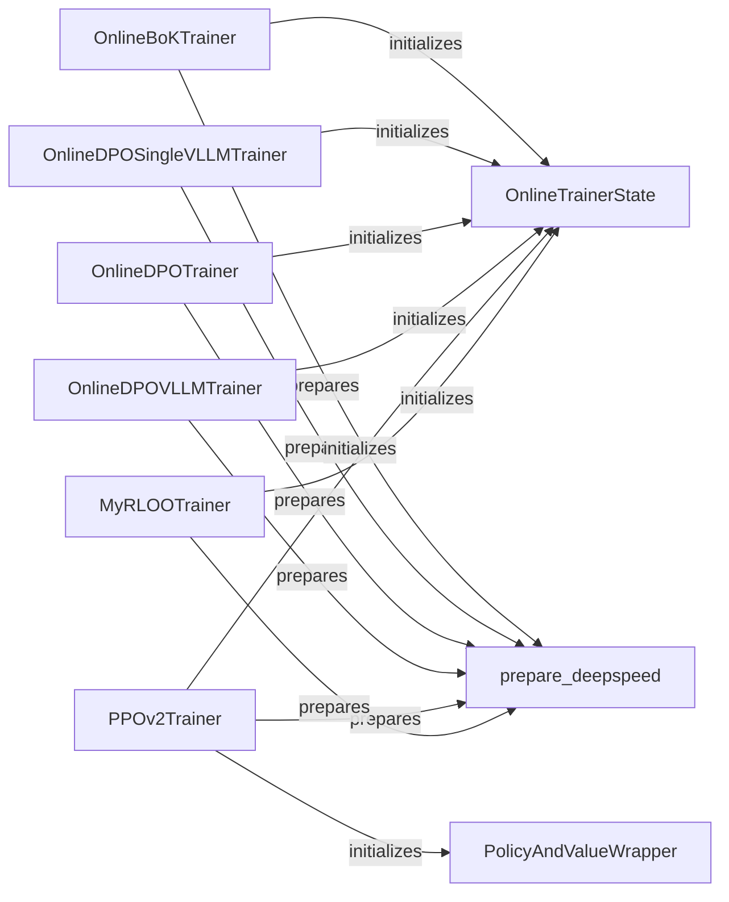

## Component Details

The online training system encompasses several components that work together to train models using different algorithms such as BoK, DPO, PPO, and RLOO. The core components include trainers for each algorithm (OnlineBoKTrainer, OnlineDPOTrainer, OnlineDPOVLLMTrainer, OnlineDPOSingleVLLMTrainer, PPOv2Trainer, MyRLOOTrainer), a state manager (OnlineTrainerState) to keep track of the training progress, a wrapper for policy and value networks (PolicyAndValueWrapper), and a utility function to prepare the DeepSpeed environment (prepare_deepspeed). These components are designed to facilitate distributed training and efficient management of the training process.

### OnlineBoKTrainer
The OnlineBoKTrainer class is responsible for training a Book of Knowledge (BoK) model online. It initializes the trainer state and prepares the DeepSpeed environment for distributed training.

**Related Classes/Methods**:

- <a href="https://github.com/mnoukhov/async_rlhf/blob/master/src/online_bok_trainer.py#L45-L216" target="_blank" rel="noopener noreferrer">`src.online_bok_trainer.OnlineBoKTrainer:__init__` (45:216)</a>

### OnlineDPOTrainer
The OnlineDPOTrainer class is responsible for training a Direct Preference Optimization (DPO) model online. It initializes the trainer state and prepares the DeepSpeed environment for distributed training.

**Related Classes/Methods**:

- <a href="https://github.com/mnoukhov/async_rlhf/blob/master/src/online_dpo_trainer.py#L86-L261" target="_blank" rel="noopener noreferrer">`src.online_dpo_trainer.OnlineDPOTrainer:__init__` (86:261)</a>

### OnlineDPOVLLMTrainer
The OnlineDPOVLLMTrainer class is responsible for training a Direct Preference Optimization (DPO) model online using VLLM. It initializes the trainer state and prepares the DeepSpeed environment for distributed training.

**Related Classes/Methods**:

- <a href="https://github.com/mnoukhov/async_rlhf/blob/master/src/online_dpo_vllm_trainer.py#L66-L242" target="_blank" rel="noopener noreferrer">`src.online_dpo_vllm_trainer.OnlineDPOVLLMTrainer:__init__` (66:242)</a>

### OnlineDPOSingleVLLMTrainer
The OnlineDPOSingleVLLMTrainer class is responsible for training a Direct Preference Optimization (DPO) model online using a single VLLM instance. It initializes the trainer state and prepares the DeepSpeed environment for distributed training.

**Related Classes/Methods**:

- <a href="https://github.com/mnoukhov/async_rlhf/blob/master/src/online_dpo_single_vllm_trainer.py#L63-L238" target="_blank" rel="noopener noreferrer">`src.online_dpo_single_vllm_trainer.OnlineDPOSingleVLLMTrainer:__init__` (63:238)</a>

### PPOv2Trainer
The PPOv2Trainer class is responsible for training a Proximal Policy Optimization (PPO) model. It initializes the policy and value network wrapper, the trainer state, and prepares the DeepSpeed environment for distributed training.

**Related Classes/Methods**:

- <a href="https://github.com/mnoukhov/async_rlhf/blob/master/src/ppov2_trainer.py#L63-L205" target="_blank" rel="noopener noreferrer">`src.ppov2_trainer.PPOv2Trainer:__init__` (63:205)</a>

### MyRLOOTrainer
The MyRLOOTrainer class is responsible for training a model using the Reward Loss Optimization Objective (RLOO). It initializes the trainer state and prepares the DeepSpeed environment for distributed training.

**Related Classes/Methods**:

- <a href="https://github.com/mnoukhov/async_rlhf/blob/master/src/rloo_trainer.py#L53-L210" target="_blank" rel="noopener noreferrer">`src.rloo_trainer.MyRLOOTrainer:__init__` (53:210)</a>

### OnlineTrainerState
The OnlineTrainerState class is responsible for managing the state of the online training process. It likely stores information such as the current training iteration, the model parameters, and the optimizer state.

**Related Classes/Methods**:

- <a href="https://github.com/mnoukhov/async_rlhf/blob/master/src/utils.py#L20-L21" target="_blank" rel="noopener noreferrer">`src.utils.OnlineTrainerState` (20:21)</a>
- <a href="https://github.com/mnoukhov/async_rlhf/blob/master/src/online_dpo_trainer.py#L48-L49" target="_blank" rel="noopener noreferrer">`.mnt.e.StartUp.async_rlhf.src.online_dpo_trainer.OnlineTrainerState` (48:49)</a>
- <a href="https://github.com/mnoukhov/async_rlhf/blob/master/src/online_dpo_single_vllm_trainer.py#L49-L50" target="_blank" rel="noopener noreferrer">`.mnt.e.StartUp.async_rlhf.src.online_dpo_single_vllm_trainer.OnlineTrainerState` (49:50)</a>
- <a href="https://github.com/mnoukhov/async_rlhf/blob/master/src/online_dpo_vllm_trainer.py#L52-L53" target="_blank" rel="noopener noreferrer">`.mnt.e.StartUp.async_rlhf.src.online_dpo_vllm_trainer.OnlineTrainerState` (52:53)</a>
- <a href="https://github.com/mnoukhov/async_rlhf/blob/master/src/rloo_trainer.py#L48-L49" target="_blank" rel="noopener noreferrer">`.mnt.e.StartUp.async_rlhf.src.rloo_trainer.OnlineTrainerState` (48:49)</a>

### PolicyAndValueWrapper
The PolicyAndValueWrapper class is responsible for wrapping the policy and value networks used in PPO training. It likely provides a convenient way to access and update the parameters of both networks.

**Related Classes/Methods**:

- <a href="https://github.com/mnoukhov/async_rlhf/blob/master/src/ppov2_trainer.py#L47-L59" target="_blank" rel="noopener noreferrer">`.mnt.e.StartUp.async_rlhf.src.ppov2_trainer.PolicyAndValueWrapper` (47:59)</a>

### prepare_deepspeed
The prepare_deepspeed function is responsible for initializing the DeepSpeed environment for distributed training. It likely configures the DeepSpeed runtime and sets up communication between the different processes.

**Related Classes/Methods**:

- <a href="https://github.com/mnoukhov/async_rlhf/blob/master/src/utils.py#L134-L169" target="_blank" rel="noopener noreferrer">`src.utils.prepare_deepspeed` (134:169)</a>