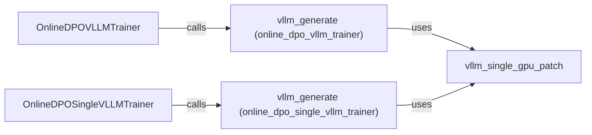

## Component Details

The VLLM integration component facilitates efficient text generation using the VLLM library, particularly within the context of online DPO training. It includes utilities for patching VLLM to work effectively with single GPUs and provides functions for generating text completions during the training process. This component optimizes the interaction with VLLM, enabling faster and more efficient inference for large language models.

### OnlineDPOSingleVLLMTrainer
This class is responsible for training a model using the online DPO algorithm with a single VLLM instance. It manages the training loop, generates completions using the VLLM library, and optimizes the model based on preference data. It orchestrates the training process and interacts with the VLLM generation component.

**Related Classes/Methods**:

- <a href="https://github.com/mnoukhov/async_rlhf/blob/master/src/online_dpo_single_vllm_trainer.py#L240-L737" target="_blank" rel="noopener noreferrer">`src.online_dpo_single_vllm_trainer.OnlineDPOSingleVLLMTrainer:train` (240:737)</a>
- <a href="https://github.com/mnoukhov/async_rlhf/blob/master/src/online_dpo_single_vllm_trainer.py#L739-L784" target="_blank" rel="noopener noreferrer">`src.online_dpo_single_vllm_trainer.OnlineDPOSingleVLLMTrainer.generate_completions` (739:784)</a>

### OnlineDPOVLLMTrainer
This class is responsible for training a model using the online DPO algorithm with VLLM. It manages the training loop and generation of completions. It orchestrates the training process and interacts with the VLLM generation component.

**Related Classes/Methods**:

- <a href="https://github.com/mnoukhov/async_rlhf/blob/master/src/online_dpo_vllm_trainer.py#L244-L700" target="_blank" rel="noopener noreferrer">`src.online_dpo_vllm_trainer.OnlineDPOVLLMTrainer:train` (244:700)</a>
- <a href="https://github.com/mnoukhov/async_rlhf/blob/master/src/online_dpo_vllm_trainer.py#L702-L747" target="_blank" rel="noopener noreferrer">`src.online_dpo_vllm_trainer.OnlineDPOVLLMTrainer.generate_completions` (702:747)</a>

### vllm_generate (online_dpo_single_vllm_trainer)
This function is responsible for generating text using the VLLM library within the context of the single VLLM trainer. It handles the specifics of calling the VLLM inference engine and utilizes the single GPU patch if available. It is called by the OnlineDPOSingleVLLMTrainer to generate text completions.

**Related Classes/Methods**:

- <a href="https://github.com/mnoukhov/async_rlhf/blob/master/src/online_dpo_single_vllm_trainer.py#L787-L809" target="_blank" rel="noopener noreferrer">`src.online_dpo_single_vllm_trainer.vllm_generate` (787:809)</a>

### vllm_generate (online_dpo_vllm_trainer)
This function is responsible for generating text using the VLLM library. It handles the specifics of calling the VLLM inference engine. It is called by the OnlineDPOVLLMTrainer to generate text completions.

**Related Classes/Methods**:

- <a href="https://github.com/mnoukhov/async_rlhf/blob/master/src/online_dpo_vllm_trainer.py#L750-L804" target="_blank" rel="noopener noreferrer">`src.online_dpo_vllm_trainer.vllm_generate` (750:804)</a>

### vllm_single_gpu_patch
This module likely contains patches or modifications to the VLLM library to enable single GPU usage or optimize performance in a single GPU environment. It modifies VLLM's behavior to function correctly on a single GPU, potentially improving performance or resolving compatibility issues.

**Related Classes/Methods**:

- <a href="https://github.com/mnoukhov/async_rlhf/blob/master/src/vllm_utils.py#L148-L151" target="_blank" rel="noopener noreferrer">`src.vllm_utils.vllm_single_gpu_patch` (148:151)</a>