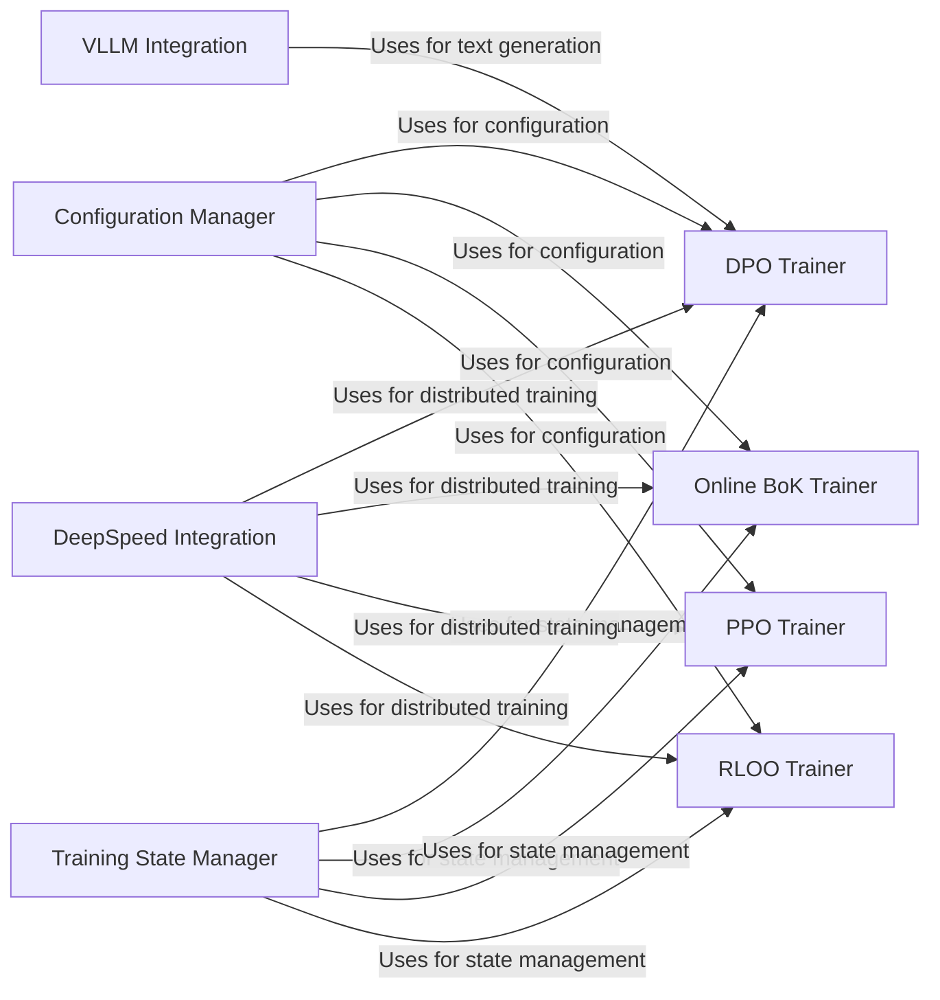

## Component Details

The `async_rlhf` project focuses on implementing various reinforcement learning from human feedback (RLHF) training paradigms, including Direct Preference Optimization (DPO), Proximal Policy Optimization (PPO), and Ranked List Optimization Objective (RLOO). It leverages techniques like DeepSpeed for distributed training and VLLM for efficient inference, aiming to optimize large language models based on human preferences. The project provides a flexible framework for experimenting with different RLHF algorithms and model architectures.

### Configuration Manager
This component is responsible for parsing and managing configuration settings from YAML files. It sets environment variables and provides configuration objects to other components, ensuring that all training parameters are properly loaded and accessible throughout the training process. It acts as a central repository for all configuration-related information.

**Related Classes/Methods**:

- <a href="https://github.com/mnoukhov/async_rlhf/blob/master/src/utils.py#L54-L131" target="_blank" rel="noopener noreferrer">`src.utils.TRLParser` (54:131)</a>
- <a href="https://github.com/mnoukhov/async_rlhf/blob/master/src/utils.py#L24-L51" target="_blank" rel="noopener noreferrer">`src.utils.YamlConfigParser` (24:51)</a>

### Training State Manager
The Training State Manager component handles the state of the online training process. It stores information such as training progress, model parameters, and optimizer states. This component provides a centralized way to track and update the training status, ensuring that the training process can be resumed or monitored effectively.

**Related Classes/Methods**:

- <a href="https://github.com/mnoukhov/async_rlhf/blob/master/src/utils.py#L20-L21" target="_blank" rel="noopener noreferrer">`src.utils.OnlineTrainerState` (20:21)</a>

### DeepSpeed Integration
This component integrates the DeepSpeed library for distributed training and optimization. It prepares the training environment for efficient execution on multiple GPUs or nodes. By handling the complexities of distributed training, it allows other components to focus on the core training logic and achieve scalability.

**Related Classes/Methods**:

- <a href="https://github.com/mnoukhov/async_rlhf/blob/master/src/utils.py#L134-L169" target="_blank" rel="noopener noreferrer">`src.utils.prepare_deepspeed` (134:169)</a>

### DPO Trainer
The DPO Trainer component implements the Direct Preference Optimization (DPO) training loop. It generates completions, calculates rewards based on preferences, and updates the model using the DPO loss function. This component provides the core logic for training models based on preference data, enabling the model to align with human preferences.

**Related Classes/Methods**:

- <a href="https://github.com/mnoukhov/async_rlhf/blob/master/src/online_dpo_trainer.py#L53-L82" target="_blank" rel="noopener noreferrer">`src.online_dpo_trainer.OnlineDPOConfig` (53:82)</a>
- <a href="https://github.com/mnoukhov/async_rlhf/blob/master/src/online_dpo_trainer.py#L48-L49" target="_blank" rel="noopener noreferrer">`src.online_dpo_trainer.OnlineTrainerState` (48:49)</a>
- <a href="https://github.com/mnoukhov/async_rlhf/blob/master/src/online_dpo_trainer.py#L85-L691" target="_blank" rel="noopener noreferrer">`src.online_dpo_trainer.OnlineDPOTrainer` (85:691)</a>
- <a href="https://github.com/mnoukhov/async_rlhf/blob/master/src/online_dpo_trainer.py#L263-L644" target="_blank" rel="noopener noreferrer">`src.online_dpo_trainer.OnlineDPOTrainer.train` (263:644)</a>
- <a href="https://github.com/mnoukhov/async_rlhf/blob/master/src/online_dpo_trainer.py#L646-L691" target="_blank" rel="noopener noreferrer">`src.online_dpo_trainer.OnlineDPOTrainer.generate_completions` (646:691)</a>

### VLLM Integration
This component provides utilities for generating text using VLLM (Very Large Language Model). It includes functions for patching VLLM to work with single GPUs and for performing efficient inference. This component optimizes the text generation process for large models, enabling faster and more efficient inference.

**Related Classes/Methods**:

- <a href="https://github.com/mnoukhov/async_rlhf/blob/master/src/online_dpo_vllm_trainer.py#L750-L804" target="_blank" rel="noopener noreferrer">`src.online_dpo_vllm_trainer.vllm_generate` (750:804)</a>
- <a href="https://github.com/mnoukhov/async_rlhf/blob/master/src/vllm_utils.py#L148-L151" target="_blank" rel="noopener noreferrer">`src.vllm_utils.vllm_single_gpu_patch` (148:151)</a>

### Online BoK Trainer
The Online BoK Trainer component implements online training for a Bag of Knowledge (BoK) model. It continuously updates the model based on new data and feedback. This component allows the model to adapt to changing information and improve its knowledge over time, making it suitable for dynamic environments.

**Related Classes/Methods**:

- <a href="https://github.com/mnoukhov/async_rlhf/blob/master/src/online_bok_trainer.py#L44-L646" target="_blank" rel="noopener noreferrer">`src.online_bok_trainer.OnlineBoKTrainer` (44:646)</a>
- <a href="https://github.com/mnoukhov/async_rlhf/blob/master/src/online_bok_trainer.py#L218-L596" target="_blank" rel="noopener noreferrer">`src.online_bok_trainer.OnlineBoKTrainer.train` (218:596)</a>

### PPO Trainer
This component implements the Proximal Policy Optimization (PPO) algorithm for reinforcement learning. It includes functionalities for policy and value function updates. The PPO Trainer enables the training of agents that can make optimal decisions in complex environments by balancing exploration and exploitation.

**Related Classes/Methods**:

- <a href="https://github.com/mnoukhov/async_rlhf/blob/master/src/ppov2_trainer.py#L62-L603" target="_blank" rel="noopener noreferrer">`src.ppov2_trainer.PPOv2Trainer` (62:603)</a>
- <a href="https://github.com/mnoukhov/async_rlhf/blob/master/src/ppov2_trainer.py#L224-L556" target="_blank" rel="noopener noreferrer">`src.ppov2_trainer.PPOv2Trainer.train` (224:556)</a>
- <a href="https://github.com/mnoukhov/async_rlhf/blob/master/src/ppov2_trainer.py#L47-L59" target="_blank" rel="noopener noreferrer">`src.ppov2_trainer.PolicyAndValueWrapper` (47:59)</a>

### RLOO Trainer
The RLOO Trainer component implements the Ranked List Optimization Objective (RLOO) training. It optimizes the model to generate ranked lists that align with preferences. This component focuses on improving the quality and relevance of ranked outputs, making it suitable for tasks such as recommendation and search.

**Related Classes/Methods**:

- <a href="https://github.com/mnoukhov/async_rlhf/blob/master/src/rloo_trainer.py#L52-L527" target="_blank" rel="noopener noreferrer">`src.rloo_trainer.MyRLOOTrainer` (52:527)</a>
- <a href="https://github.com/mnoukhov/async_rlhf/blob/master/src/rloo_trainer.py#L218-L480" target="_blank" rel="noopener noreferrer">`src.rloo_trainer.MyRLOOTrainer.train` (218:480)</a>
- <a href="https://github.com/mnoukhov/async_rlhf/blob/master/src/rloo_trainer.py#L48-L49" target="_blank" rel="noopener noreferrer">`src.rloo_trainer.OnlineTrainerState` (48:49)</a>