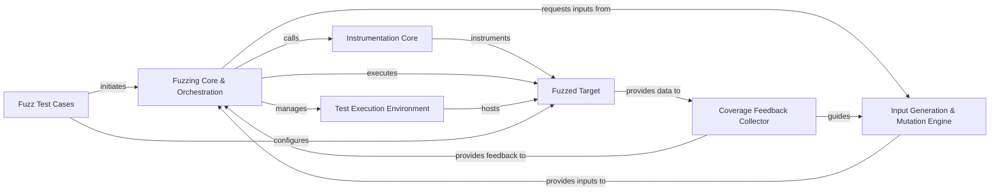

## Details

The Atheris fuzzing engine operates around a central `Fuzzing Core & Orchestration` component that manages the entire fuzzing lifecycle. `Fuzz Test Cases` initiate this process, defining the `Fuzzed Target` and campaign parameters. The `Instrumentation Core` is crucial for preparing the `Fuzzed Target` by injecting code to enable runtime data collection. During execution, the `Test Execution Environment` provides a controlled sandbox for the `Fuzzed Target`. As the target runs, the `Coverage Feedback Collector` gathers vital execution insights, primarily code coverage, which are then fed back to the `Input Generation & Mutation Engine`. This engine intelligently evolves test inputs based on the collected feedback, aiming to discover new code paths and potential vulnerabilities, thereby driving the iterative fuzzing process orchestrated by the `Fuzzing Core`.

### Fuzzing Core & Orchestration [[Expand]](./Fuzzing_Core_Orchestration.md)
The primary control unit that manages the overall fuzzing campaign. It initializes the fuzzing loop, coordinates input generation, executes the fuzzed target, and processes feedback to guide subsequent iterations. It serves as the main interface for initiating and managing fuzz tests.

**Related Classes/Methods**:

### Instrumentation Core
Provides the fundamental mechanisms for instrumenting the target code. This includes functionalities like `atheris.instrument_func`, which injects code to collect runtime information (e.g., code coverage) essential for feedback-guided fuzzing.

**Related Classes/Methods**:

### Input Generation & Mutation Engine
Responsible for creating initial seed inputs and continuously mutating them to generate new, diverse test cases. It leverages feedback from the fuzzing process to intelligently evolve inputs, aiming to explore new code paths and trigger vulnerabilities.

**Related Classes/Methods**:

### Fuzzed Target
Represents the specific functions, modules, or libraries that are under test. These are the components whose robustness, security, and behavior are being evaluated by the fuzzing process.

**Related Classes/Methods**:

### Coverage Feedback Collector
Gathers and processes execution feedback, primarily code coverage data (e.g., basic block hits, edge coverage), from the `Fuzzed Target` during its execution. This data is crucial for informing the `Input Generation & Mutation Engine` and guiding the fuzzing process.

**Related Classes/Methods**:

### Test Execution Environment
Provides the isolated and controlled runtime context for executing the `Fuzzed Target`. This component manages the execution process, handles crashes, and ensures resource isolation.

**Related Classes/Methods**:

### Fuzz Test Cases
Specific test scripts or harnesses that define the fuzzing campaign's parameters, specify the `Fuzzed Target`, and initiate the fuzzing process by interacting with the `Fuzzing Core & Orchestration`. They act as clients demonstrating the fuzzing engine's capabilities.

**Related Classes/Methods**:

### [FAQ](https://github.com/CodeBoarding/GeneratedOnBoardings/tree/main?tab=readme-ov-file#faq)