```mermaid
graph LR
    src_import_hook_HookManager["src.import_hook.HookManager"]
    src_import_hook_AtherisMetaPathFinder["src.import_hook.AtherisMetaPathFinder"]
    src_instrument_bytecode_Instrumentor["src.instrument_bytecode.Instrumentor"]
    src_version_dependent["src.version_dependent"]
    src_import_hook_HookManager -- "configures" --> src_import_hook_AtherisMetaPathFinder
    src_import_hook_AtherisMetaPathFinder -- "triggers instrumentation in" --> src_instrument_bytecode_Instrumentor
    src_instrument_bytecode_Instrumentor -- "utilizes" --> src_version_dependent
```

## Details

The `Instrumentation Engine` subsystem is central to Atheris's functionality, focusing on dynamically modifying Python bytecode and intercepting module imports. This ensures that target code is instrumented with tracing and coverage hooks before execution, a critical step for feedback-guided fuzzing.

### src.import_hook.HookManager
This component acts as the control plane for the import interception mechanism. It is responsible for activating and deactivating the custom import hook, ensuring that the instrumentation process can be initiated and cleanly shut down. It configures the AtherisMetaPathFinder to integrate with Python's import system.

**Related Classes/Methods**:

- <a href="https://github.com/google/atheris/blob/master/src/import_hook.py#L268-L305" target="_blank" rel="noopener noreferrer">`src.import_hook.HookManager`:268-305</a>

### src.import_hook.AtherisMetaPathFinder
As a specialized component within Python's sys.meta_path, this finder intercepts module import requests. Its responsibility is to identify modules that need to be instrumented and then provide a custom loader that ensures the bytecode modification process is applied before the module is executed.

**Related Classes/Methods**:

- <a href="https://github.com/google/atheris/blob/master/src/import_hook.py#L57-L180" target="_blank" rel="noopener noreferrer">`src.import_hook.AtherisMetaPathFinder`:57-180</a>

### src.instrument_bytecode.Instrumentor
This is the core component for dynamic bytecode modification. Its primary responsibility is to parse existing Python bytecode, inject new instructions (e.g., for tracing or coverage collection), and adjust bytecode offsets to maintain code integrity. It directly implements the "instrumentation" aspect of the subsystem.

**Related Classes/Methods**:

- <a href="https://github.com/google/atheris/blob/master/src/instrument_bytecode.py#L299-L1128" target="_blank" rel="noopener noreferrer">`src.instrument_bytecode.Instrumentor`:299-1128</a>

### src.version_dependent
This component provides essential utility functions that abstract away Python version-specific differences in bytecode structures and manipulation. It ensures that the Instrumentor can correctly parse and modify bytecode across various Python environments without needing to implement version-specific logic directly.

**Related Classes/Methods**:

- <a href="https://github.com/google/atheris/blob/master/src/version_dependent.py" target="_blank" rel="noopener noreferrer">`src.version_dependent`</a>

### [FAQ](https://github.com/CodeBoarding/GeneratedOnBoardings/tree/main?tab=readme-ov-file#faq)