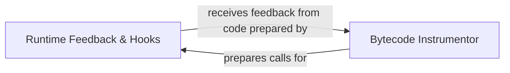

## Details

The `Runtime Feedback & Hooks` subsystem is a critical part of Atheris, embodying the feedback loop essential for coverage-guided fuzzing. It primarily consists of two tightly coupled components: the `Runtime Feedback & Hooks` itself, which processes and manages runtime data, and the `Bytecode Instrumentor`, which prepares the target for this data collection.

### Runtime Feedback & Hooks [[Expand]](./Runtime_Feedback_Hooks.md)
This component serves as the central processing unit for all runtime feedback generated by the instrumented code. It manages both Python-level callbacks and interfaces with underlying C/C++ callback mechanisms. Its responsibilities include pattern matching (e.g., for string comparisons), collecting coverage information, and providing this feedback to the fuzzer. It is the primary mechanism through which the fuzzer receives dynamic execution insights.

**Related Classes/Methods**:

- <a href="https://github.com/google/atheris/blob/master/src/function_hooks.py" target="_blank" rel="noopener noreferrer">`src/function_hooks.py:_compile_hook`</a>
- <a href="https://github.com/google/atheris/blob/master/src/function_hooks.py" target="_blank" rel="noopener noreferrer">`src/function_hooks.py:add`</a>
- <a href="https://github.com/google/atheris/blob/master/src/function_hooks.py" target="_blank" rel="noopener noreferrer">`src/function_hooks.py:gen_match`</a>
- <a href="https://github.com/google/atheris/blob/master/src/function_hooks.py" target="_blank" rel="noopener noreferrer">`src/function_hooks.py:gen_match_recursive`</a>

### Bytecode Instrumentor
This component is responsible for modifying the Python bytecode of the target program. It strategically injects calls to the `Runtime Feedback & Hooks` component's functions at relevant points (e.g., around string operations or function entries/exits). This automated instrumentation is crucial for enabling the collection of runtime feedback without requiring manual modification of the target's source code, thereby making the fuzzing process scalable and efficient.

**Related Classes/Methods**:

- <a href="https://github.com/google/atheris/blob/master/src/instrument_bytecode.py" target="_blank" rel="noopener noreferrer">`src/instrument_bytecode.py:_generate_hook_str_invocation`</a>
- <a href="https://github.com/google/atheris/blob/master/src/instrument_bytecode.py" target="_blank" rel="noopener noreferrer">`src/instrument_bytecode.py:trace_str_flow`</a>

### [FAQ](https://github.com/CodeBoarding/GeneratedOnBoardings/tree/main?tab=readme-ov-file#faq)