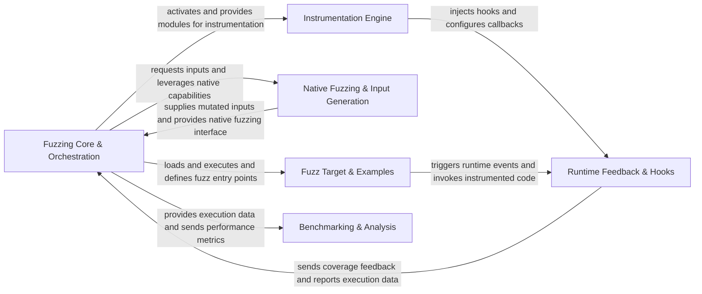

## Details

The Atheris fuzzing framework operates around a central **Fuzzing Core & Orchestration** component, which manages the overall fuzzing campaign. This core component initiates the fuzzing loop, orchestrates input generation, and coordinates with other modules. It interacts with the **Instrumentation Engine** to dynamically inject tracing and coverage hooks into the Python bytecode of the target application. During execution, the instrumented code triggers callbacks managed by the **Runtime Feedback & Hooks** component, which collects coverage information and reports execution data back to the Fuzzing Core. For input generation, the Fuzzing Core leverages the **Native Fuzzing & Input Generation** component, which integrates with native fuzzing libraries like libFuzzer and libprotobuf-mutator to generate and mutate inputs based on feedback. Users define their code under test within the **Fuzz Target & Examples** component, which provides the entry points for fuzzing and interacts with the Runtime Feedback & Hooks during execution. Finally, the **Benchmarking & Analysis** component receives execution data and performance metrics from the Fuzzing Core to evaluate the efficiency of fuzzing campaigns. This architecture ensures a clear data flow from input generation and code instrumentation through execution, feedback collection, and performance analysis, making it suitable for both detailed documentation and visual diagram generation.

### Fuzzing Core & Orchestration [[Expand]](./Fuzzing_Core_Orchestration.md)
The central control unit managing the fuzzing loop, campaign initialization, and coordination between all other components. It orchestrates input generation, target execution, and feedback processing.

**Related Classes/Methods**:

- <a href="https://github.com/google/atheris/blob/master/atheris_no_libfuzzer.py" target="_blank" rel="noopener noreferrer">`atheris_no_libfuzzer.py`</a>
- <a href="https://github.com/google/atheris/blob/master/src/__init__.py" target="_blank" rel="noopener noreferrer">`src/__init__.py`</a>

### Instrumentation Engine [[Expand]](./Instrumentation_Engine.md)
Responsible for dynamically modifying Python bytecode to inject tracing and coverage hooks, and intercepting module imports to ensure target code is instrumented before execution.

**Related Classes/Methods**:

- <a href="https://github.com/google/atheris/blob/master/src/instrument_bytecode.py" target="_blank" rel="noopener noreferrer">`src/instrument_bytecode.py`</a>
- <a href="https://github.com/google/atheris/blob/master/src/version_dependent.py" target="_blank" rel="noopener noreferrer">`src.version_dependent.py`</a>
- <a href="https://github.com/google/atheris/blob/master/src/import_hook.py" target="_blank" rel="noopener noreferrer">`src/import_hook.py`</a>

### Runtime Feedback & Hooks [[Expand]](./Runtime_Feedback_Hooks.md)
Manages the C/C++ callbacks and Python functions invoked by instrumented code, collecting coverage information and interacting with the underlying fuzzer.

**Related Classes/Methods**:

- <a href="https://github.com/google/atheris/blob/master/src/function_hooks.py" target="_blank" rel="noopener noreferrer">`src/function_hooks.py`</a>

### Native Fuzzing & Input Generation [[Expand]](./Native_Fuzzing_Input_Generation.md)
Handles the integration of native fuzzing libraries (like libFuzzer and libprotobuf-mutator) and is responsible for generating and mutating inputs based on feedback.

**Related Classes/Methods**:

- <a href="https://github.com/google/atheris/blob/master/contrib/libprotobuf_mutator/atheris_libprotobuf_mutator/mutator.cc" target="_blank" rel="noopener noreferrer">`contrib/libprotobuf_mutator/atheris_libprotobuf_mutator/mutator.cc`</a>
- <a href="https://github.com/google/atheris/blob/master/contrib/libprotobuf_mutator/atheris_libprotobuf_mutator/helpers.py" target="_blank" rel="noopener noreferrer">`contrib/libprotobuf_mutator/atheris_libprotobuf_mutator/helpers.py`</a>

### Fuzz Target & Examples
Provides the framework and demonstrative implementations for users to define their specific code under test and integrate it with Atheris.

**Related Classes/Methods**:

- <a href="https://github.com/google/atheris/blob/master/example_fuzzers/idna_fuzzer/idna_acceptance_fuzzer.py" target="_blank" rel="noopener noreferrer">`example_fuzzers/idna_fuzzer/idna_acceptance_fuzzer.py`</a>
- <a href="https://github.com/google/atheris/blob/master/example_fuzzers/json_fuzzer/json_differential_fuzzer.py" target="_blank" rel="noopener noreferrer">`example_fuzzers/json_fuzzer/json_differential_fuzzer.py`</a>

### Benchmarking & Analysis
Focuses on measuring the performance of fuzzing campaigns and analyzing execution statistics to evaluate fuzzer efficiency.

**Related Classes/Methods**:

- <a href="https://github.com/google/atheris/blob/master/src/benchmark/executions.py" target="_blank" rel="noopener noreferrer">`src/benchmark/executions.py`</a>

### [FAQ](https://github.com/CodeBoarding/GeneratedOnBoardings/tree/main?tab=readme-ov-file#faq)