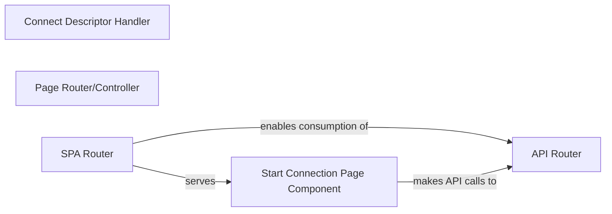

## Details

The application's architecture is centered around serving different types of content and handling API interactions. The `Connect Descriptor Handler` provides the essential descriptor file for Atlassian product integration. Dynamic server-rendered pages are managed by the `Page Router/Controller`, while the `SPA Router` is responsible for serving the client-side Single Page Application and its assets. The `API Router` provides the backend's RESTful interface, enabling the SPA and other services to interact with the application's data and business logic. The `Start Connection Page Component`, a client-side entity within the SPA, leverages the `API Router` to establish connections.

### Connect Descriptor Handler
Serves the `atlassian-connect.json` descriptor file, which is essential for Atlassian products to discover and integrate with the application's capabilities and defined modules (e.g., webhooks, general pages, API scopes).

**Related Classes/Methods**:

- <a href="https://github.com/atlassian/atlassian-connect-example-app-node/blob/main/src/routes/atlassian-connect.ts#L4-L6" target="_blank" rel="noopener noreferrer">`connectDescriptorGet`:4-6</a>

### Page Router/Controller
Manages the rendering of dynamic HTML pages (e.g., configuration, webhook logs) that are displayed within the Atlassian product's iframe. It orchestrates data retrieval and content processing for these server-rendered views.

**Related Classes/Methods**:

- <a href="https://github.com/atlassian/atlassian-connect-example-app-node/blob/main/src/routes/atlassian-connect.ts#L112-L223" target="_blank" rel="noopener noreferrer">`pages`:112-223</a>

### SPA Router
Handles the serving of the Single Page Application (SPA) assets (HTML, CSS, JavaScript bundles) and manages client-side routing. It acts as the entry point for the client-side application, ensuring the correct SPA view is loaded.

**Related Classes/Methods**:

- <a href="https://github.com/atlassian/atlassian-connect-example-app-node/blob/main/src/routes/spa.ts" target="_blank" rel="noopener noreferrer">`spaRouter`</a>

### API Router
Exposes and manages various RESTful API endpoints for the application. It allows the frontend (SPA) and potentially other external services to interact with the backend data and business logic.

**Related Classes/Methods**:

- <a href="https://github.com/atlassian/atlassian-connect-example-app-node/blob/main/src/routes/api.ts" target="_blank" rel="noopener noreferrer">`apiRouter`</a>

### Start Connection Page Component
A client-side component, part of the Single Page Application (SPA) served by the `SPA Router`, responsible for initiating connections and interacting with the backend API. Its source code is embedded within the SPA's static assets (e.g., JavaScript bundles) served from `spa/build/static` and `spa/build/index.html`.

**Related Classes/Methods**: _None_

### [FAQ](https://github.com/CodeBoarding/GeneratedOnBoardings/tree/main?tab=readme-ov-file#faq)