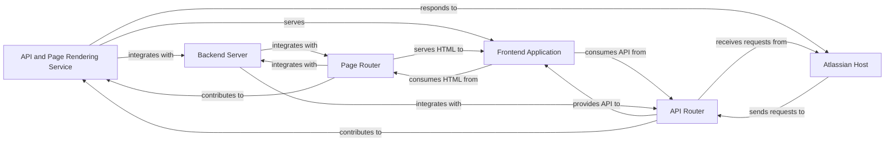

## Details

This project, `atlassian-connect-example-app-node`, is an Atlassian Connect application built with Node.js and Express.js. It serves as an example of how to integrate with Atlassian products like Jira or Confluence. The application handles incoming requests from the Atlassian host, renders dynamic pages, exposes RESTful APIs, and interacts with a frontend React application. The core functionality revolves around serving content and APIs to the Atlassian host and a single-page application (SPA).

### API and Page Rendering Service [[Expand]](./API_and_Page_Rendering_Service.md)
Exposes RESTful APIs for the frontend and dynamically serves HTML pages, acting as the primary interface for the Atlassian Connect app's web presence.

**Related Classes/Methods**:

- <a href="https://github.com/atlassian/atlassian-connect-example-app-node/blob/main/src/routes/pages.ts#L1-L9999" target="_blank" rel="noopener noreferrer">`src/routes/pages.ts`:1-9999</a>
- <a href="https://github.com/atlassian/atlassian-connect-example-app-node/blob/main/src/routes/api.ts#L1-L9999" target="_blank" rel="noopener noreferrer">`src/routes/api.ts`:1-9999</a>

### Page Router
Handles HTTP GET requests for base paths (e.g., `/`, `/hello-world`), renders and serves the main HTML page (e.g., `index.hbs`) that hosts the React frontend application, and ensures proper context for Atlassian Connect app's iframe embedding.

**Related Classes/Methods**:

- <a href="https://github.com/atlassian/atlassian-connect-example-app-node/blob/main/src/routes/pages.ts#L1-L9999" target="_blank" rel="noopener noreferrer">`src/routes/pages.ts`:1-9999</a>

### API Router
Defines and manages various RESTful API endpoints (e.g., `/api/hello-world`), processes incoming API requests from the `Frontend Application`, may handle specific Atlassian Connect lifecycle events or webhooks, and performs data retrieval or business logic execution.

**Related Classes/Methods**:

- <a href="https://github.com/atlassian/atlassian-connect-example-app-node/blob/main/src/routes/api.ts#L1-L9999" target="_blank" rel="noopener noreferrer">`src/routes/api.ts`:1-9999</a>

### Frontend Application [[Expand]](./Frontend_Application.md)
The client-side application (React SPA) that consumes HTML pages and RESTful APIs provided by the `API and Page Rendering Service`.

**Related Classes/Methods**:

- <a href="https://github.com/atlassian/atlassian-connect-example-app-node/blob/main/spa/src/App.tsx#L1-L9999" target="_blank" rel="noopener noreferrer">`spa/src/App.tsx`:1-9999</a>

### Atlassian Host
The Atlassian platform (e.g., Jira, Confluence) that interacts with the `API and Page Rendering Service`, sending module rendering requests and potentially webhooks.

**Related Classes/Methods**: _None_

### Backend Server
The broader Express.js application instance that integrates with the `API and Page Rendering Service` components, providing middleware, shared infrastructure, and overall application hosting.

**Related Classes/Methods**: _None_

### [FAQ](https://github.com/CodeBoarding/GeneratedOnBoardings/tree/main?tab=readme-ov-file#faq)