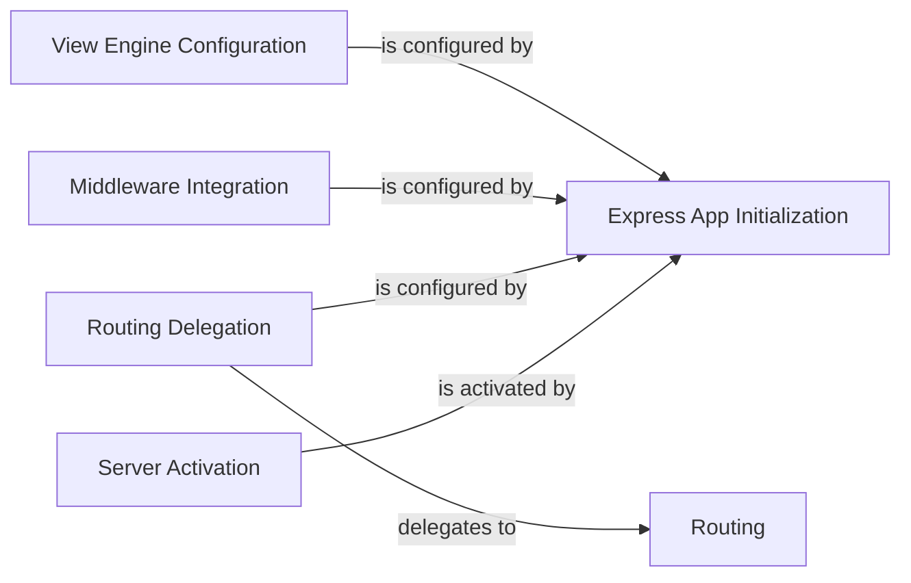

## Details

One paragraph explaining the functionality which is represented by this graph. What the main flow is and what is its purpose.

### Express App Initialization
The foundational component that creates the main Express application instance. All subsequent configurations are applied to this instance.

**Related Classes/Methods**:

- <a href="https://github.com/atlassian/atlassian-connect-example-app-node/blob/main/src/server.ts" target="_blank" rel="noopener noreferrer">`src/server.ts`</a>

### View Engine Configuration
Configures the Squirrelly template engine for rendering dynamic HTML content. This is critical for serving the add-on's user interface within Jira iframes.

**Related Classes/Methods**:

- <a href="https://github.com/atlassian/atlassian-connect-example-app-node/blob/main/src/server.ts" target="_blank" rel="noopener noreferrer">`src/server.ts`</a>

### Middleware Integration
Applies essential global middleware for request pre-processing, such as parsing JSON bodies (express.json) and managing cache headers.

**Related Classes/Methods**:

- <a href="https://github.com/atlassian/atlassian-connect-example-app-node/blob/main/src/server.ts" target="_blank" rel="noopener noreferrer">`src/server.ts`</a>

### Routing Delegation
Connects the server configuration to the request-handling logic by registering the main RootRouter. This decouples setup from application logic.

**Related Classes/Methods**:

- <a href="https://github.com/atlassian/atlassian-connect-example-app-node/blob/main/src/server.ts" target="_blank" rel="noopener noreferrer">`src/server.ts`</a>

### Routing
The central hub for directing incoming requests. It receives all traffic from the server and passes it to the appropriate route handlers.

**Related Classes/Methods**:

- <a href="https://github.com/atlassian/atlassian-connect-example-app-node/blob/main/src/routes/router.ts" target="_blank" rel="noopener noreferrer">`src/routes/router.ts`</a>

### Server Activation
The final component in the setup process. It starts the HTTP server, binding it to a port and enabling it to accept network requests.

**Related Classes/Methods**:

- <a href="https://github.com/atlassian/atlassian-connect-example-app-node/blob/main/src/server.ts" target="_blank" rel="noopener noreferrer">`src/server.ts`</a>

### [FAQ](https://github.com/CodeBoarding/GeneratedOnBoardings/tree/main?tab=readme-ov-file#faq)