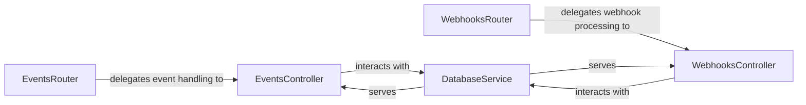

## Details

The main flow of the application revolves around handling incoming events and webhooks from Atlassian products. The EventsRouter and WebhooksRouter act as the initial entry points, directing requests to their respective controllers. The EventsController processes Atlassian Connect lifecycle events, while the WebhooksController handles Jira webhooks. Both controllers rely on the DatabaseService to persist and retrieve data, ensuring that tenant installations and webhook data are properly managed.

Critical interaction pathways include the routers delegating to their controllers, and the controllers interacting with the DatabaseService for data persistence. The DatabaseService serves both the EventsController and WebhooksController, providing a centralized mechanism for database operations.

This architecture effectively separates concerns, with routers handling routing, controllers managing business logic, and the DatabaseService abstracting database interactions. This modular design promotes maintainability and scalability for the Atlassian Connect example application.

### EventsRouter
Defines and manages the API routes for Atlassian Connect lifecycle events. It acts as the initial entry point for these events, directing incoming requests to the appropriate controller for processing.

**Related Classes/Methods**:

- <a href="https://github.com/atlassian/atlassian-connect-example-app-node/blob/main/src/routes/events.ts" target="_blank" rel="noopener noreferrer">`EventsRouter`</a>

### EventsController
Encapsulates the business logic for processing Atlassian Connect lifecycle events. This includes tasks such as registering new tenants upon installation, updating tenant status, or cleaning up data upon uninstallation.

**Related Classes/Methods**:

- <a href="https://github.com/atlassian/atlassian-connect-example-app-node/blob/main/src/routes/events.ts" target="_blank" rel="noopener noreferrer">`EventsController`</a>

### WebhooksRouter
Manages the routing of incoming webhooks from Jira. It defines the specific endpoints that Jira will call for various events (e.g., issue creation, updates), forwarding these requests to the designated controller.

**Related Classes/Methods**:

- <a href="https://github.com/atlassian/atlassian-connect-example-app-node/blob/main/src/routes/webhooks.ts" target="_blank" rel="noopener noreferrer">`WebhooksRouter`</a>

### WebhooksController
Implements the business logic for handling and processing data received from Jira webhooks. Its primary function is to extract relevant information from the webhook payload and perform actions such as logging the data or triggering further application processes.

**Related Classes/Methods**:

- <a href="https://github.com/atlassian/atlassian-connect-example-app-node/blob/main/src/routes/webhooks.ts" target="_blank" rel="noopener noreferrer">`WebhooksController`</a>

### DatabaseService
Provides an abstraction layer for database operations, specifically for managing tenant installations (from lifecycle events) and logging/storing data from Jira webhooks. It ensures data persistence for the event and webhook handlers.

**Related Classes/Methods**:

- <a href="https://github.com/atlassian/atlassian-connect-example-app-node/blob/main/src/db.ts" target="_blank" rel="noopener noreferrer">`DatabaseService`</a>

### [FAQ](https://github.com/CodeBoarding/GeneratedOnBoardings/tree/main?tab=readme-ov-file#faq)