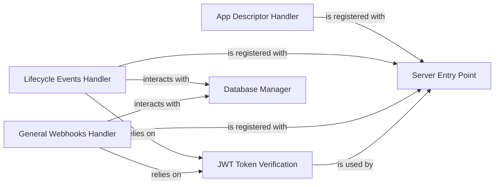

## Details

The project is an Atlassian Connect example application built with Node.js. Its core functionality revolves around handling interactions with Atlassian products, primarily through webhooks and serving an application descriptor. The application uses a server entry point (`src/server.ts`) to register various routes, including those for the app descriptor, lifecycle events, and general webhooks. JWT token verification is a critical security mechanism employed for authenticating incoming requests from Atlassian products, ensuring the integrity and authenticity of communications. The application also incorporates business logic to process these events and interact with a database (`src/db.ts`) for persistent storage of tenant-specific information.

### Server Entry Point
The main application entry point, responsible for initializing the server, configuring middleware, and registering routes.

**Related Classes/Methods**:

- <a href="https://github.com/atlassian/atlassian-connect-example-app-node/blob/main/src/server.ts#L1-L1000" target="_blank" rel="noopener noreferrer">`src/server.ts`:1-1000</a>

### App Descriptor Handler
Serves the `atlassian-connect.json` descriptor file, which is essential for Atlassian products to discover and understand the app's capabilities.

**Related Classes/Methods**:

- <a href="https://github.com/atlassian/atlassian-connect-example-app-node/blob/main/src/routes/atlassian-connect.ts#L1-L1000" target="_blank" rel="noopener noreferrer">`src/routes/atlassian-connect.ts`:1-1000</a>

### Lifecycle Events Handler
Manages the application's lifecycle events (e.g., `installed`, `uninstalled`) received via webhooks from Atlassian products. It typically stores tenant-specific information.

**Related Classes/Methods**:

- <a href="https://github.com/atlassian/atlassian-connect-example-app-node/blob/main/src/routes/events.ts#L1-L1000" target="_blank" rel="noopener noreferrer">`src/routes/events.ts`:1-1000</a>

### General Webhooks Handler
Processes other specific webhooks configured in the `atlassian-connect.json` descriptor, allowing the app to react to events within Atlassian products.

**Related Classes/Methods**:

- <a href="https://github.com/atlassian/atlassian-connect-example-app-node/blob/main/src/routes/webhooks.ts#L1-L1000" target="_blank" rel="noopener noreferrer">`src/routes/webhooks.ts`:1-1000</a>

### JWT Token Verification
Provides middleware for authenticating incoming requests from Atlassian products using JWTs.

**Related Classes/Methods**:

- <a href="https://github.com/atlassian/atlassian-connect-example-app-node/blob/main/src/middlewares/auth-header-jwt-middleware.ts#L1-L1000" target="_blank" rel="noopener noreferrer">`src/middlewares/auth-header-jwt-middleware.ts`:1-1000</a>
- <a href="https://github.com/atlassian/atlassian-connect-example-app-node/blob/main/src/middlewares/querystring-jwt-middleware.ts#L1-L1000" target="_blank" rel="noopener noreferrer">`src/middlewares/querystring-jwt-middleware.ts`:1-1000</a>
- <a href="https://github.com/atlassian/atlassian-connect-example-app-node/blob/main/src/utils/jwt.ts#L1-L1000" target="_blank" rel="noopener noreferrer">`src/utils/jwt.ts`:1-1000</a>

### Database Manager
Handles interactions with the application's database for storing and retrieving persistent data, such as tenant information.

**Related Classes/Methods**:

- <a href="https://github.com/atlassian/atlassian-connect-example-app-node/blob/main/src/db.ts#L1-L1000" target="_blank" rel="noopener noreferrer">`src/db.ts`:1-1000</a>

### [FAQ](https://github.com/CodeBoarding/GeneratedOnBoardings/tree/main?tab=readme-ov-file#faq)