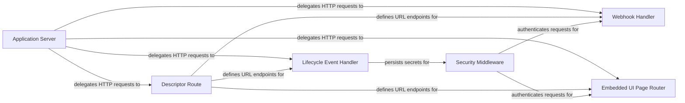

## Details

The subsystem is a Node.js Express application designed to function as an Atlassian Connect add-on for Jira. Its boundaries are defined by the REST API it exposes, which is consumed by the Atlassian Jira host. The primary interactions include the initial installation handshake, lifecycle event callbacks, webhook processing, and the rendering of embedded UI pages within the Jira interface.

### Application Server [[Expand]](./Application_Server.md)
The main entry point of the application. It initializes the Express server, configures middleware, and mounts all subsystem routes. It acts as the central dispatcher, delegating incoming HTTP requests to the appropriate routing components.

**Related Classes/Methods**: _None_

### Descriptor Route
A dedicated route that dynamically generates and serves the `atlassian-connect.json` descriptor. This descriptor is a JSON object that defines the contract between the add-on and Jira, declaring all modules, permissions, and callback URLs. The source code reveals that `connectAppDescriptor` is a large, statically-defined JavaScript object within `src/routes/atlassian-connect.ts`, which is then serialized and served as JSON.

**Related Classes/Methods**:

- <a href="https://github.com/atlassian/atlassian-connect-example-app-node/blob/main/src/routes/atlassian-connect.ts#L11-L246" target="_blank" rel="noopener noreferrer">`connectAppDescriptor`:11-246</a>

### Lifecycle Event Handler
Manages the critical `installed` and `uninstalled` webhooks from Jira. Its primary role is to securely receive and store the host details and shared secret required for authentication. It is triggered by `installed` and `uninstalled` events defined in the descriptor.

**Related Classes/Methods**: _None_

### Security Middleware
Intercepts and authenticates all incoming requests from Jira by verifying the JSON Web Token (JWT) signature using the stored shared secret. This is the gatekeeper for all protected resources. It uses the secret stored by the Lifecycle Event Handler to validate JWTs on incoming requests for webhooks and UI pages.

**Related Classes/Methods**: _None_

### Webhook Handler
Processes asynchronous webhooks from Jira (e.g., `jira:issue_created`). It allows the application to react to events and data changes within the Atlassian host. It listens for and processes business-level events from Jira, such as issue updates, allowing the app to perform actions based on user activity in Jira.

**Related Classes/Methods**: _None_

### Embedded UI Page Router
Renders the application's user interface, which is displayed within iframes inside Jira. It handles requests for pages and panels defined in the add-on descriptor. It serves HTML pages that are rendered inside iframes within the Jira UI, providing the user-facing part of the add-on.

**Related Classes/Methods**: _None_

### [FAQ](https://github.com/CodeBoarding/GeneratedOnBoardings/tree/main?tab=readme-ov-file#faq)