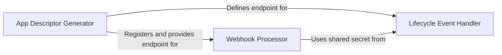

## Details

One paragraph explaining the functionality which is represented by this graph. What the main flow is and what is its purpose.

### App Descriptor Generator
Generates and serves the `atlassian-connect.json` manifest. This file is the single source of truth for the Atlassian host, defining the app's identity, authentication, permissions (scopes), and all its modules, including lifecycle and webhook endpoints.

**Related Classes/Methods**:

- <a href="https://github.com/atlassian/atlassian-connect-example-app-node/blob/main/src/routes/pages.ts#L9-L13" target="_blank" rel="noopener noreferrer">`connectAppDescriptor`:9-13</a>
- `connectDescriptorGet`

### Lifecycle Event Handler
Manages the application's installation state by processing `installed` and `uninstalled` lifecycle callbacks from the Atlassian host. It is responsible for provisioning and de-provisioning tenant-specific data, such as authentication secrets.

**Related Classes/Methods**:

- `eventsRouter`

### Webhook Processor
Authenticates, receives, and processes real-time data notifications from Jira, as defined in the app descriptor. This component contains the core logic for reacting to events within the host product, such as issue creation or updates.

**Related Classes/Methods**:

- <a href="https://github.com/atlassian/atlassian-connect-example-app-node/blob/main/src/routes/webhooks.ts#L10-L17" target="_blank" rel="noopener noreferrer">`webhooksRouter`:10-17</a>

### [FAQ](https://github.com/CodeBoarding/GeneratedOnBoardings/tree/main?tab=readme-ov-file#faq)