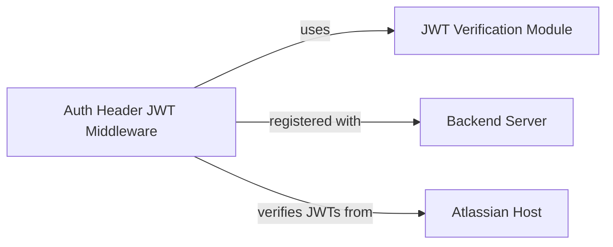

## Details

The system's security architecture is centered around JWT-based authentication. The `Atlassian Host` initiates secure communication by issuing JWTs. These tokens are then sent with requests to the `Backend Server`. Upon receiving a request, the `Auth Header JWT Middleware` acts as the primary gatekeeper, extracting the JWT and delegating its validation to the `JWT Verification Module`. This module performs the cryptographic heavy lifting, ensuring the token's authenticity and integrity. If the JWT is valid, the request is allowed to proceed to the `Backend Server`'s intended functionality; otherwise, it is rejected, thereby enforcing secure access control for the application's resources.

### JWT Verification Module
This module encapsulates the core logic for handling JSON Web Tokens (JWTs). It is responsible for decoding, verifying signatures, and validating claims (e.g., issuer, expiration) of JWTs, specifically those issued by the Atlassian Host. It provides the foundational cryptographic and parsing capabilities required for JWT processing, supporting both symmetric and asymmetric verification methods.

**Related Classes/Methods**:

- <a href="https://github.com/atlassian/atlassian-connect-example-app-node/blob/main/src/utils/jwt.ts" target="_blank" rel="noopener noreferrer">`verifySymmetricJWTToken`</a>
- <a href="https://github.com/atlassian/atlassian-connect-example-app-node/blob/main/src/utils/jwt.ts" target="_blank" rel="noopener noreferrer">`verifyAsymmetricJWTToken`</a>

### Auth Header JWT Middleware
This component implements Express.js middleware functions. It acts as an interceptor for incoming HTTP requests, specifically targeting the `Authorization` header to extract and process Atlassian-issued JWTs. It orchestrates the authentication and authorization flow by invoking the `JWT Verification Module` for token validation and then allowing or denying access based on the validation outcome.

**Related Classes/Methods**:

- <a href="https://github.com/atlassian/atlassian-connect-example-app-node/blob/main/src/middlewares/auth-header-jwt-middleware.ts" target="_blank" rel="noopener noreferrer">`authHeaderSymmetricJwtMiddleware`</a>
- <a href="https://github.com/atlassian/atlassian-connect-example-app-node/blob/main/src/middlewares/auth-header-jwt-middleware.ts" target="_blank" rel="noopener noreferrer">`authHeaderAsymmetricJwtMiddleware`</a>

### Backend Server
This represents the main application server that exposes API endpoints. It registers and utilizes the `Auth Header JWT Middleware` to protect its routes, ensuring that only authenticated requests with valid JWTs are processed.

**Related Classes/Methods**: _None_

### Atlassian Host
This represents the external Atlassian platform (e.g., Jira, Confluence) that interacts with the application. It is responsible for issuing JWTs to the application, which are then used by the `Auth Header JWT Middleware` for authentication.

**Related Classes/Methods**: _None_

### [FAQ](https://github.com/CodeBoarding/GeneratedOnBoardings/tree/main?tab=readme-ov-file#faq)