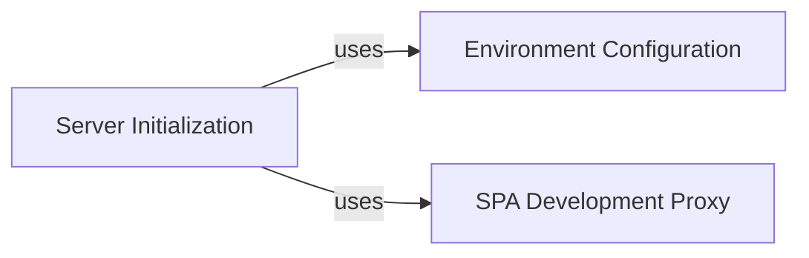

## Details

The Backend Server Core subsystem is primarily defined by the core server setup and configuration files. Its boundaries encompass the main Express server initialization, environment variable management, and development-time frontend proxying.

### Server Initialization
This component is the heart of the backend server. It initializes the Express application, configures global middleware, and sets up the main request dispatching mechanism. It acts as the central entry point for all incoming HTTP requests, routing them to appropriate handlers.

**Related Classes/Methods**:

- <a href="https://github.com/atlassian/atlassian-connect-example-app-node/blob/main/src/server.ts" target="_blank" rel="noopener noreferrer">`src/server.ts`</a>

### Environment Configuration
Responsible for loading and exposing environment variables required by the application. This ensures that sensitive information and configurable parameters (like PORT, NODE_ENV, ATLASSIAN_CONNECT_BASE_URL) are managed externally and securely.

**Related Classes/Methods**:

- <a href="https://github.com/atlassian/atlassian-connect-example-app-node/blob/main/src/env.ts" target="_blank" rel="noopener noreferrer">`src/env.ts`</a>

### SPA Development Proxy
During the development phase, this component acts as a proxy for requests targeting the frontend Single Page Application (SPA). It forwards requests to the local frontend development server, enabling the backend and frontend to run on separate ports while maintaining a unified origin for browser interactions.

**Related Classes/Methods**:

- <a href="https://github.com/atlassian/atlassian-connect-example-app-node/blob/main/src/spa-proxy.ts" target="_blank" rel="noopener noreferrer">`src/spa-proxy.ts`</a>

### [FAQ](https://github.com/CodeBoarding/GeneratedOnBoardings/tree/main?tab=readme-ov-file#faq)