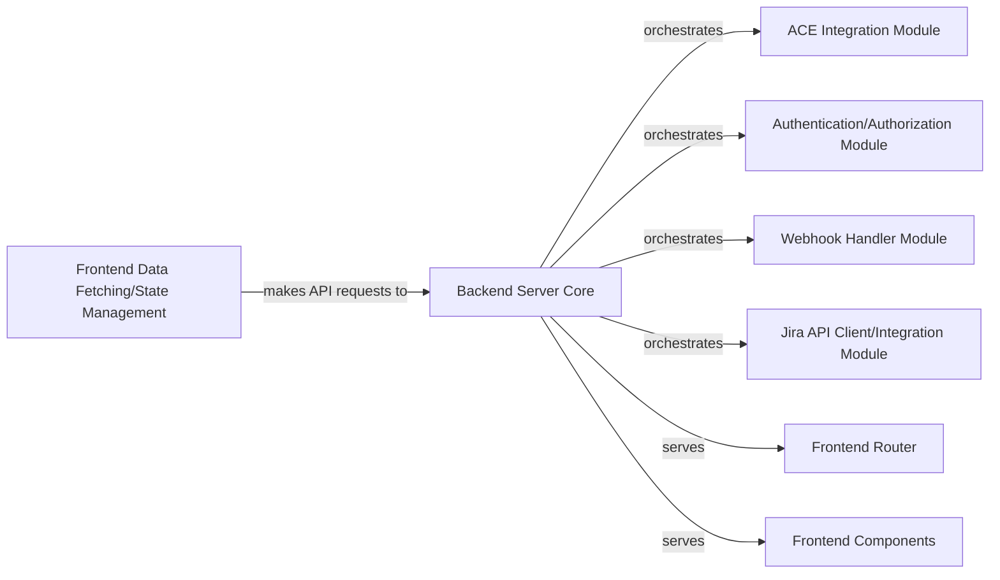

## Details

This project is an Atlassian Connect example application built with Node.js (Express) for the backend and React for the frontend. The backend serves as the core application server, managing API routes, handling Atlassian Connect lifecycle events, and interacting with Jira. The frontend provides a single-page application interface, consuming data from the backend and enabling user interaction. The application demonstrates how to integrate with Atlassian products using the Atlassian Connect framework.

### Backend Server Core [[Expand]](./Backend_Server_Core.md)
The core Express.js server responsible for initializing the application, configuring essential middleware, defining and managing API routes, and serving static frontend assets. It acts as the central orchestrator for incoming requests, directing them to appropriate handlers and integrating various backend modules.

**Related Classes/Methods**:

- <a href="https://github.com/atlassian/atlassian-connect-example-app-node/blob/main/src/server.ts" target="_blank" rel="noopener noreferrer">`src/server.ts`</a>

### ACE Integration Module
Handles Atlassian Connect Express (ACE) framework specifics, including lifecycle events (install, uninstall), descriptor serving, and JWT authentication middleware. It ensures the application correctly integrates with the Atlassian platform.

**Related Classes/Methods**:

- <a href="https://github.com/atlassian/atlassian-connect-example-app-node/blob/main/src/routes/router.ts" target="_blank" rel="noopener noreferrer">`src/routes/router.ts`</a>

### Authentication/Authorization Module
Manages user authentication, primarily JWT validation for Atlassian Connect requests, and authorization checks for API endpoints to secure backend resources.

**Related Classes/Methods**:

- <a href="https://github.com/atlassian/atlassian-connect-example-app-node/blob/main/src/routes/router.ts" target="_blank" rel="noopener noreferrer">`src/routes/router.ts`</a>

### Webhook Handler Module
Responsible for receiving, validating, and processing webhooks sent from Jira, triggering appropriate backend logic based on the event.

**Related Classes/Methods**:

- <a href="https://github.com/atlassian/atlassian-connect-example-app-node/blob/main/src/routes/router.ts" target="_blank" rel="noopener noreferrer">`src/routes/router.ts`</a>

### Jira API Client/Integration Module
Encapsulates logic for making API calls to Jira, handling authentication, request formatting, and response parsing.

**Related Classes/Methods**:

- <a href="https://github.com/atlassian/atlassian-connect-example-app-node/blob/main/src/routes/router.ts" target="_blank" rel="noopener noreferrer">`src/routes/router.ts`</a>

### Frontend Router
Manages client-side routing within the React Single Page Application, mapping URLs to specific React components and handling navigation.

**Related Classes/Methods**:

- <a href="https://github.com/atlassian/atlassian-connect-example-app-node/blob/main/spa/src/App.tsx" target="_blank" rel="noopener noreferrer">`spa/src/App.tsx`</a>

### Frontend Components
Individual UI building blocks (React components) that render the user interface, display data, and capture user input.

**Related Classes/Methods**:

- <a href="https://github.com/atlassian/atlassian-connect-example-app-node/blob/main/spa/src/components/" target="_blank" rel="noopener noreferrer">`spa/src/components/`</a>

### Frontend Data Fetching/State Management
Handles fetching data from the backend API, managing the application's state, and ensuring data consistency across components.

**Related Classes/Methods**:

- <a href="https://github.com/atlassian/atlassian-connect-example-app-node/blob/main/spa/src/pagesData/startConnectionData.tsx" target="_blank" rel="noopener noreferrer">`spa/src/pagesData/startConnectionData.tsx`</a>

### [FAQ](https://github.com/CodeBoarding/GeneratedOnBoardings/tree/main?tab=readme-ov-file#faq)