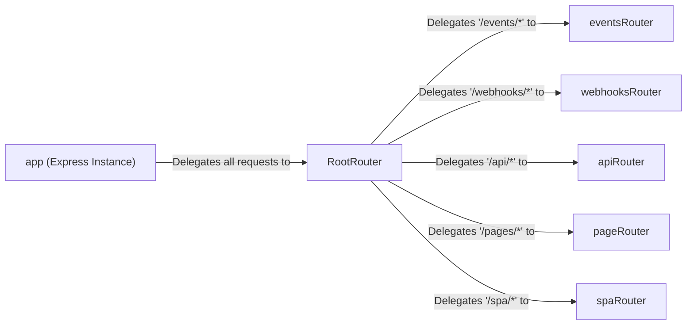

## Details

The project follows a standard Express.js web application architecture, with a clear separation of concerns in its routing mechanism. The main application entry point is `src/server.ts`, which initializes the Express app, sets up middleware, and starts the server. All incoming requests are first handled by a `RootRouter` defined in `src/routes/router.ts`. This central router acts as a dispatcher, delegating requests to specialized sub-routers based on the URL path. For instance, lifecycle events like app installation are handled by `eventsRouter` (`src/routes/events.ts`), general product webhooks by `webhooksRouter` (`src/routes/webhooks.ts`), and frontend API calls by `apiRouter` (`src/routes/api.ts`). This modular routing structure makes the application easy to maintain and extend.

### app (Express Instance)
The top-level Express application. It initializes middleware, sets up the view engine, and starts the HTTP server, acting as the container for all other backend components.

**Related Classes/Methods**:

- `src/server.ts`

### RootRouter
The master router that serves as the primary entry point for all requests from the app. It delegates traffic to specialized sub-routers based on the request path.

**Related Classes/Methods**:

- `src/routes/router.ts`

### eventsRouter
Handles critical Atlassian Connect lifecycle webhooks, such as `installed` and `uninstalled`. This is fundamental for managing the plugin's state within Jira.

**Related Classes/Methods**:

- `src/routes/events.ts`

### webhooksRouter
Processes webhooks from Jira that are not related to the installation lifecycle, such as issue updates or project changes. This enables the app to react to events in the host product.

**Related Classes/Methods**:

- `src/routes/webhooks.ts`

### apiRouter
Provides a RESTful API for the frontend application. It handles data retrieval and manipulation requests initiated by the user interface.

**Related Classes/Methods**:

- `src/routes/api.ts`

### pageRouter
Serves server-rendered HTML pages. These are often used for specific UI integration points within Jira, like custom panels or configuration screens.

**Related Classes/Methods**:

- `src/routes/pages.ts`

### spaRouter
Serves the main Single Page Application (SPA), which constitutes the primary user interface for the plugin.

**Related Classes/Methods**:

- `src/routes/spa.ts`

### [FAQ](https://github.com/CodeBoarding/GeneratedOnBoardings/tree/main?tab=readme-ov-file#faq)