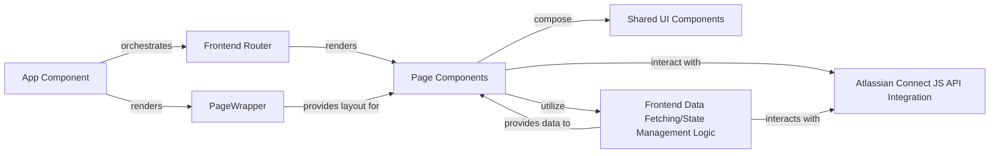

## Details

The project's frontend architecture, built with React, centers around a clear separation of concerns. The `App` component serves as the application's entry point, orchestrating routing via `BrowserRouter` and rendering the main layout provided by `PageWrapper`. Page-specific logic and data integration are handled by `Page Components` like `StartConnection`, which compose `Shared UI Components` for their visual elements and interact with `Frontend Data Fetching/State Management Logic` to retrieve and manage data. The `Atlassian Connect JS API Integration` component provides the necessary interface for the application to communicate with the Jira host environment, enabling functionalities like context retrieval and authenticated requests.

### App Component
The root component of the React application, responsible for initializing the application, setting up client-side routing, and defining the overall layout structure. It acts as the primary orchestrator for the frontend.

**Related Classes/Methods**:

- <a href="https://github.com/atlassian/atlassian-connect-example-app-node/blob/main/spa/src/App.tsx" target="_blank" rel="noopener noreferrer">`App`</a>

### Frontend Router
Manages client-side navigation within the SPA, mapping URL paths to specific Page Components. It ensures a seamless user experience by handling view transitions without full page reloads.

**Related Classes/Methods**:

- <a href="https://github.com/atlassian/atlassian-connect-example-app-node/blob/main/spa/src/index.tsx" target="_blank" rel="noopener noreferrer">`BrowserRouter`</a>
- <a href="https://github.com/atlassian/atlassian-connect-example-app-node/blob/main/spa/src/App.tsx" target="_blank" rel="noopener noreferrer">`App`</a>

### Page Components
High-level components that represent distinct views or screens within the application (e.g., StartConnection). They compose Shared UI Components and integrate with data fetching/state management logic to build their specific user interfaces.

**Related Classes/Methods**:

- <a href="https://github.com/atlassian/atlassian-connect-example-app-node/blob/main/spa/src/pages/StartConnection/index.tsx" target="_blank" rel="noopener noreferrer">`StartConnectionPage`</a>

### Shared UI Components
Reusable, atomic UI elements (e.g., buttons, forms, headers) that are used across multiple Page Components to ensure consistency in design and promote code reusability.

**Related Classes/Methods**:

- <a href="https://github.com/atlassian/atlassian-connect-example-app-node/blob/main/spa/src/components/ExampleComponent/index.tsx" target="_blank" rel="noopener noreferrer">`ExampleComponent`</a>
- <a href="https://github.com/atlassian/atlassian-connect-example-app-node/blob/main/spa/src/components/Requirements/index.tsx" target="_blank" rel="noopener noreferrer">`Requirements`</a>
- <a href="https://github.com/atlassian/atlassian-connect-example-app-node/blob/main/spa/src/components/SyncHeader/index.tsx" target="_blank" rel="noopener noreferrer">`SyncHeader`</a>

### PageWrapper
A common wrapper or layout component used by pages to provide a consistent structural foundation, often including common elements like headers, footers, or navigation, and ensuring proper integration with the Atlassian host environment.

**Related Classes/Methods**:

- <a href="https://github.com/atlassian/atlassian-connect-example-app-node/blob/main/spa/src/common/PageWrapper.tsx#L30-L35" target="_blank" rel="noopener noreferrer">`PageWrapper`:30-35</a>

### Atlassian Connect JS API Integration
The layer responsible for interacting with the Atlassian Connect JavaScript API (AP object) provided by the Jira host application. This enables functionalities like getting context, making authenticated requests to Jira's REST API via the host, and interacting with Jira UI elements.

**Related Classes/Methods**:

- <a href="https://github.com/atlassian/atlassian-connect-example-app-node/blob/main/spa/src/global.d.ts" target="_blank" rel="noopener noreferrer">`AP`</a>

### Frontend Data Fetching/State Management Logic
Handles the communication from the frontend to the Backend Server Core API, fetching data, and managing the local state of the frontend application. This could involve custom hooks, context API, or a dedicated state management library.

**Related Classes/Methods**:

- <a href="https://github.com/atlassian/atlassian-connect-example-app-node/blob/main/spa/src/pagesData/startConnectionData.tsx" target="_blank" rel="noopener noreferrer">`useStartConnectionData`</a>

### [FAQ](https://github.com/CodeBoarding/GeneratedOnBoardings/tree/main?tab=readme-ov-file#faq)