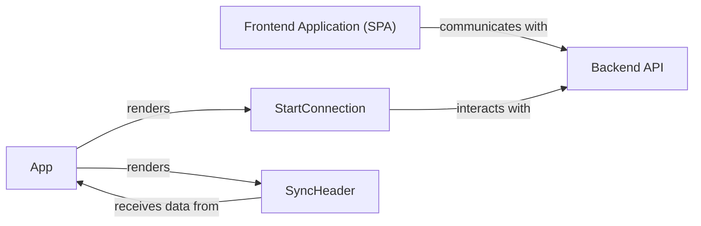

## Details

The `Frontend Application (SPA)` serves as the user's primary interface, built around the `App` component which orchestrates the overall layout and routing. The `App` component renders key sub-components like `StartConnection`, responsible for managing the connection process with Atlassian services, and `SyncHeader`, which displays real-time synchronization status. Both the `Frontend Application (SPA)` as a whole and the `StartConnection` component specifically communicate with the `Backend API` to perform necessary operations and retrieve data, forming the core interaction pathway for the application's functionality.

### Frontend Application (SPA) [[Expand]](./Frontend_Application_SPA_.md)
The overarching client-side React application. It is responsible for the entire user interface, handling user input, managing client-side state, and facilitating all interactions with the backend API. It acts as the user's direct interface to the Atlassian Connect app's functionality.

**Related Classes/Methods**:

- <a href="https://github.com/atlassian/atlassian-connect-example-app-node/blob/main/spa/src/App.tsx" target="_blank" rel="noopener noreferrer">`spa/src/App.tsx`</a>
- <a href="https://github.com/atlassian/atlassian-connect-example-app-node/blob/main/spa/src/pages/StartConnection/index.tsx" target="_blank" rel="noopener noreferrer">`spa/src/pages/StartConnection/index.tsx`</a>
- <a href="https://github.com/atlassian/atlassian-connect-example-app-node/blob/main/spa/src/components/SyncHeader/index.tsx" target="_blank" rel="noopener noreferrer">`spa/src/components/SyncHeader/index.tsx`</a>

### App
The root component of the React application. It establishes the overall layout, manages application-wide routing, and handles global state. It serves as the primary orchestrator, initializing the application and rendering top-level components based on the current route.

**Related Classes/Methods**:

- <a href="https://github.com/atlassian/atlassian-connect-example-app-node/blob/main/spa/src/App.tsx" target="_blank" rel="noopener noreferrer">`spa/src/App.tsx`</a>

### StartConnection
A dedicated page-level component responsible for managing the connection process with Atlassian services. It handles the specific UI and logic required to initiate, verify, or configure the application's connection to the Atlassian platform, often involving user authentication or authorization flows. It interacts with the Backend API to perform connection-related operations.

**Related Classes/Methods**:

- <a href="https://github.com/atlassian/atlassian-connect-example-app-node/blob/main/spa/src/pages/StartConnection/index.tsx" target="_blank" rel="noopener noreferrer">`spa/src/pages/StartConnection/index.tsx`</a>

### SyncHeader
A reusable UI component, typically displayed in the application's header. Its primary responsibility is to display real-time synchronization status or other relevant application-wide information. It receives data (e.g., sync status, user details) from parent components or global state to update its display.

**Related Classes/Methods**:

- <a href="https://github.com/atlassian/atlassian-connect-example-app-node/blob/main/spa/src/components/SyncHeader/index.tsx" target="_blank" rel="noopener noreferrer">`spa/src/components/SyncHeader/index.tsx`</a>

### Backend API
The server-side component responsible for handling requests from the Frontend Application, processing business logic, and interacting with external services or databases. It provides the necessary data and functionalities for the client-side application, particularly for connection-related operations.

**Related Classes/Methods**: _None_

### [FAQ](https://github.com/CodeBoarding/GeneratedOnBoardings/tree/main?tab=readme-ov-file#faq)