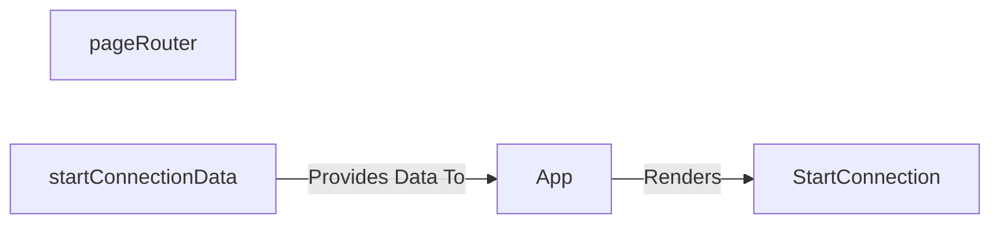

## Details

The architecture consists of a Node.js backend using the Express.js framework and a React-based Single-Page Application (SPA) frontend. The backend is responsible for handling requests from the Atlassian host, serving both documentation pages and the main application. The `pageRouter` specifically manages routes for rendering static help and documentation content from markdown files. The frontend is a modern React application built with TypeScript. Its entry point, the `App` component, bootstraps the client-side environment, setting up routing with `react-router-dom`. The primary user-facing view is the `StartConnection` page, which is responsible for displaying the initial state of the plugin. This component is designed to be data-driven, receiving its content from a separate `startConnectionData` module, which centralizes static assets and text, promoting maintainability.

### pageRouter
An Express.js router responsible for serving static documentation and informational pages. It maps several URL paths to render content from corresponding Markdown files, handling requests for pages like "Get Started" and "Introduction". It is not responsible for serving the main React application.

**Related Classes/Methods**:

- <a href="https://github.com/atlassian/atlassian-connect-example-app-node/blob/main/src/routes/pages.ts" target="_blank" rel="noopener noreferrer">`pageRouter`</a>

### App
The root component of the React SPA. It sets up the client-side router and defines the application's page structure. It is responsible for rendering the `StartConnection` component for the "/spa" path and passing the necessary data to it.

**Related Classes/Methods**:

- <a href="https://github.com/atlassian/atlassian-connect-example-app-node/blob/main/spa/src/App.tsx#L6-L26" target="_blank" rel="noopener noreferrer">`App`:6-26</a>

### StartConnection
A React component that represents the main user-facing page of the application. It assembles various UI elements to create the initial view, including a header and a list of integration requirements. Its content is passed in as props.

**Related Classes/Methods**:

- <a href="https://github.com/atlassian/atlassian-connect-example-app-node/blob/main/spa/src/pages/StartConnection/index.tsx#L42-L44" target="_blank" rel="noopener noreferrer">`StartConnection`:42-44</a>

### startConnectionData
A static data module that exports an object containing the properties (text, logos, URLs) required by the `StartConnection` component. This separates the page's content from its presentation logic, making it easier to manage.

**Related Classes/Methods**:

### [FAQ](https://github.com/CodeBoarding/GeneratedOnBoardings/tree/main?tab=readme-ov-file#faq)