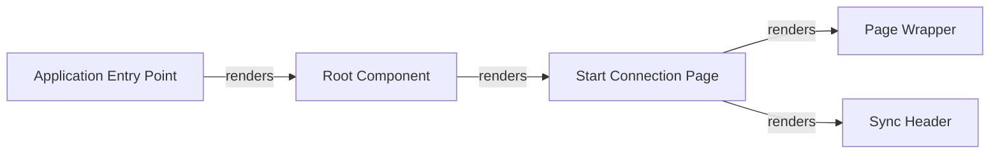

## Details

One paragraph explaining the functionality which is represented by this graph. What the main flow is and what is its purpose.

### Application Entry Point
The primary bootstrap script for the SPA. Its sole responsibility is to render the `Root Component` and mount it to the HTML DOM inside the iframe.

**Related Classes/Methods**:

- <a href="https://github.com/atlassian/atlassian-connect-example-app-node/blob/main/spa/src/index.tsx" target="_blank" rel="noopener noreferrer">`spa/src/index.tsx`</a>

### Root Component
The top-level container for the entire application. It establishes the overall UI structure and manages client-side routing to display different pages, such as the `Start Connection Page`.

**Related Classes/Methods**:

- <a href="https://github.com/atlassian/atlassian-connect-example-app-node/blob/main/spa/src/App.tsx" target="_blank" rel="noopener noreferrer">`spa/src/App.tsx`</a>

### Page Wrapper
A high-level layout component that provides a consistent structure, style, and user experience across all pages by wrapping page content. It is rendered by page components like `Start Connection Page`.

**Related Classes/Methods**:

- <a href="https://github.com/atlassian/atlassian-connect-example-app-node/blob/main/spa/src/common/PageWrapper.tsx" target="_blank" rel="noopener noreferrer">`spa/src/common/PageWrapper.tsx`</a>

### Sync Header
A key interactive UI component displayed across pages. It contains primary user controls and status indicators related to the add-on's main functionality. It is rendered by page components.

**Related Classes/Methods**:

- <a href="https://github.com/atlassian/atlassian-connect-example-app-node/blob/main/spa/src/components/SyncHeader/index.tsx" target="_blank" rel="noopener noreferrer">`spa/src/components/SyncHeader/index.tsx`</a>

### Start Connection Page
A feature-specific component representing a full page. It encapsulates the UI and logic for the initial add-on setup and connection workflow, and it composes the page using `Page Wrapper` and `Sync Header`.

**Related Classes/Methods**:

- <a href="https://github.com/atlassian/atlassian-connect-example-app-node/blob/main/spa/src/pages/StartConnection/index.tsx" target="_blank" rel="noopener noreferrer">`spa/src/pages/StartConnection/index.tsx`</a>

### [FAQ](https://github.com/CodeBoarding/GeneratedOnBoardings/tree/main?tab=readme-ov-file#faq)