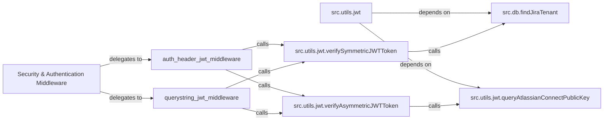

## Details

The Security & Authentication Middleware subsystem is responsible for intercepting and validating incoming HTTP requests to ensure their authenticity and integrity, particularly for requests originating from Atlassian products. This is achieved by processing JSON Web Tokens (JWTs) found in either the `Authorization` header or the query string. The core of this subsystem relies on a `jwt` utility module that handles both symmetric and asymmetric JWT verification, interacting with a database to retrieve tenant-specific secrets and fetching Atlassian's public keys for asymmetric validation.

### Security & Authentication Middleware [[Expand]](./Security_Authentication_Middleware.md)
The overarching component that intercepts incoming HTTP requests to API endpoints and pages. Its primary responsibility is to enforce security by validating JWTs, ensuring the authenticity and integrity of requests originating from Atlassian products.

**Related Classes/Methods**: _None_

### src.utils.jwt
This module serves as the core utility hub for all JWT-related operations. It orchestrates the validation process by coordinating calls to specific verification functions and handling common JWT claim validations.

**Related Classes/Methods**:

- <a href="https://github.com/atlassian/atlassian-connect-example-app-node/blob/main/src/utils/jwt.ts" target="_blank" rel="noopener noreferrer">`src.utils.jwt`</a>

### auth_header_jwt_middleware
An Express middleware function specifically designed to extract and validate JWTs found in the `Authorization` header of incoming HTTP requests. It acts as the initial entry point for header-based JWT validation.

**Related Classes/Methods**:

- <a href="https://github.com/atlassian/atlassian-connect-example-app-node/blob/main/src/middlewares/auth-header-jwt-middleware.ts" target="_blank" rel="noopener noreferrer">`authHeaderSymmetricJwtMiddleware`</a>
- <a href="https://github.com/atlassian/atlassian-connect-example-app-node/blob/main/src/middlewares/auth-header-jwt-middleware.ts" target="_blank" rel="noopener noreferrer">`authHeaderAsymmetricJwtMiddleware`</a>

### querystring_jwt_middleware
An Express middleware function responsible for extracting and validating JWTs embedded within the query string parameters of incoming HTTP requests. This handles JWTs passed via URL parameters.

**Related Classes/Methods**:

- <a href="https://github.com/atlassian/atlassian-connect-example-app-node/blob/main/src/middlewares/querystring-jwt-middleware.ts#L8-L17" target="_blank" rel="noopener noreferrer">`querystringJwtMiddleware`:8-17</a>

### src.utils.jwt.verifySymmetricJWTToken
This function performs cryptographic verification of JWTs signed with a shared symmetric secret. It decodes the token and validates its signature against a secret retrieved from the application's database, ensuring integrity and authenticity.

**Related Classes/Methods**:

- <a href="https://github.com/atlassian/atlassian-connect-example-app-node/blob/main/src/utils/jwt.ts#L31-L64" target="_blank" rel="noopener noreferrer">`src.utils.jwt.verifySymmetricJWTToken`:31-64</a>

### src.utils.jwt.verifyAsymmetricJWTToken
This function handles the cryptographic verification of JWTs signed with an asymmetric key pair. It fetches Atlassian's public key to verify the token's signature, which is crucial for tokens signed by Atlassian itself.

**Related Classes/Methods**:

- <a href="https://github.com/atlassian/atlassian-connect-example-app-node/blob/main/src/utils/jwt.ts#L78-L110" target="_blank" rel="noopener noreferrer">`src.utils.jwt.verifyAsymmetricJWTToken`:78-110</a>

### src.db.findJiraTenant
A database utility function used to retrieve tenant-specific information, primarily the shared secret required for symmetric JWT validation. It acts as the data access layer for tenant secrets.

**Related Classes/Methods**:

- <a href="https://github.com/atlassian/atlassian-connect-example-app-node/blob/main/src/db.ts#L71-L74" target="_blank" rel="noopener noreferrer">`src.db.findJiraTenant`:71-74</a>

### src.utils.jwt.queryAtlassianConnectPublicKey
A utility function responsible for fetching Atlassian's public keys from a remote endpoint. These keys are essential for performing asymmetric JWT validation.

**Related Classes/Methods**:

- <a href="https://github.com/atlassian/atlassian-connect-example-app-node/blob/main/src/utils/jwt.ts#L147-L153" target="_blank" rel="noopener noreferrer">`src.utils.jwt.queryAtlassianConnectPublicKey`:147-153</a>

### [FAQ](https://github.com/CodeBoarding/GeneratedOnBoardings/tree/main?tab=readme-ov-file#faq)