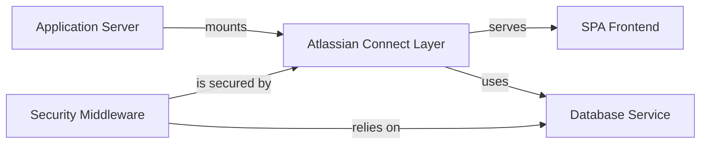

## Details

This project is a monolithic web application designed as a Jira Cloud plugin, following the architecture prescribed by the `atlassian-connect-express` (ACE) framework. The system is centered around an **Application Server** (`index.js`) that bootstraps an Express application. The core logic is encapsulated within the **Atlassian Connect Layer** (`routes/index.js`), which handles all Jira-specific interactions, such as lifecycle callbacks and serving the app descriptor (`atlassian-connect.json`). A crucial **Security Middleware**, provided by ACE, protects all endpoints by validating JWT tokens, ensuring secure communication with Jira. This middleware relies on a **Database Service** (configured in `config.json`) to retrieve tenant-specific secrets for token verification. Finally, the application serves a **SPA Frontend** (composed of `.hbs` views and static assets), which is rendered in an iframe within the Jira product, providing the user interface for the plugin.

### Application Server [[Expand]](./Application_Server.md)
The core Express.js web server. It initializes middleware, sets up routing, and serves all incoming HTTP requests. It acts as the primary entry point for the entire application.

**Related Classes/Methods**:

### Atlassian Connect Layer [[Expand]](./Atlassian_Connect_Layer.md)
A logical grouping of all modules that handle direct communication and integration with Jira. This includes serving the app descriptor, managing lifecycle webhooks, processing product webhooks, and routing for UI pages.

**Related Classes/Methods**:

### Security Middleware
Responsible for securing application endpoints by verifying JWT tokens on incoming requests from Jira. It ensures all communication is authentic and authorized.

**Related Classes/Methods**:

### Database Service
The persistence layer for the application. It manages storing and retrieving tenant information, such as client keys and shared secrets, which are essential for JWT validation and multi-tenancy.

**Related Classes/Methods**:

### SPA Frontend [[Expand]](./SPA_Frontend.md)
The client-side user interface, built as a Single Page Application. It is served by the backend and rendered within an iframe inside the Jira product, providing a rich user experience.

**Related Classes/Methods**:

### [FAQ](https://github.com/CodeBoarding/GeneratedOnBoardings/tree/main?tab=readme-ov-file#faq)