```mermaid
graph LR
    Jira_Cloud_Platform["Jira Cloud Platform"]
    Express_Backend["Express Backend"]
    Route_Handlers["Route Handlers"]
    JWT_Authentication_Middleware["JWT Authentication Middleware"]
    Tenant_Database["Tenant Database"]
    Single_Page_Application_SPA_["Single Page Application (SPA)"]
    Jira_Cloud_Platform -- "Sends Lifecycle & Webhook Events to" --> Express_Backend
    Jira_Cloud_Platform -- "Loads UI in" --> Single_Page_Application_SPA_
    Single_Page_Application_SPA_ -- "Makes API Calls to" --> Express_Backend
    Express_Backend -- "Delegates Requests to" --> Route_Handlers
    Route_Handlers -- "Is Protected By" --> JWT_Authentication_Middleware
    Route_Handlers -- "Manages Tenant Data in" --> Tenant_Database
    JWT_Authentication_Middleware -- "Verifies Tenant Secret from" --> Tenant_Database
```

## Details

This is an excellent architectural analysis of the Atlassian Connect Express (ACE) framework, which simplifies building Atlassian apps. The framework handles the JWT authentication handshake and manages tenant lifecycle events, storing credentials in a database. The Express backend serves both as an API for the frontend and as a webhook receiver for Jira events. The frontend is a standard Single Page Application (SPA) rendered in an iframe within the Jira UI.

### Jira Cloud Platform
The external Atlassian SaaS environment where the app is installed and operates.

**Related Classes/Methods**:

- `External System`

### Express Backend
The core of the application, responsible for request handling and routing.

**Related Classes/Methods**:

- `src/server.ts`
- `src/routes/router.ts`

### Route Handlers
A collection of specialized modules that implement the application's business logic.

**Related Classes/Methods**:

- `src/routes/events/`
- `src/routes/pages/`
- `src/routes/api/`
- `src/routes/webhooks/`

### JWT Authentication Middleware
A critical security layer that protects all application endpoints.

**Related Classes/Methods**:

- `src/middlewares/auth-header-jwt-middleware.ts`
- `src/middlewares/querystring-jwt-middleware.ts`
- `src/utils/jwt.ts`

### Tenant Database
The persistence layer for storing multi-tenant installation data.

**Related Classes/Methods**:

- `src/db/db.ts`

### Single Page Application (SPA)
The client-side frontend application displayed within the Jira UI.

**Related Classes/Methods**:

- `spa/src/App.tsx`

### [FAQ](https://github.com/CodeBoarding/GeneratedOnBoardings/tree/main?tab=readme-ov-file#faq)