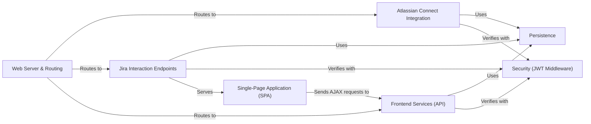

## Details

The atlassian-connect-example-app-node is a satellite application that extends Jira's functionality. Its architecture is centered around a Web Server & Routing component that acts as the primary entry point, dispatching all incoming traffic. The integration with Jira is initiated through the Atlassian Connect Integration component, which serves the atlassian-connect.json manifest and handles the critical installed lifecycle event to store tenant credentials in the Persistence layer. Once installed, all subsequent requests from Jira are first validated by the Security (JWT Middleware) component. The various endpoint components then interact with the Persistence layer to access tenant-specific data, perform business logic, and return the appropriate response, effectively creating a secure and multi-tenant application that integrates seamlessly into the Jira ecosystem.

### Web Server & Routing
The main entry point and core of the application. It initializes the Express server, configures all middleware, and directs incoming requests to the appropriate handlers.

**Related Classes/Methods**:

- `src/server.ts`
- `src/routes/router.ts`

### Atlassian Connect Integration
Manages the fundamental integration with the Atlassian platform. It dynamically generates the atlassian-connect.json descriptor and handles critical lifecycle events (installed, uninstalled).

**Related Classes/Methods**:

- `src/routes/atlassian-connect.ts`
- `src/routes/events.ts`

### Jira Interaction Endpoints
A consolidated group of controllers that handle all runtime requests from Jira after installation. This includes rendering UI pages, processing incoming webhooks, and serving the frontend SPA.

**Related Classes/Methods**:

- `src/routes/pages.ts`
- `src/routes/webhooks.ts`
- `src/routes/spa.ts`

### Frontend Services (API)
Provides a dedicated RESTful API for the Single-Page Application (SPA), enabling rich client-side functionality and data interaction.

**Related Classes/Methods**:

- `src/routes/api.ts`

### Security (JWT Middleware)
A cross-cutting component responsible for securing all application endpoints. It verifies the authenticity of every incoming request from Jira using JWT tokens.

**Related Classes/Methods**:

- `src/middlewares/`
- `src/utils/jwt.ts`

### Persistence
The database abstraction layer responsible for storing and retrieving all tenant-specific information, including client keys, shared secrets, and other application data.

**Related Classes/Methods**:

- `src/db.ts`

### Single-Page Application (SPA)
The client-facing user interface, providing a rich and interactive experience within the Jira environment.

**Related Classes/Methods**:

- `spa/`

### [FAQ](https://github.com/CodeBoarding/GeneratedOnBoardings/tree/main?tab=readme-ov-file#faq)