```mermaid
graph LR
    Backend_Server_Core["Backend Server Core"]
    Atlassian_Connect_Integration_Layer["Atlassian Connect Integration Layer"]
    Data_Persistence_Layer["Data Persistence Layer"]
    API_and_Page_Rendering_Service["API and Page Rendering Service"]
    Authentication_Authorization_Middleware["Authentication & Authorization Middleware"]
    Frontend_Application["Frontend Application"]
    Configuration_Management["Configuration Management"]
    Backend_Server_Core -- "routes requests to" --> Atlassian_Connect_Integration_Layer
    Backend_Server_Core -- "routes requests to" --> API_and_Page_Rendering_Service
    Backend_Server_Core -- "applies" --> Authentication_Authorization_Middleware
    Backend_Server_Core -- "initializes with" --> Configuration_Management
    Atlassian_Connect_Integration_Layer -- "utilizes" --> Data_Persistence_Layer
    Atlassian_Connect_Integration_Layer -- "relies on" --> Configuration_Management
    Data_Persistence_Layer -- "is queried by" --> API_and_Page_Rendering_Service
    Data_Persistence_Layer -- "is interacted with by" --> Authentication_Authorization_Middleware
    API_and_Page_Rendering_Service -- "is consumed by" --> Frontend_Application
    Authentication_Authorization_Middleware -- "is applied by" --> Backend_Server_Core
    Frontend_Application -- "makes API requests to" --> API_and_Page_Rendering_Service
    Frontend_Application -- "interacts with" --> Atlassian_host_application
    Configuration_Management -- "provides configuration data to" --> Backend_Server_Core
    Configuration_Management -- "supplies parameters to" --> Atlassian_Connect_Integration_Layer
    click Backend_Server_Core href "https://github.com/CodeBoarding/GeneratedOnBoardings/blob/main/atlassian-connect-example-app-node/Backend_Server_Core.md" "Details"
    click Atlassian_Connect_Integration_Layer href "https://github.com/CodeBoarding/GeneratedOnBoardings/blob/main/atlassian-connect-example-app-node/Atlassian_Connect_Integration_Layer.md" "Details"
    click API_and_Page_Rendering_Service href "https://github.com/CodeBoarding/GeneratedOnBoardings/blob/main/atlassian-connect-example-app-node/API_and_Page_Rendering_Service.md" "Details"
    click Authentication_Authorization_Middleware href "https://github.com/CodeBoarding/GeneratedOnBoardings/blob/main/atlassian-connect-example-app-node/Authentication_Authorization_Middleware.md" "Details"
    click Frontend_Application href "https://github.com/CodeBoarding/GeneratedOnBoardings/blob/main/atlassian-connect-example-app-node/Frontend_Application.md" "Details"
```

## Details

This project, an Atlassian Connect example application, is structured around a Node.js backend and a React frontend. The core data flow begins with user interactions or Atlassian host application events, which are routed through the `Backend Server Core`. This component, secured by the `Authentication & Authorization Middleware`, directs requests to either the `Atlassian Connect Integration Layer` for handling lifecycle events and webhooks, or the `API and Page Rendering Service` for serving dynamic content and API endpoints. Both backend services interact with the `Data Persistence Layer` for storing and retrieving tenant and application-specific data. The `Configuration Management` component provides essential environment variables and settings to the backend. The `Frontend Application` consumes the APIs exposed by the `API and Page Rendering Service` and interacts directly with the Atlassian host application via its JavaScript API for a seamless user experience.

### Backend Server Core [[Expand]](./Backend_Server_Core.md)
The central Express.js server, handling request routing and middleware application.

**Related Classes/Methods**:

- <a href="https://github.com/atlassian/atlassian-connect-example-app-node/blob/main/src/server.ts" target="_blank" rel="noopener noreferrer">`src/server.ts`</a>

### Atlassian Connect Integration Layer [[Expand]](./Atlassian_Connect_Integration_Layer.md)
Manages all Atlassian Connect specific interactions, including lifecycle events, webhooks, and providing the app descriptor.

**Related Classes/Methods**:

- <a href="https://github.com/atlassian/atlassian-connect-example-app-node/blob/main/src/routes/events.ts" target="_blank" rel="noopener noreferrer">`src/routes/events.ts`</a>
- <a href="https://github.com/atlassian/atlassian-connect-example-app-node/blob/main/src/routes/webhooks.ts" target="_blank" rel="noopener noreferrer">`src/routes/webhooks.ts`</a>
- <a href="https://github.com/atlassian/atlassian-connect-example-app-node/blob/main/src/routes/atlassian-connect.ts" target="_blank" rel="noopener noreferrer">`src/routes/atlassian-connect.ts`</a>

### Data Persistence Layer
Abstracts database interactions for managing Jira tenant information and application logs.

**Related Classes/Methods**:

- <a href="https://github.com/atlassian/atlassian-connect-example-app-node/blob/main/src/db.ts" target="_blank" rel="noopener noreferrer">`src/db.ts`</a>

### API and Page Rendering Service [[Expand]](./API_and_Page_Rendering_Service.md)
Exposes RESTful APIs for the frontend and dynamically serves HTML pages.

**Related Classes/Methods**:

- <a href="https://github.com/atlassian/atlassian-connect-example-app-node/blob/main/src/routes/pages.ts" target="_blank" rel="noopener noreferrer">`src/routes/pages.ts`</a>
- <a href="https://github.com/atlassian/atlassian-connect-example-app-node/blob/main/src/routes/api.ts" target="_blank" rel="noopener noreferrer">`src/routes/api.ts`</a>

### Authentication & Authorization Middleware [[Expand]](./Authentication_Authorization_Middleware.md)
Secures backend routes by verifying Atlassian-issued JWTs.

**Related Classes/Methods**:

- <a href="https://github.com/atlassian/atlassian-connect-example-app-node/blob/main/src/utils/jwt.ts" target="_blank" rel="noopener noreferrer">`src/utils/jwt.ts`</a>
- <a href="https://github.com/atlassian/atlassian-connect-example-app-node/blob/main/src/middlewares/auth-header-jwt-middleware.ts" target="_blank" rel="noopener noreferrer">`src/middlewares/auth-header-jwt-middleware.ts`</a>

### Frontend Application [[Expand]](./Frontend_Application.md)
The React single-page application for user interface, client-side interactions, and Atlassian Connect JS API integration.

**Related Classes/Methods**:

- <a href="https://github.com/atlassian/atlassian-connect-example-app-node/blob/main/spa/src/App.tsx" target="_blank" rel="noopener noreferrer">`spa/src/App.tsx`</a>
- <a href="https://github.com/atlassian/atlassian-connect-example-app-node/blob/main/spa/src/pages/StartConnection/index.tsx" target="_blank" rel="noopener noreferrer">`spa/src/pages/StartConnection/index.tsx`</a>
- <a href="https://github.com/atlassian/atlassian-connect-example-app-node/blob/main/spa/src/components/index.tsx" target="_blank" rel="noopener noreferrer">`spa/src/components/index.tsx`</a>
- <a href="https://github.com/atlassian/atlassian-connect-example-app-node/blob/main/spa/src/common/PageWrapper.tsx" target="_blank" rel="noopener noreferrer">`spa/src/common/PageWrapper.tsx`</a>
- <a href="https://github.com/atlassian/atlassian-connect-example-app-node/blob/main/spa/src/global.d.ts" target="_blank" rel="noopener noreferrer">`spa/src/global.d.ts`</a>

### Configuration Management
Handles loading and providing environment-specific variables and application settings.

**Related Classes/Methods**:

- <a href="https://github.com/atlassian/atlassian-connect-example-app-node/blob/main/src/env.ts" target="_blank" rel="noopener noreferrer">`src/env.ts`</a>

### [FAQ](https://github.com/CodeBoarding/GeneratedOnBoardings/tree/main?tab=readme-ov-file#faq)