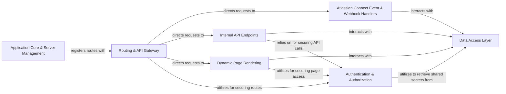

## Details

The `atlassian-connect-example-app-node` project operates as a Node.js web application backend, leveraging Express.js for its core functionality and integrating deeply with Jira through the Atlassian Connect framework. The `Application Core & Server Management` component serves as the foundational entry point, initializing the Express application, configuring global middleware, and managing environment variables. All incoming requests are first processed by the `Routing & API Gateway`, which acts as a central dispatcher, directing requests to specialized handlers. These handlers include the `Atlassian Connect Event & Webhook Handlers` for managing Jira lifecycle events (e.g., installation, uninstallation) and processing incoming webhooks, `Internal API Endpoints` for exposing the application's own RESTful services, and `Dynamic Page Rendering` for generating and serving dynamic HTML content. Security is enforced by the `Authentication & Authorization` component, which validates JWTs issued by Jira, often retrieving necessary shared secrets from the `Data Access Layer`. The `Data Access Layer` is a critical component responsible for persisting and retrieving all application data, including Jira tenant information and logs, and is extensively utilized by the event handlers, internal API endpoints, and dynamic page renderers. This design ensures a clear separation of concerns, promoting maintainability and scalability for the Atlassian Connect application.

### Application Core & Server Management
Initializes the Express application, sets up global middleware, and manages environment configurations. It's the primary entry point for the backend.

**Related Classes/Methods**:

- <a href="https://github.com/atlassian/atlassian-connect-example-app-node/blob/main/src/server.ts" target="_blank" rel="noopener noreferrer">`src/server.ts`</a>
- <a href="https://github.com/atlassian/atlassian-connect-example-app-node/blob/main/src/env.ts" target="_blank" rel="noopener noreferrer">`src/env.ts`</a>

### Data Access Layer
Provides a robust interface for persisting and retrieving application data, specifically managing Jira tenant information and application logs.

**Related Classes/Methods**:

- <a href="https://github.com/atlassian/atlassian-connect-example-app-node/blob/main/src/db.ts" target="_blank" rel="noopener noreferrer">`src/db.ts`</a>

### Authentication & Authorization
Secures application routes and API endpoints by validating JSON Web Tokens (JWTs) issued by Jira, supporting both symmetric and asymmetric verification mechanisms.

**Related Classes/Methods**:

- <a href="https://github.com/atlassian/atlassian-connect-example-app-node/blob/main/src/utils/jwt.ts" target="_blank" rel="noopener noreferrer">`src/utils/jwt.ts`</a>
- <a href="https://github.com/atlassian/atlassian-connect-example-app-node/blob/main/src/middlewares/auth-header-jwt-middleware.ts" target="_blank" rel="noopener noreferrer">`src/middlewares/auth-header-jwt-middleware.ts`</a>
- <a href="https://github.com/atlassian/atlassian-connect-example-app-node/blob/main/src/middlewares/querystring-jwt-middleware.ts" target="_blank" rel="noopener noreferrer">`src/middlewares/querystring-jwt-middleware.ts`</a>

### Routing & API Gateway
Defines and manages all application routes, acting as the central dispatcher that directs incoming requests to the appropriate handlers.

**Related Classes/Methods**:

- <a href="https://github.com/atlassian/atlassian-connect-example-app-node/blob/main/src/routes/router.ts" target="_blank" rel="noopener noreferrer">`src/routes/router.ts`</a>

### Atlassian Connect Event & Webhook Handlers
Processes specific lifecycle events sent by Jira (e.g., installation, uninstallation, enabling, disabling) and handles incoming Jira webhook events, updating the database and logging as required.

**Related Classes/Methods**:

- <a href="https://github.com/atlassian/atlassian-connect-example-app-node/blob/main/src/routes/events.ts" target="_blank" rel="noopener noreferrer">`src/routes/events.ts`</a>
- <a href="https://github.com/atlassian/atlassian-connect-example-app-node/blob/main/src/routes/webhooks.ts" target="_blank" rel="noopener noreferrer">`src/routes/webhooks.ts`</a>
- <a href="https://github.com/atlassian/atlassian-connect-example-app-node/blob/main/src/routes/atlassian-connect.ts" target="_blank" rel="noopener noreferrer">`src/routes/atlassian-connect.ts`</a>

### Internal API Endpoints
Exposes internal RESTful API endpoints for the frontend application and other internal services, handling data operations and implementing core business logic.

**Related Classes/Methods**:

- <a href="https://github.com/atlassian/atlassian-connect-example-app-node/blob/main/src/routes/api.ts" target="_blank" rel="noopener noreferrer">`src/routes/api.ts`</a>

### Dynamic Page Rendering
Generates and serves dynamic HTML content for various application pages (e.g., configuration views, log displays) and provides utilities for markup conversion.

**Related Classes/Methods**:

- <a href="https://github.com/atlassian/atlassian-connect-example-app-node/blob/main/src/routes/pages.ts" target="_blank" rel="noopener noreferrer">`src/routes/pages.ts`</a>
- <a href="https://github.com/atlassian/atlassian-connect-example-app-node/blob/main/src/utils/markup.ts" target="_blank" rel="noopener noreferrer">`src/utils/markup.ts`</a>

### [FAQ](https://github.com/CodeBoarding/GeneratedOnBoardings/tree/main?tab=readme-ov-file#faq)