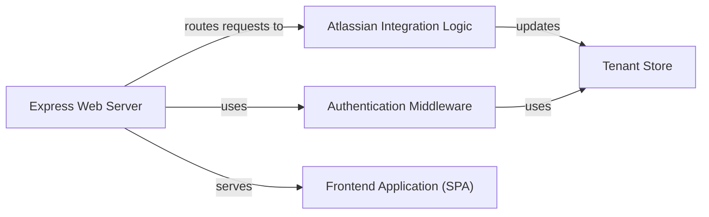

## Details

One paragraph explaining the functionality which is represented by this graph. What the main flow is and what is its purpose.

### Express Web Server [[Expand]](./Express_Web_Server.md)
The core of the application, responsible for routing, middleware, and serving all HTTP requests. It hosts the other backend components.

**Related Classes/Methods**:

- `app`
- <a href="https://github.com/atlassian/atlassian-connect-example-app-node/blob/main/src/routes/router.ts" target="_blank" rel="noopener noreferrer">`RootRouter`</a>

### Atlassian Integration Logic [[Expand]](./Atlassian_Integration_Logic.md)
A logical grouping that handles all communications originating from the Atlassian host. This includes generating the app descriptor, processing lifecycle events (`installed`, `uninstalled`), and handling incoming webhooks.

**Related Classes/Methods**:

- `AtlassianConnectRouter`
- `EventsRouter`
- <a href="https://github.com/atlassian/atlassian-connect-example-app-node/blob/main/src/routes/webhooks.ts#L10-L17" target="_blank" rel="noopener noreferrer">`WebhooksRouter`:10-17</a>

### Authentication Middleware
Secures the application by verifying the authenticity of all incoming requests from Jira using JWT validation. It checks tokens in both authorization headers and URL query strings.

**Related Classes/Methods**:

- `AuthHeaderJwtMiddleware`
- `QueryStringJwtMiddleware`
- `decodeAsymmetric`

### Tenant Store
An in-memory database responsible for persisting installation-specific data for each Jira tenant, primarily the client key and shared secret used for authentication.

**Related Classes/Methods**:

- `db`

### Frontend Application (SPA) [[Expand]](./Frontend_Application_SPA_.md)
A client-side React application that provides the user interface. It is served by the web server and rendered within an iframe in the Jira UI.

**Related Classes/Methods**:

- `App`
- `PagesRouter`

### [FAQ](https://github.com/CodeBoarding/GeneratedOnBoardings/tree/main?tab=readme-ov-file#faq)