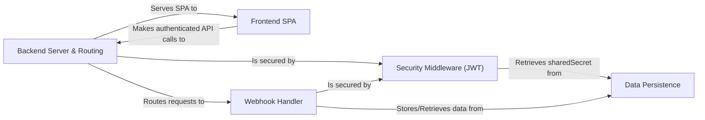

## Details

This project is an Atlassian Connect Express (ACE) application, a Node.js framework for building Atlassian cloud add-ons. The architecture is centered around a main Express.js server (`src/server.ts`) that orchestrates all interactions. This server sets up routing (`src/routes/router.ts`), which defines endpoints for serving the Atlassian Connect descriptor (`atlassian-connect.json`), handling app lifecycle events (`/installed`), and processing incoming webhooks. A key architectural feature is the security model, enforced by JWT middleware (`src/middlewares/auth-header-jwt-middleware.ts`) on nearly all routes to authenticate requests from the Jira host. The application persists tenant-specific data, including the crucial `sharedSecret` for JWT validation, using a database abstraction layer defined in `src/db.ts`. The frontend is a React-based Single-Page Application (SPA) served by the backend, which runs in an iframe within the Jira UI.

### Backend Server & Routing
The core Express.js server that acts as the main entry point. It serves the atlassian-connect.json descriptor, routes all incoming requests to the appropriate handlers (including lifecycle events like /installed), and serves the frontend application.

**Related Classes/Methods**:

- <a href="https://github.com/atlassian/atlassian-connect-example-app-node/blob/main/spa/src/App.tsx#L6-L23" target="_blank" rel="noopener noreferrer">``:6-23</a>
- <a href="https://github.com/atlassian/atlassian-connect-example-app-node/blob/main/spa/src/App.tsx#L6-L23" target="_blank" rel="noopener noreferrer">``:6-23</a>
- <a href="https://github.com/atlassian/atlassian-connect-example-app-node/blob/main/spa/src/App.tsx#L6-L23" target="_blank" rel="noopener noreferrer">``:6-23</a>

### Frontend SPA
A React-based single-page application providing the user interface. It runs in an iframe within Jira, uses the Atlassian AP.js library to interact with the host, and communicates with its backend via authenticated API calls.

**Related Classes/Methods**:

- <a href="https://github.com/atlassian/atlassian-connect-example-app-node/blob/main/spa/src/App.tsx#L6-L23" target="_blank" rel="noopener noreferrer">``:6-23</a>

### Webhook Handler
Manages incoming data webhooks from Jira (e.g., jira:issue_created) to process events. The logic for these webhooks is defined in a dedicated router, while lifecycle webhooks (/installed, /uninstalled) are handled by the main router.

**Related Classes/Methods**:

- <a href="https://github.com/atlassian/atlassian-connect-example-app-node/blob/main/spa/src/App.tsx#L6-L23" target="_blank" rel="noopener noreferrer">``:6-23</a>

### Security Middleware (JWT)
A critical security component implemented as Express middleware. It intercepts and validates the JWT on all incoming requests from Jira (pages, webhooks, APIs) to authenticate the host and prevent unauthorized access.

**Related Classes/Methods**:

- <a href="https://github.com/atlassian/atlassian-connect-example-app-node/blob/main/spa/src/App.tsx#L6-L23" target="_blank" rel="noopener noreferrer">``:6-23</a>

### Data Persistence
Provides a database abstraction layer responsible for storing and retrieving all application data. Its most critical function is managing the Jira tenant information (clientKey, sharedSecret) required for JWT validation.

**Related Classes/Methods**:

- <a href="https://github.com/atlassian/atlassian-connect-example-app-node/blob/main/spa/src/App.tsx#L6-L23" target="_blank" rel="noopener noreferrer">``:6-23</a>

### [FAQ](https://github.com/CodeBoarding/GeneratedOnBoardings/tree/main?tab=readme-ov-file#faq)