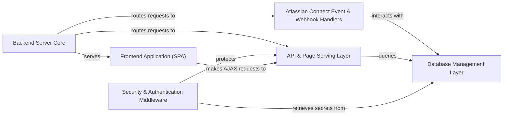

## Details

This project implements an Atlassian Connect application, featuring a clear separation between a React-based frontend Single Page Application (SPA) and a Node.js Express backend. The core flow involves the Backend Server Core initializing the application, serving the SPA, and routing incoming requests. The Security & Authentication Middleware plays a crucial role in validating JWT tokens for all requests originating from Atlassian, ensuring secure communication. Atlassian Connect Event & Webhook Handlers process lifecycle events and Jira webhooks, updating the Database Management Layer, which persists tenant and application data. The API & Page Serving Layer exposes RESTful APIs for the frontend and dynamically renders pages, while the Frontend Application (SPA) provides the interactive user interface within the Atlassian product's iframe, communicating with the backend via AJAX requests.

### Frontend Application (SPA) [[Expand]](./Frontend_Application_SPA_.md)
The client-side React application responsible for the user interface and interactions within the Atlassian product's iframe. It handles rendering, user input, and communication with the backend API.

**Related Classes/Methods**:

- <a href="https://github.com/atlassian/atlassian-connect-example-app-node/blob/main/spa/src/App.tsx#L6-L23" target="_blank" rel="noopener noreferrer">`App`:6-23</a>
- <a href="https://github.com/atlassian/atlassian-connect-example-app-node/blob/main/spa/src/pages/StartConnection/index.tsx#L31-L54" target="_blank" rel="noopener noreferrer">`StartConnection`:31-54</a>
- <a href="https://github.com/atlassian/atlassian-connect-example-app-node/blob/main/spa/src/components/SyncHeader/index.tsx#L33-L57" target="_blank" rel="noopener noreferrer">`SyncHeader`:33-57</a>

### Backend Server Core [[Expand]](./Backend_Server_Core.md)
Manages the Express server's lifecycle, environment configuration, and proxies the frontend SPA during development. It acts as the central entry point for all incoming HTTP requests, routing them to appropriate handlers.

**Related Classes/Methods**:

- <a href="https://github.com/atlassian/atlassian-connect-example-app-node/blob/main/src/spa-proxy.ts#L16-L20" target="_blank" rel="noopener noreferrer">`proxyLocalUIForDev`:16-20</a>
- <a href="https://github.com/atlassian/atlassian-connect-example-app-node/blob/main/src/env.ts#L4-L11" target="_blank" rel="noopener noreferrer">`envVars`:4-11</a>

### Atlassian Connect Event & Webhook Handlers [[Expand]](./Atlassian_Connect_Event_Webhook_Handlers.md)
Dedicated modules for processing lifecycle events from Atlassian (e.g., app installation, uninstallation, enabling/disabling) and handling incoming webhooks from Jira. These handlers are responsible for updating the application's database based on these events.

**Related Classes/Methods**:

- <a href="https://github.com/atlassian/atlassian-connect-example-app-node/blob/main/src/routes/atlassian-connect.ts#L231-L244" target="_blank" rel="noopener noreferrer">`webhooks`:231-244</a>

### Database Management Layer
Provides an abstraction for persistent data storage, primarily managing Atlassian tenant installation details (client key, shared secret, base URL) and application-specific logs. It encapsulates database interactions, ensuring data integrity and consistency.

**Related Classes/Methods**:

- <a href="https://github.com/atlassian/atlassian-connect-example-app-node/blob/main/src/db.ts#L66-L145" target="_blank" rel="noopener noreferrer">`ConnectAppDatabase`:66-145</a>

### API & Page Serving Layer [[Expand]](./API_Page_Serving_Layer.md)
Exposes RESTful API endpoints for the frontend and other services, dynamically renders HTML pages displayed within the Atlassian product's iframe, and serves the atlassian-connect.json descriptor, which defines the app's capabilities.

**Related Classes/Methods**:

- <a href="https://github.com/atlassian/atlassian-connect-example-app-node/blob/main/src/routes/atlassian-connect.ts#L112-L223" target="_blank" rel="noopener noreferrer">`pages`:112-223</a>
- <a href="https://github.com/atlassian/atlassian-connect-example-app-node/blob/main/src/routes/api.ts" target="_blank" rel="noopener noreferrer">`apiRouter`</a>
- <a href="https://github.com/atlassian/atlassian-connect-example-app-node/blob/main/src/routes/atlassian-connect.ts#L4-L6" target="_blank" rel="noopener noreferrer">`connectDescriptorGet`:4-6</a>
- <a href="https://github.com/atlassian/atlassian-connect-example-app-node/blob/main/src/routes/spa.ts" target="_blank" rel="noopener noreferrer">`spaRouter`</a>

### Security & Authentication Middleware [[Expand]](./Security_Authentication_Middleware.md)
Implements JWT validation for requests originating from Atlassian products, ensuring authenticity and integrity by verifying tokens against stored tenant secrets (symmetric validation) or Atlassian public keys (asymmetric validation). This layer protects API endpoints and pages.

**Related Classes/Methods**:

- <a href="https://github.com/atlassian/atlassian-connect-example-app-node/blob/main/src/utils/jwt.ts#L31-L64" target="_blank" rel="noopener noreferrer">`verifySymmetricJWTToken`:31-64</a>
- <a href="https://github.com/atlassian/atlassian-connect-example-app-node/blob/main/src/utils/jwt.ts#L78-L110" target="_blank" rel="noopener noreferrer">`verifyAsymmetricJWTToken`:78-110</a>

### [FAQ](https://github.com/CodeBoarding/GeneratedOnBoardings/tree/main?tab=readme-ov-file#faq)