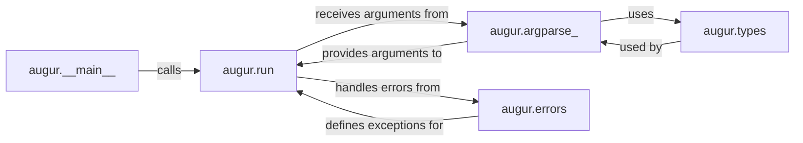

## Details

The `CLI & Core Orchestration` subsystem is fundamental to `augur` because it provides the entry point for the application, handles user input, and directs the execution flow to the appropriate modules. Without these components, `augur` would not be able to receive commands, parse arguments, or execute its core functionalities.

### augur.__main__
This is the absolute entry point of the `augur` application when executed from the command line. Its sole responsibility is to initiate the CLI environment and delegate the primary execution logic to `augur.run`. It acts as the initial bootstrap for the entire application.

**Related Classes/Methods**:

- `augur.run` (1:1)

### augur.run
The central orchestrator of the `augur` application. It receives the parsed command-line arguments from `augur.argparse_`, determines which `augur` command needs to be executed, and then dispatches control to the relevant functional modules. It also plays a crucial role in managing global error reporting by interacting with `augur.errors`. This component is essential for directing the flow of execution based on user input.

**Related Classes/Methods**:

- <a href="https://github.com/nextstrain/augur/augur/argparse_.py#L1-L1" target="_blank" rel="noopener noreferrer">`augur.argparse_` (1:1)</a>
- <a href="https://github.com/nextstrain/augur/augur/errors.py#L1-L1" target="_blank" rel="noopener noreferrer">`augur.errors` (1:1)</a>

### augur.argparse_
This component is dedicated to defining and parsing all command-line arguments that `augur` accepts. It constructs the argument parser, validates inputs, and provides the structured, parsed arguments to `augur.run`. It heavily relies on `augur.types` to define valid argument choices and types, ensuring robust input handling.

**Related Classes/Methods**:

- `augur.run` (1:1)
- <a href="https://github.com/nextstrain/augur/augur/types.py#L1-L1" target="_blank" rel="noopener noreferrer">`augur.types` (1:1)</a>

### augur.errors
This module defines a hierarchy of custom exception classes, with `augur.errors.AugurError` as the base. It provides a standardized and centralized mechanism for error reporting throughout the `augur` project. By using custom exceptions, `augur` can provide more specific and user-friendly error messages, improving the overall user experience. Many other `augur` modules will raise these custom exceptions when issues arise, and `augur.run` will handle them.

**Related Classes/Methods**:

- <a href="https://github.com/nextstrain/augur/augur/errors.py#L1-L1" target="_blank" rel="noopener noreferrer">`augur.errors.AugurError` (1:1)</a>
- `augur.run` (1:1)

### augur.types
This component defines various custom data types and enumerations, such as `ArgparseEnum` subclasses like `DataErrorMethod`, `EmptyOutputReportingMethod`, and `ValidationMode`. These types are critical for `augur.argparse_` to define valid argument choices and for other modules to ensure data consistency and validation across the project. It acts as a central repository for common data structures.

**Related Classes/Methods**:

- <a href="https://github.com/nextstrain/augur/augur/types.py#L4-L36" target="_blank" rel="noopener noreferrer">`augur.types.ArgparseEnum` (4:36)</a>
- <a href="https://github.com/nextstrain/augur/augur/types.py#L40-L48" target="_blank" rel="noopener noreferrer">`augur.types.DataErrorMethod` (40:48)</a>
- <a href="https://github.com/nextstrain/augur/augur/types.py#L52-L59" target="_blank" rel="noopener noreferrer">`augur.types.EmptyOutputReportingMethod` (52:59)</a>
- <a href="https://github.com/nextstrain/augur/augur/types.py#L63-L70" target="_blank" rel="noopener noreferrer">`augur.types.ValidationMode` (63:70)</a>
- <a href="https://github.com/nextstrain/augur/augur/argparse_.py#L1-L1" target="_blank" rel="noopener noreferrer">`augur.argparse_` (1:1)</a>

### [FAQ](https://github.com/CodeBoarding/GeneratedOnBoardings/tree/main?tab=readme-ov-file#faq)