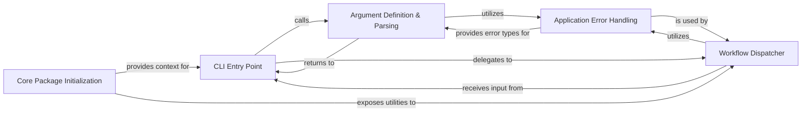

## Details

This component serves as the central command-line interface and application core for the `augur` bioinformatics pipeline. It is responsible for parsing user commands, validating initial inputs, and orchestrating the execution flow of the entire pipeline. It acts as the primary entry point, coordinating calls to various analytical and data management modules.

### CLI Entry Point
The main entry point for the `augur` command-line application. It initializes the argument parsing process and dispatches control to the appropriate workflow based on user input. This is the first point of interaction when a user runs `augur` from the terminal.

**Related Classes/Methods**:

- <a href="https://github.com/nextstrain/augur/blob/master/augur/__main__.py#L1-L1" target="_blank" rel="noopener noreferrer">`augur.__main__` (1:1)</a>

### Argument Definition & Parsing
Responsible for defining the structure of all command-line arguments, subcommands, and options that `augur` supports. It parses the raw command-line input provided by the user into a structured, program-readable format, ensuring that inputs conform to expected patterns.

**Related Classes/Methods**:

- <a href="https://github.com/nextstrain/augur/blob/master/augur/argparse_.py#L1-L1" target="_blank" rel="noopener noreferrer">`augur.argparse_` (1:1)</a>

### Core Package Initialization
Handles the initial setup of the `augur` Python package. This includes tasks such as defining package-level metadata (e.g., version), potentially setting up logging configurations, and exposing core functionalities or shared utilities that are globally accessible within the `augur` ecosystem.

**Related Classes/Methods**:

- <a href="https://github.com/nextstrain/augur/blob/master/augur/__init__.py#L1-L1" target="_blank" rel="noopener noreferrer">`augur.__init__` (1:1)</a>

### Workflow Dispatcher
This conceptual component interprets the parsed command-line arguments and orchestrates the execution of the specific bioinformatics pipeline steps. It acts as the central coordinator, calling various analytical and data management modules (e.g., alignment, tree building, ancestral reconstruction) in the correct sequence based on the user's command.

**Related Classes/Methods**:

- <a href="https://github.com/nextstrain/augur/blob/master/augur/__main__.py#L1-L1" target="_blank" rel="noopener noreferrer">`augur.__main__` (1:1)</a>

### Application Error Handling
Provides a structured way to define and manage application-specific errors and exceptions. This component ensures robust error reporting and graceful exits for the command-line interface, providing informative messages to the user instead of raw technical errors.

**Related Classes/Methods**:

- <a href="https://github.com/nextstrain/augur/blob/master/augur/errors.py#L1-L1" target="_blank" rel="noopener noreferrer">`augur.errors` (1:1)</a>

### [FAQ](https://github.com/CodeBoarding/GeneratedOnBoardings/tree/main?tab=readme-ov-file#faq)