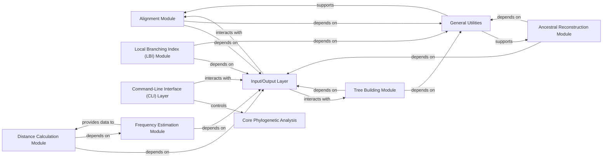

## Details

The `Core Phylogenetic Analysis` component is central to the `augur` project, embodying the core bioinformatics functionalities. It's designed with a modular architecture, where each sub-module specializes in a distinct phylogenetic task. This design aligns perfectly with the "Bioinformatics Pipeline Toolkit" project type, promoting reusability and maintainability.

### Core Phylogenetic Analysis [[Expand]](./Core_Phylogenetic_Analysis.md)
This overarching component orchestrates the fundamental computational steps for phylogenetic inference. It acts as a logical grouping for specialized modules that perform multiple sequence alignment, phylogenetic tree construction, ancestral sequence inference, genetic distance calculations, and Local Branching Index (LBI) computation.

**Related Classes/Methods**:

- <a href="https://github.com/nextstrain/augur/blob/master/augur/align.py#L1-L1" target="_blank" rel="noopener noreferrer">`augur.align` (1:1)</a>
- <a href="https://github.com/nextstrain/augur/blob/master/augur/tree.py#L1-L1" target="_blank" rel="noopener noreferrer">`augur.tree` (1:1)</a>
- <a href="https://github.com/nextstrain/augur/blob/master/augur/ancestral.py#L1-L1" target="_blank" rel="noopener noreferrer">`augur.ancestral` (1:1)</a>
- <a href="https://github.com/nextstrain/augur/blob/master/augur/distance.py#L1-L1" target="_blank" rel="noopener noreferrer">`augur.distance` (1:1)</a>
- <a href="https://github.com/nextstrain/augur/blob/master/augur/lbi.py#L1-L1" target="_blank" rel="noopener noreferrer">`augur.lbi` (1:1)</a>

### Alignment Module
Responsible for performing multiple sequence alignment, a crucial prerequisite for phylogenetic analysis. It likely interacts with external alignment tools via shell commands.

**Related Classes/Methods**:

- <a href="https://github.com/nextstrain/augur/blob/master/augur/align.py#L1-L1" target="_blank" rel="noopener noreferrer">`augur.align` (1:1)</a>

### Tree Building Module
Handles the construction of phylogenetic trees using various algorithms (e.g., RAxML, FastTree, IQ-TREE). This module takes aligned sequences as input and produces a phylogenetic tree.

**Related Classes/Methods**:

- <a href="https://github.com/nextstrain/augur/blob/master/augur/tree.py#L1-L1" target="_blank" rel="noopener noreferrer">`augur.tree` (1:1)</a>

### Ancestral Reconstruction Module
Focuses on inferring ancestral nucleotide or amino acid sequences at internal nodes of a phylogenetic tree. This is vital for understanding evolutionary changes over time.

**Related Classes/Methods**:

- <a href="https://github.com/nextstrain/augur/blob/master/augur/ancestral.py#L1-L1" target="_blank" rel="noopener noreferrer">`augur.ancestral` (1:1)</a>

### Distance Calculation Module
Calculates genetic distances between sequences or nodes on a phylogenetic tree. This module is crucial for quantifying evolutionary divergence.

**Related Classes/Methods**:

- <a href="https://github.com/nextstrain/augur/blob/master/augur/distance.py#L1-L1" target="_blank" rel="noopener noreferrer">`augur.distance` (1:1)</a>

### Local Branching Index (LBI) Module
Computes the Local Branching Index (LBI) to identify rapidly diversifying lineages within a phylogenetic tree. This is a specialized analysis for understanding evolutionary dynamics.

**Related Classes/Methods**:

- <a href="https://github.com/nextstrain/augur/blob/master/augur/lbi.py#L1-L1" target="_blank" rel="noopener noreferrer">`augur.lbi` (1:1)</a>

### Input/Output Layer
This component provides a standardized interface for reading and writing various data formats used throughout the `augur` project, such as sequence files, alignment files, tree files, and metadata.

**Related Classes/Methods**:

- `augur.io` (1:1)

### General Utilities
This component encompasses a collection of shared helper functions, data structures, and common functionalities used across multiple modules within the `augur` project. This includes functions for file path manipulation, error handling, shell command execution, and general data processing.

**Related Classes/Methods**:

- `augur.util_support` (1:1)
- <a href="https://github.com/nextstrain/augur/blob/master/augur/errors.py#L1-L1" target="_blank" rel="noopener noreferrer">`augur.errors` (1:1)</a>

### Command-Line Interface (CLI) Layer
This component is responsible for parsing command-line arguments, validating user input, and orchestrating the execution of the various phylogenetic analysis modules based on the provided commands and parameters.

**Related Classes/Methods**:

- `augur.cli` (1:1)

### Frequency Estimation Module
This module performs calculations related to sequence frequencies, which can be used in various phylogenetic analyses, including genetic distance calculations and evolutionary model fitting.

**Related Classes/Methods**:

- <a href="https://github.com/nextstrain/augur/blob/master/augur/frequency_estimators.py#L1-L1" target="_blank" rel="noopener noreferrer">`augur.frequency_estimators` (1:1)</a>

### [FAQ](https://github.com/CodeBoarding/GeneratedOnBoardings/tree/main?tab=readme-ov-file#faq)