```mermaid
graph LR
    Utility_Functions["Utility Functions"]
    Data_Types_and_Schemas["Data Types and Schemas"]
    Error_Handling_Framework["Error Handling Framework"]
    Date_and_Time_Utilities["Date and Time Utilities"]
    Support_Utilities["Support Utilities"]
    Utility_Functions -- "depends on" --> Data_Types_and_Schemas
    Utility_Functions -- "depends on" --> Error_Handling_Framework
    Date_and_Time_Utilities -- "depends on" --> Error_Handling_Framework
    Error_Handling_Framework -- "provides base exceptions to" --> Date_and_Time_Utilities
    Error_Handling_Framework -- "provides base exceptions to" --> Support_Utilities
    Data_Types_and_Schemas -- "provides data structures to" --> Utility_Functions
    Data_Types_and_Schemas -- "provides data structures to" --> Date_and_Time_Utilities
    Data_Types_and_Schemas -- "provides data structures to" --> Support_Utilities
```

## Details

This foundational component provides a collection of common helper functions, reusable data structures, and robust error handling mechanisms that are utilized across all other `augur` components. It includes utilities for generic file reading/writing, date parsing and handling, and fundamental data manipulation, ensuring consistency and reducing code duplication throughout the project.

### Utility Functions
This component provides a wide array of general utility functions for common operations like file handling, data manipulation, and string processing. It acts as a central hub for reusable code snippets, ensuring consistency and reducing code duplication across the `augur` project.

**Related Classes/Methods**:

- <a href="https://github.com/nextstrain/augur/blob/master/augur/utils.py#L1-L1000" target="_blank" rel="noopener noreferrer">`augur.utils` (1:1000)</a>

### Data Types and Schemas
This component defines the core data structures, enumerations (like `ArgparseEnum`), and type definitions used throughout the `augur` project. It ensures data consistency and facilitates clear communication and validation between different modules, which is crucial for a data-centric bioinformatics pipeline.

**Related Classes/Methods**:

- <a href="https://github.com/nextstrain/augur/blob/master/augur/types.py#L1-L1000" target="_blank" rel="noopener noreferrer">`augur.types` (1:1000)</a>

### Error Handling Framework
This component centralizes the definition of custom exception classes, such as `AugurError` and its various specialized subclasses (e.g., `InvalidDate`, `CyclicGeolocationRulesError`), specific to `augur`'s operations. It provides a structured and consistent approach to error handling across the pipeline, allowing for more specific and informative error reporting.

**Related Classes/Methods**:

- <a href="https://github.com/nextstrain/augur/blob/master/augur/errors.py#L1-L1000" target="_blank" rel="noopener noreferrer">`augur.errors` (1:1000)</a>

### Date and Time Utilities
This component specializes in parsing, validating, and resolving ambiguous date formats, which is crucial for epidemiological and phylogenetic data often characterized by varying date granularities. It provides specialized functions for date-related operations, ensuring temporal accuracy.

**Related Classes/Methods**:

- <a href="https://github.com/nextstrain/augur/blob/master/augur/dates/ambiguous_date.py#L1-L1000" target="_blank" rel="noopener noreferrer">`augur.dates.ambiguous_date` (1:1000)</a>

### Support Utilities
This component provides additional general-purpose utility functions and helper classes that support various functionalities across the `augur` project. This may include more specialized data handling or file processing capabilities that complement the broader `Utility Functions` component.

**Related Classes/Methods**:

- `augur.util_support` (1:1000)

### [FAQ](https://github.com/CodeBoarding/GeneratedOnBoardings/tree/main?tab=readme-ov-file#faq)