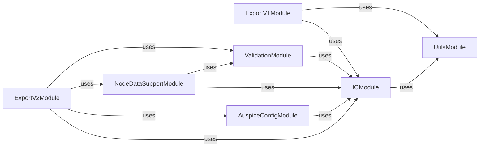

## Details

The `Data Export & Visualization Preparation` subsystem in `augur` is responsible for transforming and consolidating phylogenetic, metadata, and analytical data into a structured JSON format suitable for visualization platforms like Auspice. This process involves handling different schema versions (v1 and v2) and ensuring data integrity.

### ExportV1Module
Orchestrates the transformation and consolidation of phylogenetic, metadata, and analytical data into the Auspice v1 JSON format. It handles reading input data, processing tree structures, decorating JSON output, and writing the final files.

**Related Classes/Methods**:

- <a href="https://github.com/nextstrain/augur/augur/export_v1.py#L1-L1" target="_blank" rel="noopener noreferrer">`augur.export_v1` (1:1)</a>

### ExportV2Module
Manages the export of data into the Auspice v2 JSON format, providing more granular control over data presentation (e.g., colorings, filters, geo-resolutions). Its `run` method coordinates data parsing, configuration handling, setting metadata attributes, and validating the output.

**Related Classes/Methods**:

- <a href="https://github.com/nextstrain/augur/augur/export_v2.py#L1-L1" target="_blank" rel="noopener noreferrer">`augur.export_v2` (1:1)</a>

### IOModule
Encapsulates all input/output operations, including reading sequences, metadata, and general file handling (opening, reading, writing JSON, TSV, etc.). It provides a standardized interface for data ingress and egress across the `augur` project.

**Related Classes/Methods**:

- `augur.io` (1:1)

### UtilsModule
A foundational utility module providing common functions for data manipulation (e.g., handling node data, colors, geographical coordinates, date parsing) and general helpers used across the `augur` project.

**Related Classes/Methods**:

- <a href="https://github.com/nextstrain/augur/augur/utils.py#L1-L1" target="_blank" rel="noopener noreferrer">`augur.utils` (1:1)</a>

### AuspiceConfigModule
Manages the reading, merging, and processing of Auspice configuration files, including handling deprecated names and consolidating different configuration sections (e.g., colorings, filters, display settings).

**Related Classes/Methods**:

- <a href="https://github.com/nextstrain/augur/augur/util_support/auspice_config.py#L1-L1" target="_blank" rel="noopener noreferrer">`augur.util_support.auspice_config` (1:1)</a>

### NodeDataSupportModule
Provides specialized support for handling node-specific data within the phylogenetic tree, including updating node attributes, validating node data files, and reading node data from various sources. It ensures that tree nodes are correctly annotated for visualization.

**Related Classes/Methods**:

- <a href="https://github.com/nextstrain/augur/augur/util_support/node_data.py#L1-L1" target="_blank" rel="noopener noreferrer">`augur.util_support.node_data` (1:1)</a>
- <a href="https://github.com/nextstrain/augur/augur/util_support/node_data_file.py#L1-L1" target="_blank" rel="noopener noreferrer">`augur.util_support.node_data_file` (1:1)</a>
- <a href="https://github.com/nextstrain/augur/augur/util_support/node_data_reader.py#L1-L1" target="_blank" rel="noopener noreferrer">`augur.util_support.node_data_reader` (1:1)</a>

### ValidationModule
Responsible for validating data against predefined JSON schemas, ensuring the integrity and correctness of the exported Auspice JSON files. It helps catch errors before the data is used for visualization.

**Related Classes/Methods**:

- <a href="https://github.com/nextstrain/augur/augur/validate.py#L1-L1" target="_blank" rel="noopener noreferrer">`augur.validate` (1:1)</a>
- <a href="https://github.com/nextstrain/augur/augur/validate_export.py#L1-L1" target="_blank" rel="noopener noreferrer">`augur.validate_export` (1:1)</a>

### [FAQ](https://github.com/CodeBoarding/GeneratedOnBoardings/tree/main?tab=readme-ov-file#faq)