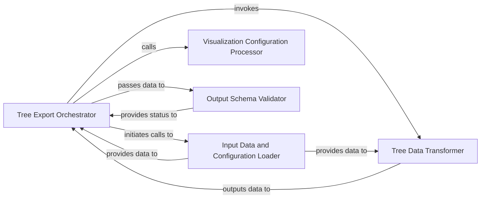

## Details

The `Data Export & Visualization Preparation` component is a critical part of the bioinformatics pipeline, responsible for transforming processed phylogenetic data into standardized JSON formats suitable for external visualization platforms like Auspice. This component adheres to the project's architectural patterns by being modular, data-centric, and part of a larger pipeline. This component is dedicated to formatting and serializing all processed bioinformatics data, particularly phylogenetic trees and their associated node data and metadata, into standardized JSON formats. These outputs are specifically designed for seamless integration with external visualization platforms, such as Auspice, enabling interactive exploration of the analysis results.

### Tree Export Orchestrator
This component serves as the primary entry point for the data export process, coordinating the entire workflow for different Auspice schema versions (v1 and v2). It orchestrates the loading of input data, the transformation and enrichment of phylogenetic tree data, the application of visualization-specific configurations, and the final serialization and validation of the output JSON. It acts as the central control unit for the export pipeline, embodying the "Pipeline/Workflow Architecture" pattern.

**Related Classes/Methods**:

- <a href="https://github.com/nextstrain/augur/blob/master/augur/export_v1.py" target="_blank" rel="noopener noreferrer">`augur.export_v1.run`</a>
- <a href="https://github.com/nextstrain/augur/blob/master/augur/export_v2.py" target="_blank" rel="noopener noreferrer">`augur.export_v2.run`</a>

### Input Data and Configuration Loader
Responsible for reading, parsing, and preparing all necessary input data, including phylogenetic tree files, associated metadata (TSVs), and configuration files. It ensures that the raw data is correctly interpreted and made available for subsequent processing steps in the export pipeline. This component handles the initial data ingestion and setup, aligning with a "Data-Centric Architecture" by focusing on robust data input.

**Related Classes/Methods**:

- <a href="https://github.com/nextstrain/augur/blob/master/augur/export_v1.py" target="_blank" rel="noopener noreferrer">`augur.export_v1.ensure_config_is_v1`</a>
- <a href="https://github.com/nextstrain/augur/blob/master/augur/export_v2.py" target="_blank" rel="noopener noreferrer">`augur.export_v2.parse_node_data_and_metadata`</a>
- <a href="https://github.com/nextstrain/augur/blob/master/augur/export_v2.py" target="_blank" rel="noopener noreferrer">`augur.export_v2.get_additional_metadata_columns`</a>
- <a href="https://github.com/nextstrain/augur/blob/master/augur/export_v2.py" target="_blank" rel="noopener noreferrer">`augur.export_v2.get_config_colorings_as_dict`</a>

### Tree Data Transformer
This component handles the core transformation of the phylogenetic tree object into a JSON-compatible structure. It recursively traverses the tree, converting nodes and branches, and enriches them with various biological and epidemiological attributes derived from input metadata, ancestral reconstructions, and trait inferences. This includes adding details like dates, geographic information, and confidence scores, forming the foundational tree representation. This component is central to the "Data Models and Schemas" aspect, as it shapes the primary data structure for export.

**Related Classes/Methods**:

- <a href="https://github.com/nextstrain/augur/blob/master/augur/export_v1.py" target="_blank" rel="noopener noreferrer">`augur.export_v1.convert_tree_to_json_structure`</a>
- <a href="https://github.com/nextstrain/augur/blob/master/augur/export_v2.py" target="_blank" rel="noopener noreferrer">`augur.export_v2.convert_tree_to_json_structure`</a>
- <a href="https://github.com/nextstrain/augur/blob/master/augur/export_v1.py" target="_blank" rel="noopener noreferrer">`augur.export_v1.add_tsv_metadata_to_nodes`</a>
- <a href="https://github.com/nextstrain/augur/blob/master/augur/export_v2.py" target="_blank" rel="noopener noreferrer">`augur.export_v2.set_node_attrs_on_tree`</a>
- <a href="https://github.com/nextstrain/augur/blob/master/augur/export_v2.py" target="_blank" rel="noopener noreferrer">`augur.export_v2.set_branch_attrs_on_tree`</a>
- <a href="https://github.com/nextstrain/augur/blob/master/augur/export_v2.py" target="_blank" rel="noopener noreferrer">`augur.export_v2.create_author_data`</a>
- <a href="https://github.com/nextstrain/augur/blob/master/augur/export_v2.py" target="_blank" rel="noopener noreferrer">`augur.export_v2.attr_confidence`</a>

### Visualization Configuration Processor
Manages the definition and application of visual colorings, data filters, and geographic resolutions based on specific traits or metadata properties. This component prepares the processed tree data for interactive visualization in platforms like Auspice, enabling users to highlight and explore specific aspects of the phylogenetic analysis results. It ensures the data is visually ready for display, directly supporting the "Data-Centric Architecture" by preparing data for its final consumption.

**Related Classes/Methods**:

- <a href="https://github.com/nextstrain/augur/blob/master/augur/export_v1.py" target="_blank" rel="noopener noreferrer">`augur.export_v1.process_colorings`</a>
- <a href="https://github.com/nextstrain/augur/blob/master/augur/export_v2.py" target="_blank" rel="noopener noreferrer">`augur.export_v2.set_colorings`</a>
- <a href="https://github.com/nextstrain/augur/blob/master/augur/export_v2.py" target="_blank" rel="noopener noreferrer">`augur.export_v2.set_filters`</a>
- <a href="https://github.com/nextstrain/augur/blob/master/augur/export_v1.py" target="_blank" rel="noopener noreferrer">`augur.export_v1.process_geographic_info`</a>
- <a href="https://github.com/nextstrain/augur/blob/master/augur/export_v2.py" target="_blank" rel="noopener noreferrer">`augur.export_v2.set_geo_resolutions`</a>

### Output Schema Validator
Ensures that the final generated JSON output conforms strictly to the specified Auspice schema (v1 or v2). This validation step is critical for guaranteeing compatibility and seamless integration with external visualization platforms, preventing malformed data from being passed downstream. It acts as a quality gate for the exported data, aligning with the "Data Models and Schemas" pattern by enforcing data integrity.

**Related Classes/Methods**:

- <a href="https://github.com/nextstrain/augur/blob/master/augur/export_v2.py" target="_blank" rel="noopener noreferrer">`augur.export_v2.validate_data_json`</a>

### [FAQ](https://github.com/CodeBoarding/GeneratedOnBoardings/tree/main?tab=readme-ov-file#faq)