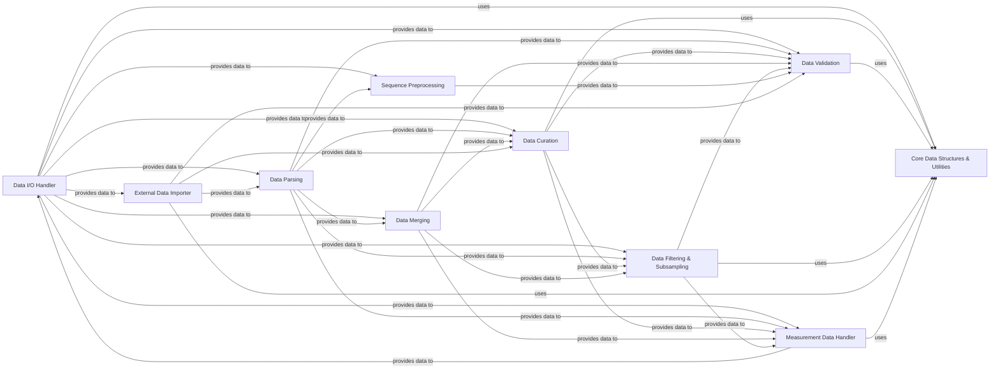

## Details

The `Data I/O & Preprocessing` component in `augur` is a critical subsystem responsible for managing the entire lifecycle of data from ingestion to initial transformation, ensuring data quality and readiness for downstream bioinformatics analyses. It adheres to Bioinformatics Pipeline Toolkit patterns by providing modular, data-centric functionalities.

### Data I/O Handler
This is the foundational component for all data ingress and egress. It manages reading from and writing to diverse bioinformatics file formats such as FASTA, VCF, JSON, and Newick trees.

**Related Classes/Methods**:

- `augur.io` (1:1)
- <a href="https://github.com/nextstrain/augur/blob/master/augur/io/file.py#L1-L1" target="_blank" rel="noopener noreferrer">`augur.io.file` (1:1)</a>
- <a href="https://github.com/nextstrain/augur/blob/master/augur/io/metadata.py#L1-L1" target="_blank" rel="noopener noreferrer">`augur.io.metadata` (1:1)</a>
- <a href="https://github.com/nextstrain/augur/blob/master/augur/io/sequences.py#L1-L1" target="_blank" rel="noopener noreferrer">`augur.io.sequences` (1:1)</a>
- <a href="https://github.com/nextstrain/augur/blob/master/augur/io/strains.py#L1-L1" target="_blank" rel="noopener noreferrer">`augur.io.strains` (1:1)</a>
- <a href="https://github.com/nextstrain/augur/blob/master/augur/io/json.py#L1-L1" target="_blank" rel="noopener noreferrer">`augur.io.json` (1:1)</a>
- <a href="https://github.com/nextstrain/augur/blob/master/augur/io/print.py#L1-L1" target="_blank" rel="noopener noreferrer">`augur.io.print` (1:1)</a>
- <a href="https://github.com/nextstrain/augur/blob/master/augur/io/shell_command_runner.py#L1-L1" target="_blank" rel="noopener noreferrer">`augur.io.shell_command_runner` (1:1)</a>

### Data Parsing
Responsible for interpreting raw input data from various file formats and transforming it into structured Python objects or data frames that are suitable for further processing within the pipeline.

**Related Classes/Methods**:

- <a href="https://github.com/nextstrain/augur/blob/master/augur/parse.py#L1-L1" target="_blank" rel="noopener noreferrer">`augur.parse` (1:1)</a>

### Data Curation
Focuses on cleaning, standardizing, and enriching metadata and other data fields. This includes tasks like formatting dates, abbreviating author names, and applying geolocation rules to ensure data consistency.

**Related Classes/Methods**:

- `augur.curate` (1:1)
- <a href="https://github.com/nextstrain/augur/blob/master/augur/curate/abbreviate_authors.py#L1-L1" target="_blank" rel="noopener noreferrer">`augur.curate.abbreviate_authors` (1:1)</a>
- <a href="https://github.com/nextstrain/augur/blob/master/augur/curate/apply_geolocation_rules.py#L1-L1" target="_blank" rel="noopener noreferrer">`augur.curate.apply_geolocation_rules` (1:1)</a>
- <a href="https://github.com/nextstrain/augur/blob/master/augur/curate/format_dates.py#L1-L1" target="_blank" rel="noopener noreferrer">`augur.curate.format_dates` (1:1)</a>

### Data Merging
Handles the combination of multiple datasets or metadata files into a single, coherent structure, typically based on common identifiers or keys.

**Related Classes/Methods**:

- <a href="https://github.com/nextstrain/augur/blob/master/augur/merge.py#L1-L1" target="_blank" rel="noopener noreferrer">`augur.merge` (1:1)</a>

### Data Validation
Ensures the integrity and correctness of data by validating it against predefined schemas and rules. It identifies and handles inconsistencies or errors in the input data.

**Related Classes/Methods**:

- <a href="https://github.com/nextstrain/augur/blob/master/augur/validate.py#L1-L1" target="_blank" rel="noopener noreferrer">`augur.validate` (1:1)</a>

### Data Filtering & Subsampling
Implements logic to select specific subsets of data based on various criteria (filtering) or to reduce the overall dataset size (subsampling) for performance or specific analytical needs.

**Related Classes/Methods**:

- `augur.filter` (1:1)
- <a href="https://github.com/nextstrain/augur/blob/master/augur/filter/_run.py#L1-L1" target="_blank" rel="noopener noreferrer">`augur.filter._run` (1:1)</a>
- <a href="https://github.com/nextstrain/augur/blob/master/augur/filter/io.py#L1-L1" target="_blank" rel="noopener noreferrer">`augur.filter.io` (1:1)</a>
- <a href="https://github.com/nextstrain/augur/blob/master/augur/filter/subsample.py#L1-L1" target="_blank" rel="noopener noreferrer">`augur.filter.subsample` (1:1)</a>
- <a href="https://github.com/nextstrain/augur/blob/master/augur/filter/weights_file.py#L1-L1" target="_blank" rel="noopener noreferrer">`augur.filter.weights_file` (1:1)</a>

### Sequence Preprocessing
Performs specialized operations on sequence data, including creating indices for efficient access (e.g., augur.index) and masking problematic or ambiguous regions (augur.mask) to improve downstream analysis accuracy.

**Related Classes/Methods**:

- <a href="https://github.com/nextstrain/augur/blob/master/augur/index.py#L1-L1" target="_blank" rel="noopener noreferrer">`augur.index` (1:1)</a>
- <a href="https://github.com/nextstrain/augur/blob/master/augur/mask.py#L1-L1" target="_blank" rel="noopener noreferrer">`augur.mask` (1:1)</a>

### External Data Importer
Facilitates the ingestion of data from specific external software formats, such as BEAST output files, converting them into augur-compatible structures for integration into the pipeline.

**Related Classes/Methods**:

- `augur.import_` (1:1)
- <a href="https://github.com/nextstrain/augur/blob/master/augur/import_/beast.py#L1-L1" target="_blank" rel="noopener noreferrer">`augur.import_.beast` (1:1)</a>

### Measurement Data Handler
Manages the concatenation and export of measurement-specific data, preparing it for analysis or output. This component ensures that quantitative data is correctly aggregated and formatted.

**Related Classes/Methods**:

- `augur.measurements` (1:1)
- <a href="https://github.com/nextstrain/augur/blob/master/augur/measurements/concat.py#L1-L1" target="_blank" rel="noopener noreferrer">`augur.measurements.concat` (1:1)</a>
- <a href="https://github.com/nextstrain/augur/blob/master/augur/measurements/export.py#L1-L1" target="_blank" rel="noopener noreferrer">`augur.measurements.export` (1:1)</a>

### Core Data Structures & Utilities
Provides fundamental data types, enumerations (e.g., for validation modes), and a centralized error handling mechanism (AugurError and its subclasses) that are utilized across the entire Data I/O & Preprocessing component. It acts as a foundational support layer.

**Related Classes/Methods**:

- <a href="https://github.com/nextstrain/augur/blob/master/augur/types.py#L1-L1" target="_blank" rel="noopener noreferrer">`augur.types` (1:1)</a>
- <a href="https://github.com/nextstrain/augur/blob/master/augur/errors.py#L1-L1" target="_blank" rel="noopener noreferrer">`augur.errors` (1:1)</a>

### [FAQ](https://github.com/CodeBoarding/GeneratedOnBoardings/tree/main?tab=readme-ov-file#faq)