```mermaid
graph LR
    Data_Input_Output["Data Input/Output"]
    Date_Time_Management["Date & Time Management"]
    Data_Validation["Data Validation"]
    External_Data_Import["External Data Import"]
    Measurement_Data_Management["Measurement Data Management"]
    General_Utilities["General Utilities"]
    Error_Handling["Error Handling"]
    Type_Definitions["Type Definitions"]
    Data_Input_Output -- "reads/writes data for" --> External_Data_Import
    Data_Input_Output -- "handles file operations for" --> Measurement_Data_Management
    Data_Input_Output -- "utilizes helper functions from" --> General_Utilities
    Data_Input_Output -- "defines exceptions via" --> Error_Handling
    Date_Time_Management -- "provides date validation to" --> Data_Validation
    Date_Time_Management -- "defines exceptions via" --> Error_Handling
    Data_Validation -- "ensures data integrity for" --> Data_Input_Output
    Data_Validation -- "validates data for" --> Measurement_Data_Management
    Data_Validation -- "defines exceptions via" --> Error_Handling
    Data_Validation -- "uses common types from" --> Type_Definitions
    External_Data_Import -- "relies on" --> Data_Input_Output
    External_Data_Import -- "uses" --> General_Utilities
    Measurement_Data_Management -- "relies on" --> Data_Input_Output
    Measurement_Data_Management -- "uses" --> Data_Validation
    General_Utilities -- "supports various tasks for" --> Data_Input_Output
    General_Utilities -- "supports" --> External_Data_Import
    General_Utilities -- "supports" --> Measurement_Data_Management
    General_Utilities -- "uses common types from" --> Type_Definitions
    Error_Handling -- "provides exceptions to" --> Data_Input_Output
    Error_Handling -- "provides exceptions to" --> Date_Time_Management
    Error_Handling -- "provides exceptions to" --> Data_Validation
    Type_Definitions -- "defines types for" --> Data_Validation
    Type_Definitions -- "defines types for" --> General_Utilities
```

## Details

This subsystem provides the essential infrastructure for all data-related operations within `augur`, encompassing file handling, date processing, data validation, and specialized data import/management. It ensures data integrity, consistency, and efficient exchange throughout the project.

### Data Input/Output
This component is the core for reading from and writing to various file formats, including sequences (FASTA), metadata (TSV/CSV), JSON, and handling shell command execution for I/O-related tasks. It abstracts the complexities of file handling and ensures consistent data exchange within the `augur` ecosystem.

**Related Classes/Methods**:

- `augur.io` (0:0)
- <a href="https://github.com/nextstrain/augur/augur/io/file.py#L0-L0" target="_blank" rel="noopener noreferrer">`augur.io.file` (0:0)</a>
- <a href="https://github.com/nextstrain/augur/augur/io/metadata.py#L0-L0" target="_blank" rel="noopener noreferrer">`augur.io.metadata` (0:0)</a>
- <a href="https://github.com/nextstrain/augur/augur/io/sequences.py#L0-L0" target="_blank" rel="noopener noreferrer">`augur.io.sequences` (0:0)</a>
- <a href="https://github.com/nextstrain/augur/augur/io/strains.py#L0-L0" target="_blank" rel="noopener noreferrer">`augur.io.strains` (0:0)</a>
- <a href="https://github.com/nextstrain/augur/augur/io/json.py#L0-L0" target="_blank" rel="noopener noreferrer">`augur.io.json` (0:0)</a>
- <a href="https://github.com/nextstrain/augur/augur/io/shell_command_runner.py#L0-L0" target="_blank" rel="noopener noreferrer">`augur.io.shell_command_runner` (0:0)</a>
- <a href="https://github.com/nextstrain/augur/augur/io/print.py#L0-L0" target="_blank" rel="noopener noreferrer">`augur.io.print` (0:0)</a>

### Date & Time Management
This component centralizes all date and time-related operations, including parsing various date formats, validating dates, and handling ambiguous date entries. It's crucial for temporal analyses and filtering operations within `augur`.

**Related Classes/Methods**:

- `augur.dates` (0:0)
- <a href="https://github.com/nextstrain/augur/augur/dates/ambiguous_date.py#L0-L0" target="_blank" rel="noopener noreferrer">`augur.dates.ambiguous_date` (0:0)</a>
- <a href="https://github.com/nextstrain/augur/augur/dates/errors.py#L0-L0" target="_blank" rel="noopener noreferrer">`augur.dates.errors` (0:0)</a>

### Data Validation
This component is responsible for ensuring the integrity and correctness of data at various stages of processing. It includes validation routines for different data types and structures, crucial for maintaining data quality throughout the `augur` pipeline.

**Related Classes/Methods**:

- <a href="https://github.com/nextstrain/augur/augur/validate.py#L0-L0" target="_blank" rel="noopener noreferrer">`augur.validate` (0:0)</a>
- <a href="https://github.com/nextstrain/augur/augur/validate_export.py#L0-L0" target="_blank" rel="noopener noreferrer">`augur.validate_export` (0:0)</a>

### External Data Import
This component specifically handles the import of data from external tools or formats, such as BEAST. It provides specialized parsing and conversion logic to integrate external datasets into the `augur` framework.

**Related Classes/Methods**:

- `augur.import_` (0:0)
- <a href="https://github.com/nextstrain/augur/augur/import_/beast.py#L0-L0" target="_blank" rel="noopener noreferrer">`augur.import_.beast` (0:0)</a>

### Measurement Data Management
This component focuses on the handling, concatenation, and export of specialized measurement data. It provides functionalities tailored for quantitative data, ensuring it can be processed and integrated with other `augur` analyses.

**Related Classes/Methods**:

- `augur.measurements` (0:0)
- <a href="https://github.com/nextstrain/augur/augur/measurements/concat.py#L0-L0" target="_blank" rel="noopener noreferrer">`augur.measurements.concat` (0:0)</a>
- <a href="https://github.com/nextstrain/augur/augur/measurements/export.py#L0-L0" target="_blank" rel="noopener noreferrer">`augur.measurements.export` (0:0)</a>

### General Utilities
This component serves as a collection of miscellaneous helper functions and common utilities that are broadly applicable across different `augur` components. It includes functions for data manipulation, string operations, and other general-purpose tasks that don't fit into more specific categories.

**Related Classes/Methods**:

- <a href="https://github.com/nextstrain/augur/augur/utils.py#L0-L0" target="_blank" rel="noopener noreferrer">`augur.utils` (0:0)</a>

### Error Handling
This component defines custom exception classes used throughout the `augur` project to provide specific and informative error messages. This improves debugging and makes the system more robust by allowing for precise error identification and handling.

**Related Classes/Methods**:

- <a href="https://github.com/nextstrain/augur/augur/errors.py#L0-L0" target="_blank" rel="noopener noreferrer">`augur.errors` (0:0)</a>

### Type Definitions
This component defines common data types, enums, and argument parsing utilities used across the `augur` project. It ensures consistency in data structures and command-line interfaces, promoting uniformity and reducing potential errors.

**Related Classes/Methods**:

- <a href="https://github.com/nextstrain/augur/augur/types.py#L0-L0" target="_blank" rel="noopener noreferrer">`augur.types` (0:0)</a>

### [FAQ](https://github.com/CodeBoarding/GeneratedOnBoardings/tree/main?tab=readme-ov-file#faq)