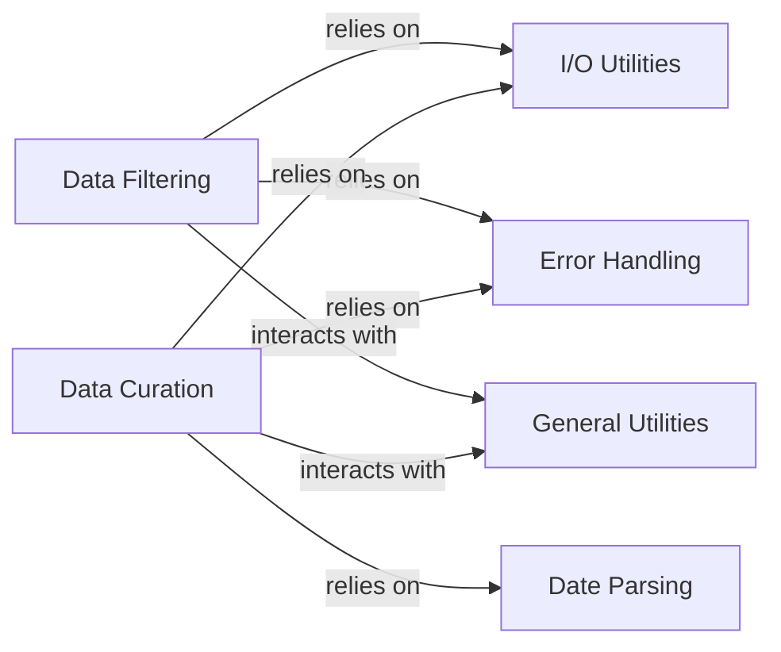

## Details

This analysis focuses on the `Data Preprocessing` subsystem within the `augur` project, which is crucial for transforming raw input data into a clean, standardized, and analysis-ready format. This subsystem is composed of several fundamental components, each with distinct responsibilities and interactions.

### Data Filtering
This component is responsible for the initial screening and reduction of sequence data. It applies various criteria (e.g., date ranges, geographic locations, sequence quality) to include or exclude sequences and can subsample datasets to manage size and diversity.

**Related Classes/Methods**:

- <a href="https://github.com/nextstrain/augur/augur/filter/__init__.py#L0-L0" target="_blank" rel="noopener noreferrer">`augur/filter/__init__.py` (0:0)</a>
- <a href="https://github.com/nextstrain/augur/augur/filter/_run.py#L0-L0" target="_blank" rel="noopener noreferrer">`augur/filter/_run.py` (0:0)</a>
- <a href="https://github.com/nextstrain/augur/augur/filter/include_exclude_rules.py#L0-L0" target="_blank" rel="noopener noreferrer">`augur/filter/include_exclude_rules.py` (0:0)</a>
- <a href="https://github.com/nextstrain/augur/augur/filter/subsample.py#L0-L0" target="_blank" rel="noopener noreferrer">`augur/filter/subsample.py` (0:0)</a>
- <a href="https://github.com/nextstrain/augur/augur/filter/io.py#L0-L0" target="_blank" rel="noopener noreferrer">`augur/filter/io.py` (0:0)</a>
- <a href="https://github.com/nextstrain/augur/augur/filter/validate_arguments.py#L0-L0" target="_blank" rel="noopener noreferrer">`augur/filter/validate_arguments.py` (0:0)</a>
- <a href="https://github.com/nextstrain/augur/augur/filter/weights_file.py#L0-L0" target="_blank" rel="noopener noreferrer">`augur/filter/weights_file.py` (0:0)</a>

### Data Curation
This component focuses on standardizing and enriching metadata associated with the sequences. This includes tasks such as applying geolocation rules, formatting dates, renaming columns, abbreviating author names, normalizing string fields, and parsing GenBank location information.

**Related Classes/Methods**:

- <a href="https://github.com/nextstrain/augur/augur/curate/__init__.py#L0-L0" target="_blank" rel="noopener noreferrer">`augur/curate/__init__.py` (0:0)</a>
- <a href="https://github.com/nextstrain/augur/augur/curate/apply_geolocation_rules.py#L0-L0" target="_blank" rel="noopener noreferrer">`augur/curate/apply_geolocation_rules.py` (0:0)</a>
- <a href="https://github.com/nextstrain/augur/augur/curate/format_dates.py#L0-L0" target="_blank" rel="noopener noreferrer">`augur/curate/format_dates.py` (0:0)</a>
- <a href="https://github.com/nextstrain/augur/augur/curate/rename.py#L0-L0" target="_blank" rel="noopener noreferrer">`augur/curate/rename.py` (0:0)</a>
- <a href="https://github.com/nextstrain/augur/augur/curate/abbreviate_authors.py#L0-L0" target="_blank" rel="noopener noreferrer">`augur/curate/abbreviate_authors.py` (0:0)</a>
- <a href="https://github.com/nextstrain/augur/augur/curate/normalize_strings.py#L0-L0" target="_blank" rel="noopener noreferrer">`augur/curate/normalize_strings.py` (0:0)</a>
- <a href="https://github.com/nextstrain/augur/augur/curate/parse_genbank_location.py#L0-L0" target="_blank" rel="noopener noreferrer">`augur/curate/parse_genbank_location.py` (0:0)</a>

### I/O Utilities
This component provides the foundational capabilities for reading raw input data (sequences, metadata, rule files) and writing processed data. It abstracts the complexities of file handling and data serialization/deserialization.

**Related Classes/Methods**:

- <a href="https://github.com/nextstrain/augur/augur/io/file.py#L0-L0" target="_blank" rel="noopener noreferrer">`augur/io/file.py` (0:0)</a>
- <a href="https://github.com/nextstrain/augur/augur/io/metadata.py#L0-L0" target="_blank" rel="noopener noreferrer">`augur/io/metadata.py` (0:0)</a>
- <a href="https://github.com/nextstrain/augur/augur/io/sequences.py#L0-L0" target="_blank" rel="noopener noreferrer">`augur/io/sequences.py` (0:0)</a>
- <a href="https://github.com/nextstrain/augur/augur/io/print.py#L0-L0" target="_blank" rel="noopener noreferrer">`augur/io/print.py` (0:0)</a>

### General Utilities
This component serves as a repository for common helper functions and reusable utilities that support various operations across the `augur` project, including those within data preprocessing.

**Related Classes/Methods**:

- <a href="https://github.com/nextstrain/augur/augur/utils.py#L0-L0" target="_blank" rel="noopener noreferrer">`augur/utils.py` (0:0)</a>

### Error Handling
This component defines and manages custom error types and mechanisms for reporting issues encountered during data processing. It ensures that errors are caught, reported consistently, and can be handled gracefully.

**Related Classes/Methods**:

- <a href="https://github.com/nextstrain/augur/augur/errors.py#L0-L0" target="_blank" rel="noopener noreferrer">`augur/errors.py` (0:0)</a>
- <a href="https://github.com/nextstrain/augur/augur/filter/weights_file.py#L10-L12" target="_blank" rel="noopener noreferrer">`augur.filter.weights_file.InvalidWeightsFile` (10:12)</a>
- <a href="https://github.com/nextstrain/augur/augur/curate/apply_geolocation_rules.py#L0-L0" target="_blank" rel="noopener noreferrer">`augur.curate.apply_geolocation_rules.CyclicGeolocationRulesError` (0:0)</a>
- <a href="https://github.com/nextstrain/augur/augur/curate/apply_geolocation_rules.py#L0-L0" target="_blank" rel="noopener noreferrer">`augur.curate.apply_geolocation_rules.NoGeolocationRulesProvidedError` (0:0)</a>
- <a href="https://github.com/nextstrain/augur/augur/dates/errors.py#L2-L12" target="_blank" rel="noopener noreferrer">`augur.dates.errors.InvalidDate` (2:12)</a>

### Date Parsing
This component specializes in the parsing, validation, and formatting of date-related information, which is a critical aspect of metadata curation.

**Related Classes/Methods**:

- <a href="https://github.com/nextstrain/augur/augur/dates/__init__.py#L0-L0" target="_blank" rel="noopener noreferrer">`augur/dates/__init__.py` (0:0)</a>
- <a href="https://github.com/nextstrain/augur/augur/dates/errors.py#L0-L0" target="_blank" rel="noopener noreferrer">`augur/dates/errors.py` (0:0)</a>

### [FAQ](https://github.com/CodeBoarding/GeneratedOnBoardings/tree/main?tab=readme-ov-file#faq)