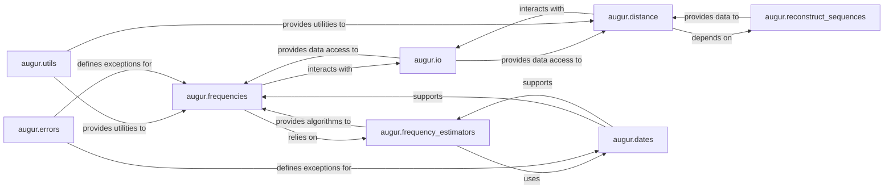

## Details

The Epidemiological Analysis subsystem within {project_name} is designed to perform quantitative analyses of pathogen evolution, focusing on the temporal dynamics of clades and genotypes, and the genetic relatedness between samples. It primarily leverages three core components: augur.frequencies, augur.frequency_estimators, and augur.distance, supported by foundational utilities for data handling, date management, and error reporting.

### augur.frequencies
This component orchestrates the entire workflow for estimating the frequencies of clades or mutations over time. It is responsible for parsing input data, selecting appropriate frequency estimation methods, and formatting the final output. It acts as the primary control flow for temporal frequency analysis.

**Related Classes/Methods**:

- <a href="https://github.com/nextstrain/augur/augur/frequencies.py#L1-L1" target="_blank" rel="noopener noreferrer">`augur.frequencies` (1:1)</a>

### augur.frequency_estimators
This component houses the core algorithms and statistical models used for various frequency estimation techniques. This includes Kernel Density Estimation (KDE) for both tree-based and alignment-based data, as well as general frequency estimators. It provides the mathematical backbone for all frequency calculations.

**Related Classes/Methods**:

- <a href="https://github.com/nextstrain/augur/augur/frequency_estimators.py#L1-L1" target="_blank" rel="noopener noreferrer">`augur.frequency_estimators` (1:1)</a>

### augur.distance
This component is dedicated to computing various types of phylogenetic distances, such as distances to the root, to the last common ancestor, or between all pairs of nodes within a phylogenetic tree. It manages the loading of necessary data and applies the distance algorithms, often involving sequence reconstruction.

**Related Classes/Methods**:

- <a href="https://github.com/nextstrain/augur/augur/distance.py#L1-L1" target="_blank" rel="noopener noreferrer">`augur.distance` (1:1)</a>

### augur.io
A foundational component that provides standardized methods for reading and writing data to and from various file formats, including metadata, sequences, and general file operations. It serves as the essential input/output layer for the entire `augur` project, ensuring data accessibility for analytical components.

**Related Classes/Methods**:

- `augur.io` (1:1)
- <a href="https://github.com/nextstrain/augur/augur/io/file.py#L1-L1" target="_blank" rel="noopener noreferrer">`augur.io.file` (1:1)</a>
- <a href="https://github.com/nextstrain/augur/augur/io/metadata.py#L1-L1" target="_blank" rel="noopener noreferrer">`augur.io.metadata` (1:1)</a>
- <a href="https://github.com/nextstrain/augur/augur/io/sequences.py#L1-L1" target="_blank" rel="noopener noreferrer">`augur.io.sequences` (1:1)</a>

### augur.utils
This component offers a collection of general-purpose utility functions that support diverse operations across the `augur` project. These include annotating phylogenetic trees, reading node-specific data, writing JSON output, and handling color parsing, providing a common toolkit for various functionalities.

**Related Classes/Methods**:

- <a href="https://github.com/nextstrain/augur/augur/utils.py#L1-L1" target="_blank" rel="noopener noreferrer">`augur.utils` (1:1)</a>

### augur.dates
This component is specifically designed to handle date-related operations. It manages conversions between different date formats (e.g., timestamp to float, numeric date representations) and addresses complexities like ambiguous date formats, which are crucial for temporal epidemiological analyses.

**Related Classes/Methods**:

- `augur.dates` (1:1)

### augur.errors
This component defines custom exception classes, such as `AugurError`, to provide specific and informative error messages for various issues encountered within the `augur` project. It centralizes error definition, contributing to more robust and user-friendly error handling.

**Related Classes/Methods**:

- <a href="https://github.com/nextstrain/augur/augur/errors.py#L1-L1" target="_blank" rel="noopener noreferrer">`augur.errors` (1:1)</a>

### augur.reconstruct_sequences
This component is responsible for reconstructing ancestral sequences or performing other sequence-related processing. This functionality is often a prerequisite for accurate phylogenetic distance calculations, providing the necessary processed genetic data.

**Related Classes/Methods**:

- <a href="https://github.com/nextstrain/augur/augur/reconstruct_sequences.py#L1-L1" target="_blank" rel="noopener noreferrer">`augur.reconstruct_sequences` (1:1)</a>

### [FAQ](https://github.com/CodeBoarding/GeneratedOnBoardings/tree/main?tab=readme-ov-file#faq)