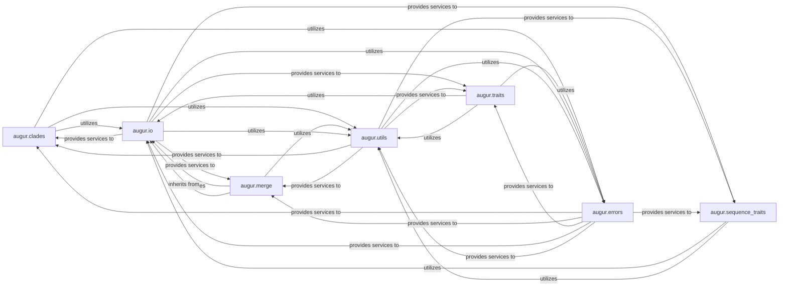

## Details

This subsystem is central to enriching phylogenetic data within `augur` by integrating metadata and inferring evolutionary traits. It encompasses modules responsible for defining and assigning clades, annotating sequences with derived traits, inferring ancestral characteristics, and robustly merging diverse data sources. The core functionality relies heavily on efficient data input/output and a suite of general utility functions, all supported by a consistent error handling framework.

### augur.clades
This module is responsible for defining, parsing, and assigning clades to nodes in a phylogenetic tree. It ensures data integrity and associates nodes with specific clades based on genetic markers.

**Related Classes/Methods**:

- <a href="https://github.com/nextstrain/augur/augur/clades.py#L0-L0" target="_blank" rel="noopener noreferrer">`augur.clades` (0:0)</a>

### augur.sequence_traits
Focuses on annotating strains with sequence-derived traits. It reads VCF files and feature definitions (e.g., from GFF or GenBank) to enrich sequence data with relevant biological characteristics.

**Related Classes/Methods**:

- <a href="https://github.com/nextstrain/augur/augur/sequence_traits.py#L0-L0" target="_blank" rel="noopener noreferrer">`augur.sequence_traits` (0:0)</a>

### augur.traits
Dedicated to inferring ancestral traits and labeling branches based on these inferences. It uses metadata and phylogenetic trees to reconstruct the evolutionary history of specific traits (e.g., geographic origin, host).

**Related Classes/Methods**:

- <a href="https://github.com/nextstrain/augur/augur/traits.py#L0-L0" target="_blank" rel="noopener noreferrer">`augur.traits` (0:0)</a>

### augur.merge
Facilitates the merging of various data types, primarily metadata and sequences. It includes robust validation of arguments and handles potential conflicts during the merge process, often interacting with database-like structures.

**Related Classes/Methods**:

- <a href="https://github.com/nextstrain/augur/augur/merge.py#L0-L0" target="_blank" rel="noopener noreferrer">`augur.merge` (0:0)</a>

### augur.io
A foundational package providing a unified interface for reading and writing various data formats, including JSON, metadata tables (TSV/CSV), and biological sequences (FASTA, VCF). It also manages interactions with external shell commands.

**Related Classes/Methods**:

- `augur.io` (0:0)

### augur.utils
Provides a collection of general-purpose utility functions used across various `augur` components. These include functions for reading node data, getting parent names, handling JSON file names, and writing JSON output.

**Related Classes/Methods**:

- <a href="https://github.com/nextstrain/augur/augur/utils.py#L0-L0" target="_blank" rel="noopener noreferrer">`augur.utils` (0:0)</a>

### augur.errors
Defines custom error types, primarily `AugurError`, to provide specific and informative error messages throughout the `augur` ecosystem.

**Related Classes/Methods**:

- <a href="https://github.com/nextstrain/augur/augur/errors.py#L0-L0" target="_blank" rel="noopener noreferrer">`augur.errors` (0:0)</a>

### [FAQ](https://github.com/CodeBoarding/GeneratedOnBoardings/tree/main?tab=readme-ov-file#faq)